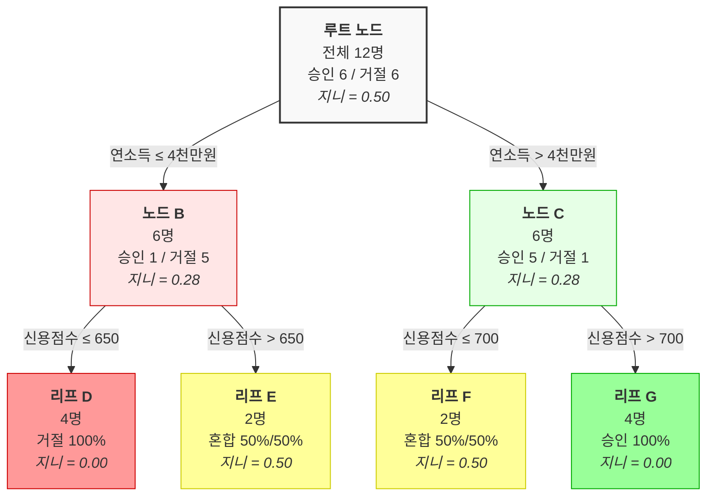

# 의사결정나무 예시: 대출 승인 (Mermaid 소스)

이 파일은 `diagram/3-3.png`로 렌더링되어야 합니다.

## 렌더링 방법

1. Mermaid Live Editor: https://mermaid.live
2. VS Code Mermaid 확장 사용
3. mmdc CLI: `mmdc -i 3-3-decision-tree-loan.md -o 3-3.png`
