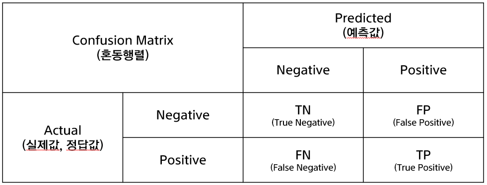
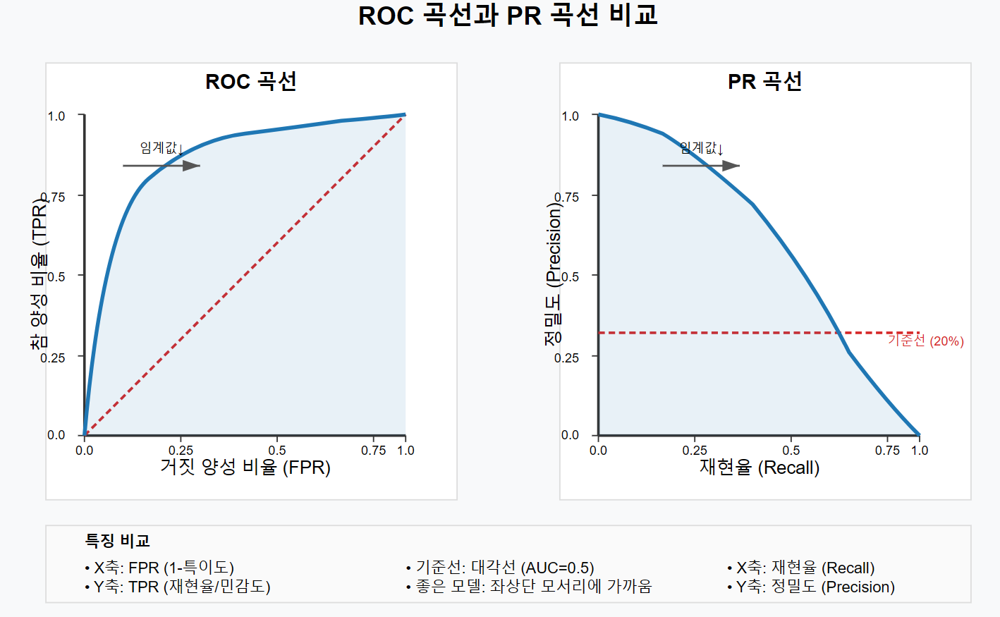
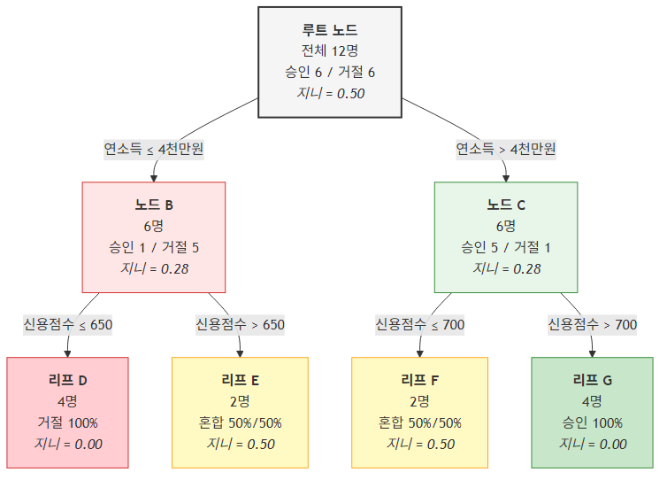
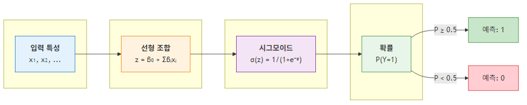
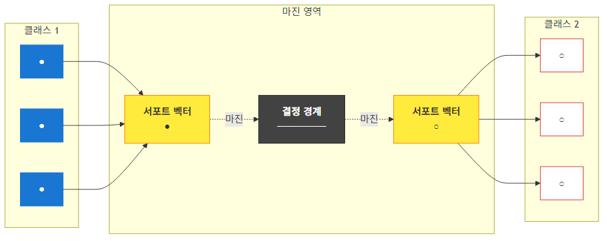
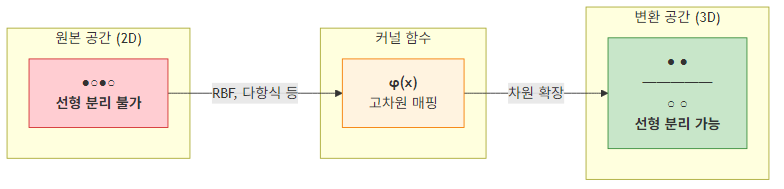

## 3주차: 분류와 회귀 — 이론과 실습

> **미션**: 분류와 회귀의 차이를 구분하고, 평가 지표를 비즈니스 맥락에서 선택할 수 있으며, 의사결정나무와 이상치 탐지를 직접 구현하고 해석할 수 있다

### 학습목표

이 수업을 마치면 다음을 수행할 수 있다:

1. 분류와 회귀 문제를 구분하고, 같은 비즈니스 문제도 정의 방식에 따라 달라짐을 이해한다
2. 혼동행렬에서 정밀도, 재현율, F1, ROC-AUC를 계산하고 비즈니스 비용과 연결할 수 있다
3. 의사결정나무의 분할 기준(지니 불순도, 정보 이득)과 가지치기를 설명할 수 있다
4. 로지스틱 회귀와 SVM의 원리와 현대적 활용 맥락을 이해한다
5. Isolation Forest, One-class SVM, LOF, Autoencoder의 이상치 탐지 원리를 비교할 수 있다
6. AutoML의 역할과 한계를 파악하고, 베이스라인 구축 도구로 활용할 수 있다

### 실습 방식

실습은 **실행 → 이해 → 직접 코딩** 3단계로 진행한다.

1. **실행**: 제공된 코드를 그대로 실행해 결과를 확인한다
2. **이해**: 코드 구조와 결과를 읽고 왜 그런 결과가 나왔는지 파악한다
3. **직접 코딩**: AI 코딩 도구(Copilot, Claude, ChatGPT 등)에 프롬프트를 주어 코드를 수정하거나 새로 작성한다

**제출 형태**: 개별 제출 — 실행 결과 + 직접 작성한 코드 + 해석

**실습 환경 준비**:

```bash
pip install scikit-learn numpy pandas matplotlib
pip install torch  # 실습 2 (Autoencoder)
```

---

### 3.1 분류와 회귀: 출력이 무엇이냐가 모든 것을 바꾼다

지도학습은 입력 X로부터 출력 Y를 예측하는 함수를 학습한다. Y가 범주냐 숫자냐에 따라 문제 정의, 모델 선택, 평가 방법이 근본적으로 달라진다.

**분류(Classification)**: Y가 범주형일 때. 스팸/정상, 이탈/유지, 숫자 0~9 인식.

- **이진 분류**: 두 가지 결과 중 하나. 대출 승인/거절, 질병 양성/음성. 관심 대상(질병 있음, 사기 거래)을 "양성(Positive)"으로 지정한다
- **다중 분류**: 세 개 이상. 뉴스 기사 분류(정치/경제/사회/문화), 손글씨 숫자 인식(0~9)
- **다중 레이블 분류**: 하나의 샘플이 여러 클래스에 동시 속함. 영화가 "액션"이면서 "코미디"

**회귀(Regression)**: Y가 연속형일 때. 주택 가격, 수요량, 고객 생애 가치(LTV) 예측.

**경계가 모호한 경우**: "고객 이탈 예측"을 이진 분류(이탈/유지)로 풀 수도 있고, "남은 가입 개월 수 예측"으로 회귀로 풀 수도 있다. 같은 비즈니스 문제도 정의 방식에 따라 분류 또는 회귀가 된다. 또한 로지스틱 회귀가 "이탈 확률 73%"를 출력하면, 이를 이진 분류로 변환하는 **임계값(threshold)** 설정에 따라 결과가 달라진다.

| 알고리즘 | 분류 | 회귀 | 특징 |
| -------- | ---- | ---- | ---- |
| 선형 회귀 | - | ✓ | 해석 용이, 빠름 |
| 로지스틱 회귀 | ✓ | - | 확률 출력, 선형 결정 경계 |
| 의사결정나무 | ✓ | ✓ | 해석 용이, 비선형 |
| 랜덤 포레스트 | ✓ | ✓ | 앙상블, 과적합 방지 |
| XGBoost/LightGBM | ✓ | ✓ | 정형 데이터 최고 성능 |
| SVM | ✓ | ✓ (SVR) | 커널 트릭, 고차원 효과적 |
| 신경망 | ✓ | ✓ | 비정형 데이터, 대규모 |

---

### 3.2 평가 지표: "좋은 모델"은 무엇으로 판단하는가

어떤 지표를 사용하느냐에 따라 "최적" 모델이 달라진다. 비즈니스 목표에 맞는 지표 선택이 중요하다.

#### 혼동행렬

혼동행렬은 분류 모델의 예측 결과를 정리한 2×2 표다.



|  | 예측: 양성 | 예측: 음성 |
|--|-----------|-----------|
| **실제: 양성** | TP (적중) | FN (놓침, 2종 오류) |
| **실제: 음성** | FP (거짓 경보, 1종 오류) | TN (정확 거부) |

**정확도(Accuracy)** = (TP + TN) / 전체. 직관적이지만, 사기 거래 0.1%인 데이터에서 "모두 정상"으로 예측하면 정확도 99.9%다. 모델은 쓸모없다.

**정밀도(Precision)** = TP / (TP + FP). "양성으로 예측한 것 중 실제 양성의 비율." 정밀도가 낮으면 거짓 경보가 많다.

**재현율(Recall)** = TP / (TP + FN). "실제 양성 중 양성으로 예측한 비율." 재현율이 낮으면 놓치는 양성이 많다.

**F1** = 2 × (Precision × Recall) / (Precision + Recall). 정밀도와 재현율의 조화 평균. 둘 다 높아야 F1이 높다.

정밀도와 재현율은 일반적으로 반비례한다. 이유는 많은 분류 모델이 먼저 **확률**을 출력하고, 그 확률을 양성/음성으로 바꾸기 위해 **임계값(threshold)**을 정해야 하기 때문이다. 임계값은 "예측 확률이 몇 점 이상이면 양성으로 볼 것인가"를 뜻한다. 임계값을 낮추면 더 많은 사례를 양성으로 잡아 재현율은 올라가지만, 거짓 경보도 늘어나 정밀도는 내려가기 쉽다. 반대로 임계값을 높이면 양성 판정이 신중해져 정밀도는 올라갈 수 있지만, 실제 양성을 놓쳐 재현율이 내려갈 수 있다.

예를 들어 어떤 모델이 학생의 "불합격 위험"을 다음과 같이 예측했다고 하자.

| 학생 | 실제 결과 | 불합격 확률 |
| ---- | --------- | ----------- |
| A | 불합격(1) | 0.90 |
| B | 불합격(1) | 0.80 |
| C | 합격(0) | 0.70 |
| D | 불합격(1) | 0.40 |
| E | 합격(0) | 0.30 |

이때 임계값을 어떻게 잡느냐에 따라 같은 모델도 전혀 다른 판단을 내린다.

| 임계값 | 양성(불합격)으로 예측되는 학생 | TPR(재현율) | FPR |
| ------ | ------------------------------ | ----------- | --- |
| 0.8 | A, B | 2/3 | 0/2 |
| 0.5 | A, B, C | 2/3 | 1/2 |
| 0.3 | A, B, C, D, E | 3/3 | 2/2 |

위 표에서 보듯 임계값을 0.8에서 0.3으로 낮추면 실제 불합격자를 더 많이 잡지만(TPR 상승), 합격자까지 불합격으로 잘못 판정하는 비율(FPR)도 커진다. 임계값을 정하는 이유는 결국 **확률을 실제 의사결정으로 바꾸기 위해서**다. 암 진단처럼 놓침(FN)의 비용이 큰 문제는 임계값을 낮추는 편이 낫고, 스팸 필터처럼 거짓 경보(FP)의 비용이 큰 문제는 임계값을 높이는 편이 낫다.

| 상황 | FP(거짓 경보) 비용 | FN(놓침) 비용 | 우선 지표 |
| ---- | ------------------ | ------------- | --------- |
| 암 진단 | 추가 검사 비용 | 생명 위험 | 재현율 |
| 스팸 필터 | 중요 메일 손실 | 스팸 받음 | 정밀도 |
| 사기 탐지 | 정상 거래 차단 | 사기 손실 | 상황별 |
| 추천 시스템 | 관심 없는 추천 | 좋은 추천 놓침 | 정밀도 |
| 설비 고장 예측 | 불필요한 점검 | 비계획 정지 | 재현율 |

#### ROC 곡선과 AUC

**ROC 곡선**은 임계값을 하나만 고정해서 보는 그래프가 아니다. 임계값을 0.9, 0.8, 0.7처럼 계속 바꿔 가며, 그때마다 계산되는 TPR(재현율)과 FPR(FP/(FP+TN))을 점으로 찍어 만든 곡선이다. 바로 앞의 예시를 쓰면 임계값 0.8에서는 점 `(0, 2/3)`, 임계값 0.5에서는 `(1/2, 2/3)`, 임계값 0.3에서는 `(1, 1)`이 찍힌다. 이 점들을 이은 선이 ROC 곡선이다.

따라서 **ROC AUC에는 "대표 임계값"이 하나 들어 있는 것이 아니다.** AUC는 ROC 곡선 아래 면적으로, 0.5(무작위)~1(완벽) 사이 값을 가진다. 즉, 특정 임계값 하나의 성능이 아니라 **임계값을 전체적으로 바꾸어도 양성과 음성을 얼마나 잘 순위화하는가**를 요약한 값이다. AUC가 높다는 것은 임의의 양성 샘플이 임의의 음성 샘플보다 더 높은 점수를 받을 가능성이 크다는 뜻이다.

**PR 곡선(Precision-Recall Curve)**: 클래스 불균형이 심한 상황(사기 탐지, 희귀 질환)에서는 ROC보다 PR 곡선이 양성 클래스의 실제 탐지 능력을 더 잘 보여준다.



- ROC 곡선: 클래스가 균형적이고 전반적 분류 능력을 볼 때
- PR 곡선: 클래스 불균형이 심하고 양성 탐지가 핵심일 때

#### 회귀 평가 지표

| 지표 | 수식 | 특징 |
| ---- | ---- | ---- |
| MAE | Σ\|yᵢ - ŷᵢ\| / n | 직관적, 이상치에 강건 |
| MSE | Σ(yᵢ - ŷᵢ)² / n | 큰 오차에 큰 패널티. 미분 가능 |
| RMSE | √MSE | 원래 단위와 같은 스케일 |
| R² | 1 - (잔차제곱합 / 총제곱합) | 설명 분산 비율. 1에 가까울수록 좋음 |
| MAPE | Σ\|yᵢ - ŷᵢ\|/\|yᵢ\| × 100 / n | 백분율로 스케일 독립적. 실제값 0 근처에서 불안정 |

---

### 3.3 의사결정나무: 규칙으로 설명할 수 있는 모델

의사결정나무는 가장 해석 가능한 머신러닝 알고리즘이다. 인간의 if-then 의사결정과 유사하게 작동하며, 비전문가도 결과를 이해할 수 있다.

#### 분할 원리

데이터를 반복적으로 분할하여 동질적인 그룹을 만든다. 대출 승인 예시로 보면:



1. 루트 노드: "연소득 ≤ 4천만원?" → 예/아니오로 분기
2. 각 하위 노드에서 다시 "신용점수 ≤ 650?" 같은 질문
3. 최종 리프 노드에 도달하면 다수 클래스로 예측

매 분할마다 **불순도(impurity)**를 가장 많이 줄이는 변수와 분할점을 탐욕적으로 선택한다.

#### 불순도 측정: 지니 불순도

**지니 불순도** = 1 - Σpᵢ². 무작위로 선택한 샘플이 잘못 분류될 확률을 측정한다. 쉽게 말해, 한 그룹 안에 서로 다른 종류가 얼마나 섞여 있는지를 숫자 하나로 나타낸 것이다. 과일 바구니에 사과만 담겨 있으면 불순도는 0(순수)이고, 사과와 오렌지가 반반이면 불순도가 최대다.

| 노드 구성 | 계산 | 지니 불순도 |
| --------- | ---- | ----------- |
| 승인 6, 거절 6 (완전 혼합) | 1 - (0.5)² - (0.5)² | 0.50 (최대) |
| 승인 1, 거절 5 | 1 - (1/6)² - (5/6)² | 0.28 |
| 승인 0, 거절 4 (순수) | 1 - 0² - 1² | 0.00 (최소) |

**정보 이득** = 부모 불순도 - 자식 불순도의 가중 평균. 쉽게 말해, 어떤 질문을 던졌을 때 데이터가 얼마나 깔끔하게 나뉘었는지를 측정하는 값이다. 정보 이득이 가장 큰 변수가 분할 기준으로 선택된다.

구체적인 예를 보자. 대출 데이터 12건(승인 6, 거절 6)이 있다고 하자. 부모 노드의 지니 불순도는 0.50이다.

**질문 A: "연소득 ≤ 4천만원?"**

| 자식 노드 | 구성 | 지니 불순도 |
| --------- | ---- | ----------- |
| 예 (7명) | 승인 2, 거절 5 | 1 - (2/7)² - (5/7)² = 0.41 |
| 아니오 (5명) | 승인 4, 거절 1 | 1 - (4/5)² - (1/5)² = 0.32 |

가중 평균 = (7/12) × 0.41 + (5/12) × 0.32 = 0.37 → 정보 이득 = 0.50 - 0.37 = **0.13**

**질문 B: "신용점수 ≤ 650?"**

| 자식 노드 | 구성 | 지니 불순도 |
| --------- | ---- | ----------- |
| 예 (6명) | 승인 1, 거절 5 | 1 - (1/6)² - (5/6)² = 0.28 |
| 아니오 (6명) | 승인 5, 거절 1 | 1 - (5/6)² - (1/6)² = 0.28 |

가중 평균 = (6/12) × 0.28 + (6/12) × 0.28 = 0.28 → 정보 이득 = 0.50 - 0.28 = **0.22**

질문 B의 정보 이득(0.22)이 질문 A(0.13)보다 크므로, 신용점수가 첫 분할 기준으로 선택된다. 이처럼 의사결정나무는 매 단계에서 모든 변수와 분할점을 시도해 보고, 정보 이득이 가장 큰 조합을 선택한다.

**엔트로피** = -Σpᵢ log₂(pᵢ). 지니 불순도와 대부분 유사한 분할을 선택한다. scikit-learn 기본값은 지니 불순도(계산이 약간 빠름).

#### 가지치기: 과적합 방지

제한 없이 성장시키면 훈련 데이터의 노이즈까지 학습하는 과적합이 발생한다. 시험 기출문제의 정답을 통째로 외우면 그 시험은 만점이지만 새 시험에서는 틀리는 것과 같다. 가지치기는 핵심 패턴만 남기고 지엽적인 규칙을 잘라내는 것이다.

핵심 패턴 = 기출에서 반복되는 출제 원리 (진짜 배워야 할 것)
노이즈 = 특정 시험지에만 있던 우연한 출제 경향, 오타, 함정 문제 (외워봐야 다음 시험에 안 나올 것)

**사전 가지치기** — 트리 성장을 일찍 멈춘다:

| 파라미터 | 역할 |
| -------- | ---- |
| `max_depth` | 트리의 최대 깊이 제한 |
| `min_samples_split` | 분할에 필요한 최소 샘플 수 |
| `min_samples_leaf` | 리프 노드의 최소 샘플 수 |
| `max_leaf_nodes` | 최대 리프 노드 수 |

**사후 가지치기** — 완전히 성장한 뒤 불필요한 분할을 제거. scikit-learn의 `ccp_alpha` 파라미터로 조절한다.

#### 장단점

장점: 규칙 형태로 시각화/설명 가능, 스케일링 불필요, 수치형+범주형 혼합 처리, 비선형 관계 포착.

단점: 단일 트리는 과적합에 취약, 데이터 변화에 민감(높은 분산), 대각선 경계 표현이 비효율적. → 이 단점을 보완하기 위해 랜덤 포레스트, 그래디언트 부스팅 같은 앙상블이 발전했다.

---

### 🔬 실습 1: 타이타닉 생존 예측 의사결정나무

#### Step 1 — 실행

`practice/chapter3/code/3-3-titanic-decision-tree.py`를 실행한다.

```bash
cd practice/chapter3/code
python 3-3-titanic-decision-tree.py
```

출력에서 아래 표를 채운다.

**모델 성능**:

| 항목 | 값 |
| ---- | -- |
| 정확도 | |
| 생존율(전체) | |

**혼동 행렬**:

|  | 예측:사망 | 예측:생존 |
|--|---------|---------|
| 실제:사망 | | |
| 실제:생존 | | |

**특성 중요도**:

| 특성 | 중요도 |
| ---- | ------ |
| Sex | |
| Age | |
| 3rd_class | |
| 1st_class | |

#### Step 2 — 이해

코드의 핵심 구조를 확인한다.

```python
# max_depth=4로 제한한 이유는 무엇인가?
dt_model = DecisionTreeClassifier(max_depth=4, random_state=42)
dt_model.fit(X_train, y_train)
```

- 저장된 트리 시각화(`titanic_decision_tree.png`)를 열어 본다. 루트 노드에서 어떤 변수로 첫 분할을 하는가?
- 성별(Sex)이 중요도 1위인 이유: "여성과 아이를 먼저(Women and children first)" 원칙이 실제 적용되었음을 보여준다
- 3등석 승객의 생존율이 낮은 이유: 선박 하부에 위치해 갑판까지 이동 거리가 멀었다
- 특성 중요도의 합은 1이 된다. 1st_class 중요도가 낮은 이유는? (힌트: 3rd_class 변수로 이미 간접 표현됨)

#### Step 3 — 직접 코딩

아래 프롬프트를 AI 코딩 도구에 입력해서 코드를 작성하고, 실행 결과를 비교한다.

**프롬프트 1**: max_depth 변경으로 과적합 관찰

> `3-3-titanic-decision-tree.py`를 수정해서, max_depth를 2, 3, 4, 6, None(제한 없음)으로 바꾸며 훈련 정확도와 테스트 정확도를 비교하는 표를 출력하는 코드를 작성해줘.

결과를 기록한다:

| max_depth | 훈련 정확도 | 테스트 정확도 |
| --------- | ----------- | ------------- |
| 2 | | |
| 3 | | |
| 4 | | |
| 6 | | |
| None | | |

- max_depth가 커질수록 훈련 정확도는 어떻게 변하는가?
- 테스트 정확도는 어느 시점부터 떨어지기 시작하는가? 이것이 과적합이다.

**프롬프트 2** (선택): 혼동행렬 히트맵 시각화

> 타이타닉 의사결정나무의 혼동행렬을 seaborn 히트맵으로 시각화하고, 정밀도·재현율·F1을 직접 계산하여 출력하는 코드를 작성해줘. sklearn의 confusion_matrix를 사용해줘.

**프롬프트 3**: Random Forest와 비교

> 타이타닉 데이터에서 단일 의사결정나무(max_depth=4)와 Random Forest(n_estimators=100, max_depth=4)의 정확도, 정밀도, 재현율을 비교하는 코드를 작성해줘.

| 모델 | 정확도 | 정밀도 | 재현율 |
| ---- | ------ | ------ | ------ |
| Decision Tree | | | |
| Random Forest | | | |

- 앙상블이 단일 트리보다 성능이 좋은가?
- 왜 그런가? (힌트: 여러 트리의 예측을 합치면 개별 트리의 오류가 상쇄된다)

**프롬프트 4** (선택): 교차검증으로 안정성 평가

> 타이타닉 데이터에서 의사결정나무(max_depth=4)를 5-fold 교차검증으로 평가하는 코드를 작성해줘. cross_val_score를 사용하고 각 폴드의 정확도와 평균±표준편차를 출력해줘.

---

### 3.4 로지스틱 회귀와 SVM: 여전히 쓸모 있는 선형 모델

딥러닝 시대에도 선형 모델은 해석 가능성, 학습 속도, 적은 데이터에서의 안정성 측면에서 가치가 있다.

#### 로지스틱 회귀



입력 특성의 선형 조합 z = β₀ + Σβᵢxᵢ를 **시그모이드 함수** σ(z) = 1/(1+e⁻ᶻ)로 변환하여 0~1 사이의 확률을 출력한다. 확률이 임계값(기본 0.5) 이상이면 클래스 1, 미만이면 클래스 0으로 예측한다.

쉽게 말해, 여러 특성의 영향을 한 줄로 합산해 점수를 만든 뒤 그 점수를 "양성일 가능성"으로 바꾸는 모델이다. 예를 들어 연체 이력, 소득, 기존 대출 수를 합쳐 0.82라는 확률이 나오면 "연체 위험이 높다"처럼 해석할 수 있다.

계수 βᵢ가 해당 특성의 영향을 직접 보여주므로, 규제 산업(금융, 의료)에서 널리 사용된다. "왜 이 고객이 거절되었는가?"에 답할 수 있다.

#### 선형 SVM (서포트 벡터 머신)



두 클래스 사이의 **마진**(결정 경계와 가장 가까운 점 사이의 거리)을 최대화하는 선형 결정 경계를 찾는다. 결정 경계에 가장 가까운 점을 **서포트 벡터**라 한다.

직관적으로는 두 집단 사이에 선을 하나 긋는 것이 아니라, **가장 넓은 안전지대가 생기도록 경계를 잡는 방법**이라고 보면 된다. 경계 바로 근처에 있는 몇 개의 점이 경계를 사실상 결정하는데, 이 점들이 서포트 벡터다.

- 파라미터 C: 마진 위반 허용 정도. C가 크면 엄격(과적합 경향), 작으면 넓은 마진(일반화 우선)
- 장점: 해석 가능, 고차원에서 효율적, 메모리 절약
- 단점: 선형 분리 가능한 데이터에만 적합, 비선형 관계 포착 어려움

#### 커널 SVM



선형 SVM의 한계를 극복하기 위한 별도 모형이다. **커널 트릭**을 사용해 선형 분류가 불가능한 데이터를 고차원 공간으로 암묵적으로 매핑하여 선형 분리를 가능하게 한다.

커널 트릭은 평면에서 직선으로 나눌 수 없는 데이터를, 더 높은 차원에서는 선형 경계로 나눌 수 있게 만드는 아이디어다. 2차원에서는 뒤엉켜 보이던 점들이 3차원에서는 분리될 수 있다고 생각하면 이해하기 쉽다.

주요 커널:
- **RBF(방사 기저 함수)**: 가장 널리 사용. 비선형 경계 학습 가능
- **다항식**: 차수를 높여 복잡한 경계 표현
- **선형**: 기본 선형 SVM과 동일

#### 선택 가이드

| 상황 | 권장 모델 | 이유 |
| ---- | --------- | ---- |
| 해석이 중요 (의료, 금융 규제) | 로지스틱 회귀 | 계수로 영향 설명 |
| 데이터가 적음 (< 1,000) | 선형 모델 | 과적합 방지 |
| 베이스라인 구축 | 로지스틱 회귀 | 빠름, 안정적 |
| 고차원 희소 데이터 (텍스트) | 선형 SVM | 효율적, 성능 양호 |
| 비선형 관계, 대용량 | XGBoost, 신경망 | 표현력 필요 |

---

### 3.5 이상치 탐지: 정상에서 벗어난 것을 찾아내기

이상치 탐지는 정상 패턴에서 벗어난 데이터를 식별하는 문제다. 신용카드 사기, 네트워크 침입, 설비 고장 예측 등에 활용된다.

일반 분류와 다른 점:

- 이상치는 전체의 극히 일부 → 단순 정확도는 무의미
- 이상치 레이블이 없거나 불완전 → 비지도/준지도 접근이 현실적
- FN(놓침)과 FP(거짓 경보) 비용이 비대칭

#### Isolation Forest

이상치가 정상보다 "고립되기 쉽다"는 아이디어에 기반한다.

정상 데이터는 비슷한 점들 사이에 모여 있고, 이상치는 군집에서 떨어져 있는 경우가 많다. 그래서 무작위로 계속 잘라 나가면, 바깥에 떨어진 점은 몇 번 자르지 않아도 금방 혼자 남는다.

- 무작위로 변수를 선택하고, 범위 내 무작위 분할점으로 반복 분할
- 이상치는 적은 분할 횟수로 고립됨 → **평균 경로 길이가 짧으면 이상치**
- 장점: 빠르고 대용량에 확장 쉬움
- 단점: 국소 이상치에 약할 수 있음

#### One-class SVM

정상 데이터만으로 학습하여 "정상 영역"을 정의한다. 새 데이터가 이 영역 밖이면 이상치.

쉽게 말해 정상 데이터 주변에 울타리를 하나 친 뒤, 그 울타리 밖으로 나가면 이상치라고 판단하는 방식이다. 레이블이 거의 없고 정상 사례만 충분히 있을 때 특히 유용하다.

- 커널을 사용해 비선형 경계도 학습 가능
- 장점: 이상치 레이블 없이 적용 가능
- 단점: 학습 비용 큼, 하이퍼파라미터(nu, gamma)에 민감

#### Local Outlier Factor (LOF)

각 데이터 포인트가 이웃들에 비해 얼마나 밀도가 낮은지를 측정한다.

핵심은 절대적인 위치보다 **주변과 비교했을 때 얼마나 뜬금없는가**를 보는 데 있다. 같은 외곽이라도 주변이 함께 듬성듬성하면 정상일 수 있고, 나만 유독 외따로 떨어져 있으면 이상치일 가능성이 높다.

- 핵심: "정상은 이웃과 비슷한 밀도, 이상치는 눈에 띄게 낮은 밀도"
- LOF 점수 ≈ 1이면 정상, 1보다 훨씬 크면 이상치
- 장점: 클러스터마다 밀도가 다를 때 효과적
- 단점: k 하이퍼파라미터에 민감, 대용량에서 느림

#### Autoencoder

입력을 저차원으로 압축(인코더)했다가 다시 복원(디코더)하는 신경망이다. 정상 데이터로 학습하면, 이상치는 잘 복원되지 않아 **재구성 오차가 크다**.

사진을 흐릿하게 압축했다가 다시 복원한다고 생각하면 쉽다. 자주 본 정상 패턴은 비교적 잘 복원하지만, 거의 보지 못한 이상 패턴은 복원 과정에서 오차가 크게 남는다. 이 오차를 이상치 신호로 사용한다.

- 장점: 고차원 데이터(이미지, 시계열)에서 비선형 패턴 학습 가능
- 단점: 충분한 정상 데이터 필요, 하이퍼파라미터 튜닝 복잡

#### 알고리즘 비교

| 알고리즘 | 학습 데이터 | 학습 속도 | 장점 | 단점 |
| -------- | ----------- | --------- | ---- | ---- |
| Isolation Forest | 혼합(정상+이상) | 빠름 | 확장성, 단순 | 국소 이상치 약함 |
| One-class SVM | 정상만 | 느림 | 이론적 근거 | 대용량 부적합 |
| LOF | 혼합 | 보통 | 밀도 기반, 국소 이상치 | 고차원 성능 저하 |
| Autoencoder | 정상만 | 보통 | 고차원 효과적 | 튜닝 복잡 |

---

### 🔬 실습 2: 이상치 탐지 알고리즘 비교

#### Step 1 — 실행

`practice/chapter3/code/3-5-anomaly-detection.py`를 실행한다.

```bash
python 3-5-anomaly-detection.py
```

출력에서 아래 표를 채운다.

| 알고리즘 | 정밀도 | 재현율 | F1 | 학습 시간 |
| -------- | ------ | ------ | -- | --------- |
| Isolation Forest | | | | |
| One-class SVM | | | | |
| LOF | | | | |
| Autoencoder | | | | |

| 항목 | 값 |
| ---- | -- |
| 전체 거래 수 | |
| 사기 비율 | |
| 최고 F1 알고리즘 | |
| 최고 재현율 알고리즘 | |
| 가장 빠른 알고리즘 | |

#### Step 2 — 이해

코드의 핵심 구조를 확인한다.

```python
# contamination: 이상치 비율을 알고리즘에 알려주는 파라미터
contamination = n_fraud / len(y)
iso_forest = IsolationForest(contamination=contamination, random_state=42)
```

- 사기 비율이 0.5%인데, "모두 정상"으로 예측하면 정확도는 99.5%다. 이것이 정확도가 무의미한 이유다.
- Isolation Forest의 F1이 가장 높은 이유: 이상치가 무작위 분할에서 빠르게 고립되는 특성을 효과적으로 포착
- Autoencoder 성능이 낮은 이유: 5개 특성의 단순 합성 데이터에서는 복잡한 신경망이 오히려 불리. 고차원 실제 데이터에서 강점이 있다
- 4가지 알고리즘 중 정상 데이터만으로 학습하는 것은 어느 것인가? (One-class SVM, Autoencoder)

#### Step 3 — 직접 코딩

**프롬프트 5**: contamination 비율 변경 실험

> `3-5-anomaly-detection.py`를 수정해서, Isolation Forest의 contamination을 0.005, 0.01, 0.02, 0.05로 바꾸며 정밀도, 재현율, F1을 비교하는 표를 출력하는 코드를 작성해줘.

결과를 기록한다:

| contamination | 정밀도 | 재현율 | F1 |
| ------------- | ------ | ------ | -- |
| 0.005 | | | |
| 0.01 | | | |
| 0.02 | | | |
| 0.05 | | | |

- contamination을 높이면 정밀도와 재현율은 각각 어떻게 변하는가?
- 실무에서 이 값은 어떻게 결정하는가? (힌트: 후속 검토 용량, 허용 거짓 경보율)

**프롬프트 6** (선택): Isolation Forest 이상치 점수 시각화

> 신용카드 사기 데이터에 Isolation Forest를 적용하고, 이상치 점수(anomaly score)의 분포를 정상/사기 거래별로 히스토그램으로 나란히 시각화하는 코드를 작성해줘.

**프롬프트 7**: 알고리즘별 성능을 막대 그래프로 비교

> `3-5-anomaly-detection.py` 실행 결과의 4가지 알고리즘 정밀도, 재현율, F1을 matplotlib 그룹 막대 그래프로 시각화하는 코드를 작성해줘. 알고리즘명을 x축에, 지표값을 y축에 표시해줘.

| 알고리즘 | 정밀도 | 재현율 | F1 |
| -------- | ------ | ------ | -- |
| Isolation Forest | | | |
| One-class SVM | | | |
| LOF | | | |
| Autoencoder | | | |

- 그래프에서 어떤 알고리즘이 정밀도-재현율 균형이 가장 좋은가?
- 재현율만 높은 알고리즘이 실무에서 항상 좋은 것인가? (힌트: 거짓 경보 비용)

**프롬프트 8** (하지 않아도 됨): Autoencoder 구조 변경 실험

> `3-5-anomaly-detection.py`의 Autoencoder에서 hidden_dim을 4, 8, 16, 32로 바꾸며 F1을 비교하는 코드를 작성해줘. epochs는 50으로 고정해줘.

---

### 3.6 AutoML: 빠른 베이스라인 구축 도구

AutoML은 모델 선택, 하이퍼파라미터 튜닝, 전처리 파이프라인 구성을 자동화한다. 데이터 과학자를 대체하는 것이 아니라, **빠른 베이스라인 구축과 반복 실험**을 가능하게 하는 도구다.

쉽게 말하면 "어떤 모델이 맞을지 하나씩 손으로 돌려 보는 작업"을 자동으로 대신해 주는 실험 엔진에 가깝다. 사람이 문제를 정의하고 데이터를 점검하면, AutoML은 여러 후보를 빠르게 시험해 출발점을 만들어 준다.

#### AutoML이 자동화하는 것

- 알고리즘 선택과 하이퍼파라미터 탐색 (그리드/랜덤/베이지안 탐색)
- 전처리 파이프라인 구성 (결측치, 스케일링, 인코딩)
- 앙상블 결합

#### 대표 라이브러리

| 라이브러리 | 강점 | 약점 | 적합한 상황 |
| ---------- | ---- | ---- | ----------- |
| AutoGluon | 최고 성능, 쉬운 사용 | 메모리 사용량 큼 | Kaggle 수준 성능 필요 |
| Auto-sklearn | 메타학습, 앙상블 | 속도 느림 | 충분한 시간 있을 때 |
| FLAML | 가볍고 빠름 | 앙상블 제한적 | 빠른 프로토타입 |
| H2O | 분산 처리, 시각화 | 설치 복잡 | 대용량 데이터 |

#### AutoML의 한계

- 도메인 지식을 자동으로 주입하기 어렵다
- 내부 모델이 복잡해지면 해석 가능성이 떨어진다
- 데이터 품질 자체를 해결해주지 못한다 — 결측, 이상치, 라벨 오류는 선행 점검이 필요

AutoML은 "모델링 단계의 자동화"를 담당한다. 상류의 데이터 엔지니어링(데이터 수집, 품질 관리)과 하류의 MLOps(배포, 모니터링, 재학습) 사이에 위치한다. 세 영역이 유기적으로 연결되어야 실무에서 머신러닝이 가치를 창출한다.

```
데이터 엔지니어링 → AutoML(모델링 자동화) → MLOps(배포/운영)
```

바람직한 활용: "베이스라인 구축과 벤치마킹" 역할을 분명히 두고, 성능·설명 가능성·운영 비용을 함께 평가한다.

---

### 핵심 정리

```text
1. 분류는 범주 예측, 회귀는 연속값 예측. 같은 문제도 정의에 따라 달라진다.
2. 정확도만으로는 불충분하다. 비즈니스 비용에 따라 정밀도/재현율/F1/AUC를 선택한다.
3. 의사결정나무는 해석 가능하지만 과적합에 취약하다. 가지치기와 앙상블로 보완한다.
4. 로지스틱 회귀와 SVM은 해석성과 안정성이 필요한 상황에서 여전히 유효하다.
5. 이상치 탐지는 불균형 데이터 문제다. 정확도 대신 정밀도/재현율/F1로 평가한다.
6. AutoML은 베이스라인 도구이지, 문제 정의와 검증을 대신하지 않는다.
```

---

### 제출 기준

- ✓ 2개 제공 코드를 모두 실행하고 결과 수치를 기록했다
- ✓ Step 3의 프롬프트 중 최소 4개 이상을 AI 도구로 코드를 작성하고 실행했다
- ✓ 직접 작성한 코드와 실행 결과를 포함했다
- ✓ 각 실습의 결과를 왜 그런 결과가 나왔는지 1~2문장으로 해석했다

### 바이브 코딩 팁

- AI 도구에 프롬프트를 줄 때, **데이터와 목표를 구체적으로** 적을수록 좋은 코드가 나온다
- 생성된 코드를 그대로 실행하지 말고, **코드를 읽고 이해한 뒤** 실행한다
- 에러가 나면 에러 메시지를 AI에 다시 붙여넣어 수정을 요청한다
- 결과가 예상과 다르면 왜 다른지 AI에게 물어본다
- **AI가 생성한 코드의 결과도 반드시 검증**한다 — 이것이 이론에서 배운 원칙의 실천이다
