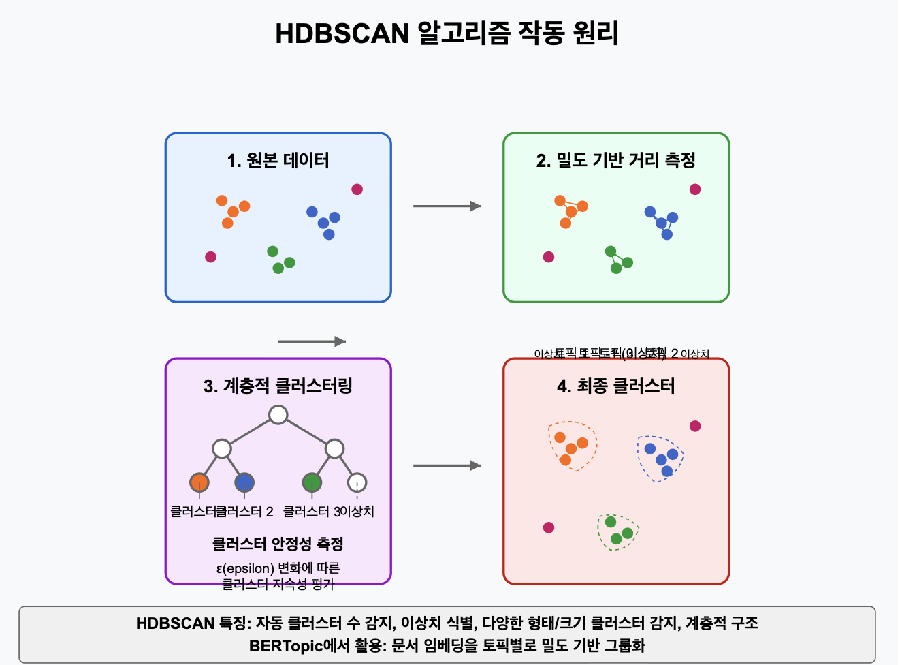
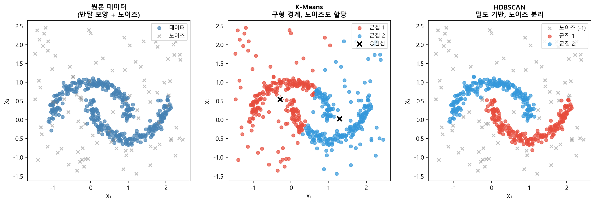
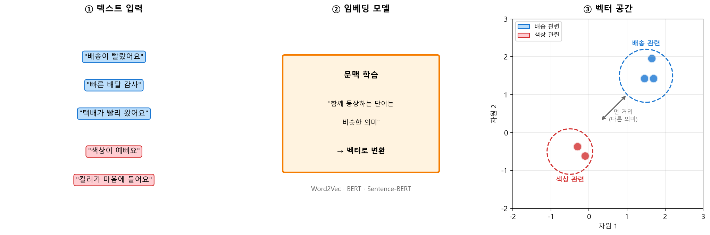
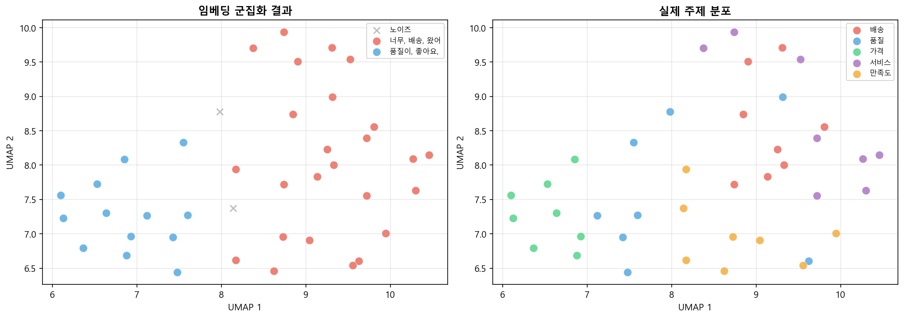

## 4주차: 군집 분석 — 이론과 실습

> **미션**: 군집 분석의 핵심 원리를 이해하고, 제공된 코드를 실행한 뒤, AI 코딩 도구를 활용해 코드를 직접 수정·확장하며 다양한 군집화 방법의 차이를 체험한다

### 학습목표

이 수업을 마치면 다음을 수행할 수 있다:

1. 군집 분석이 비지도학습에서 어떤 역할을 하는지 설명하고, 분류와의 차이를 구분할 수 있다
2. K-Means의 작동 원리와 한계(구형 가정, K 사전 지정)를 설명할 수 있다
3. HDBSCAN이 비구형 군집과 노이즈를 처리하는 원리를 이해한다
4. 임베딩 기반 군집화 파이프라인(SBERT → UMAP → HDBSCAN)을 구성할 수 있다
5. 딥 클러스터링(DEC, IDEC)의 아이디어를 이해하고, K-Means와의 성능 차이를 해석할 수 있다
6. "임베딩 유사성"과 "군집화 목적 유사성"의 일치 여부가 성능을 좌우함을 설명할 수 있다

### 실습 방식

실습은 **실행 → 이해 → 직접 코딩** 3단계로 진행한다.

1. **실행**: 제공된 코드를 그대로 실행해 결과를 확인한다
2. **이해**: 코드 구조와 결과를 읽고 왜 그런 결과가 나왔는지 파악한다
3. **직접 코딩**: AI 코딩 도구(Copilot, Claude, ChatGPT 등)에 프롬프트를 주어 코드를 수정하거나 새로 작성한다

**제출 형태**: 개별 제출 — 실행 결과 + 직접 작성한 코드 + 해석

**실습 환경 준비**:

```bash
pip install scikit-learn numpy pandas matplotlib
pip install hdbscan                # 실습 1
pip install sentence-transformers  # 실습 2
pip install umap-learn             # 실습 2
pip install torch                  # 실습 3
```

---

### 4.1 군집 분석 개요: 레이블 없이 구조를 발견하는 법

군집 분석(Cluster Analysis)은 **비지도학습**의 대표 기법이다. 정답 레이블 없이 데이터에서 자연스러운 그룹을 발견한다. 핵심 질문은 하나다: **"내 데이터에서 '유사하다'는 것은 무엇을 의미하는가?"**

#### 분류 vs 군집화

분류와 군집화는 모두 데이터를 그룹에 넣지만, 근본적으로 다르다.

| 구분 | 분류(Classification) | 군집화(Clustering) |
| ---- | -------------------- | ------------------ |
| 학습 유형 | 지도학습 | 비지도학습 |
| 레이블 | 미리 정해져 있음 (스팸/정상) | 데이터에서 발견 |
| 클래스 수 | 사전에 알려짐 | 자동 결정 또는 추정 |
| 목표 | 새 데이터의 클래스 예측 | 데이터 구조 이해 |

분류는 "이 이메일이 스팸인가?"에 답한다. 군집화는 "우리 고객들은 어떤 그룹으로 나뉘는가?"에 답한다. 실무에서는 둘을 연계하기도 한다 — 먼저 군집화로 고객 세그먼트를 발견하고, 각 세그먼트에 "VIP", "이탈 위험" 같은 레이블을 붙여 분류 모델의 학습 데이터로 활용한다.

#### 유사성의 정의가 알고리즘을 결정한다

| 알고리즘 | 유사성 기준 | 군집 형태 |
| -------- | ----------- | --------- |
| K-Means | 중심점까지의 거리 | 구형 |
| HDBSCAN | 밀도가 높은 영역의 연결 | 임의 형태 |
| 임베딩 + 군집화 | 의미 벡터 간 거리 | 의미적 유사성 |

#### 비즈니스 응용 사례

- **고객 세분화**: RFM(최근성, 빈도, 금액) 분석으로 VIP/충성/일반/이탈위험 그룹화 → 세그먼트별 맞춤 마케팅
- **이상 패턴 탐지**: 정상 거래의 군집에서 벗어난 데이터를 이상으로 판단 (사기 탐지, 불량품 탐지)
- **문서/텍스트 그룹화**: 고객 리뷰를 "배송", "품질", "가격" 등 주제별로 자동 분류 (VOC 분석)
- **이미지 유사 검색**: 상품 이미지를 군집화해 "비슷한 상품 추천" 기능 구현

---

### 4.2 K-Means: 가장 직관적인 군집화

K-Means는 가장 널리 쓰이는 군집화 알고리즘이다. 작동 원리가 단순하고 빠르다.

#### 알고리즘 동작

1. **초기화**: K개의 중심점(centroid)을 배치한다
2. **할당**: 각 데이터를 가장 가까운 중심점에 배정한다
3. **업데이트**: 각 군집의 평균 위치로 중심점을 이동한다
4. **반복**: 중심점이 더 이상 변하지 않으면 종료

목적 함수는 군집 내 분산(WCSS)의 최소화다: J = Σ_k Σ_{i∈C_k} ||x_i - μ_k||². 즉 "각 데이터가 속한 군집의 중심까지 거리의 합"을 줄인다.

#### K-Means의 한계

| 한계 | 설명 |
| ---- | ---- |
| **구형 군집만 탐지** | 유클리드 거리 기반이라 반달, 고리 모양은 분리 불가 |
| **K를 미리 지정** | 최적 K를 찾는 것 자체가 하나의 과제 |
| **초기값 민감** | 운이 나쁘면 지역 최솟값에 수렴 (K-Means++로 완화) |
| **이상치에 취약** | 극단값 하나가 중심점을 크게 이동시킴 |
| **노이즈 처리 불가** | 모든 점을 강제로 군집에 할당함 |

#### K 결정 방법

| 방법 | 원리 | 장점 | 단점 |
| ---- | ---- | ---- | ---- |
| 엘보우 | WCSS 감소율이 급격히 완만해지는 지점 | 직관적, 빠름 | 주관적 해석 |
| 실루엣 분석 | 응집도(a)와 분리도(b) 비교: s = (b-a)/max(a,b) | 해석 가능한 점수 | K=2에 편향 |
| Gap Statistic | 실제 WCSS와 균등분포 WCSS의 차이 | 이론적 근거 | 계산 비용 높음 |

실무에서는 엘보우와 실루엣을 함께 보고 후보 K를 추린 후, 비즈니스 해석 가능성을 고려해 최종 K를 결정한다.

---

### 4.3 HDBSCAN: 밀도가 곧 유사성이다

K-Means의 가장 큰 한계는 비구형 군집을 처리하지 못한다는 점이다. 반달, 고리, 불규칙한 형태의 군집은 중심점 기반 방식으로 탐지할 수 없다. **밀도 기반 군집화**는 "밀도가 높은 영역"을 군집으로 정의한다.

#### DBSCAN에서 HDBSCAN으로

DBSCAN은 이웃 탐색 반경 ε과 최소 이웃 수 minPts로 밀도가 높은 영역을 군집으로 묶고, 어디에도 속하지 않는 점은 노이즈로 분리한다. 문제는 **단일 ε 값으로는 밀도가 다른 군집을 동시에 탐지하기 어렵다**는 점이다. ε이 작으면 희박한 군집이 노이즈가 되고, ε이 크면 조밀한 군집들이 합쳐진다.

HDBSCAN은 이 한계를 극복한다. 핵심 아이디어:

1. **상호 도달 거리**: 밀도가 낮은 영역에서는 거리를 늘리고, 높은 영역에서는 실제 거리를 사용
2. **계층적 군집 트리**: 다양한 ε 값에서 군집을 추출
3. **안정성 기반 선택**: 넓은 ε 범위에서 유지되는 견고한 군집을 자동 선택

비유하면, K-Means는 자를 대고 원을 그려 데이터를 나누지만, HDBSCAN은 데이터가 자연스럽게 몰려 있는 지형을 따라 경계를 그린다.



#### K-Means vs HDBSCAN 비교

| 특성 | K-Means | HDBSCAN |
| ---- | ------- | ------- |
| 군집 형태 | 구형만 | 임의 형태 |
| K 결정 | 사전 지정 필요 | 자동 결정 |
| 노이즈 처리 | 불가 (강제 할당) | 자동 탐지 (레이블 -1) |
| 주요 파라미터 | n_clusters | min_cluster_size, min_samples |
| 적합한 상황 | 구형 군집, K를 알 때 | 비구형, 노이즈 있을 때 |



---

### 🔬 실습 1: HDBSCAN 군집 분석

#### Step 1 — 실행

`practice/chapter4/code/4-3-hdbscan-clustering.py`를 실행한다.

```bash
cd practice/chapter4/code
python 4-3-hdbscan-clustering.py
```

출력에서 아래 표를 채운다.

**실험 1: 구형 군집 데이터**

| 알고리즘 | 군집 수 | 노이즈 | 실루엣 | ARI |
| -------- | ------- | ------ | ------ | --- |
| K-Means | | | | |
| HDBSCAN | | | | |

**실험 2: 비구형 군집 데이터 (반달 모양 + 노이즈)**

| 알고리즘 | 군집 수 | 노이즈 탐지 | 실루엣 | ARI |
| -------- | ------- | ----------- | ------ | --- |
| K-Means | | | | |
| HDBSCAN | | | | |

**실험 3: HDBSCAN 파라미터 영향**

| min_cluster_size | min_samples | 군집 수 | 노이즈 |
| ---------------- | ----------- | ------- | ------ |
| 10 | 3 | | |
| 15 | 5 | | |
| 20 | 10 | | |
| 30 | 15 | | |

#### Step 2 — 이해

코드의 핵심 구조를 확인한다.

```python
# K-Means: 군집 수를 미리 지정해야 함
kmeans = KMeans(n_clusters=n_true_clusters, random_state=42, n_init=10)
labels_kmeans = kmeans.fit_predict(X)

# HDBSCAN: 군집 수를 자동 결정, 노이즈 자동 탐지
clusterer = hdbscan.HDBSCAN(min_cluster_size=15, min_samples=5)
labels_hdbscan = clusterer.fit_predict(X)
```

- 구형 군집에서 두 알고리즘의 ARI 차이가 크지 않은 이유: K-Means의 구형 가정이 실제 데이터와 맞기 때문
- 비구형 군집에서 K-Means의 ARI가 낮은 이유: 중심점 기반 구형 경계로는 반달 모양을 분리할 수 없음
- HDBSCAN이 노이즈를 탐지할 수 있는 이유: 어떤 군집에도 연결되지 않는 점은 레이블 -1로 분리

#### Step 3 — 직접 코딩

**프롬프트 1**: min_cluster_size에 따른 군집 결과 변화

> `4-3-hdbscan-clustering.py`의 반달 데이터에서 min_cluster_size를 5, 10, 20, 40, 80으로 바꾸며 군집 수, 노이즈 비율, ARI를 비교하는 표를 출력하는 코드를 작성해줘. min_samples는 5로 고정해줘.

결과를 기록한다:

| min_cluster_size | 군집 수 | 노이즈 비율 | ARI |
| ---------------- | ------- | ----------- | --- |
| 5 | | | |
| 10 | | | |
| 20 | | | |
| 40 | | | |
| 80 | | | |

- min_cluster_size가 커지면 군집 수와 노이즈 비율은 각각 어떻게 변하는가?
- ARI가 가장 높은 설정은 어떤 것인가?

**프롬프트 2** (선택): K-Means 엘보우 분석

> `4-3-hdbscan-clustering.py`의 반달 데이터에서 K-Means의 K를 2~8로 바꾸며 WCSS(inertia)와 실루엣 점수를 계산하고, 엘보우 그래프와 실루엣 그래프를 나란히 그리는 코드를 작성해줘. 최적 K가 실제 군집 수(2)와 일치하는지 확인해줘.

---

### 4.4 임베딩 기반 군집화: 의미가 유사하면 가까이 놓는다

텍스트를 군집화하려면 먼저 숫자로 바꿔야 한다. 전통적인 TF-IDF는 단어 빈도만 세므로, "배송이 빨랐어요"와 "빠른 배달 감사합니다"가 다른 단어를 사용해 거리가 멀 수 있다. 반면 **임베딩**은 의미를 보존하는 벡터 표현이다.

#### 임베딩이 의미를 포착하는 원리

Sentence-BERT 같은 임베딩 모델은 대규모 텍스트에서 문맥을 학습하여, **의미가 유사한 문장은 벡터 공간에서 가깝게 배치**한다. TF-IDF가 "단어 개수표"라면, 임베딩은 "의미 지도"다.

| 항목 | TF-IDF | 임베딩 (SBERT) |
| ---- | ------ | -------------- |
| 표현 | 단어 빈도, 희소 벡터 | 의미 기반, 밀집 벡터 |
| 차원 | 수천~수만 | 384~768 |
| "빨랐어요" vs "빠른 배달" | 다른 단어 → 거리 멀음 | 같은 의미 → 거리 가까움 |



#### 임베딩 + HDBSCAN 파이프라인

고차원 임베딩(384차원)에서 직접 군집화하면 "차원의 저주"로 성능이 떨어진다. UMAP으로 10~50차원으로 축소한 후 HDBSCAN을 적용하는 것이 일반적이다.

```
텍스트 → Sentence-BERT 임베딩(384차원) → UMAP 차원 축소(10차원) → HDBSCAN 군집화 → 군집 레이블링
```

군집화 후에는 군집별 빈출 키워드를 추출하거나, LLM에 대표 문서를 입력해 자동 레이블링할 수 있다.

---

### 🔬 실습 2: 임베딩 기반 고객 리뷰 군집화

#### Step 1 — 실행

`practice/chapter4/code/4-4-embedding-clustering.py`를 실행한다.

```bash
cd practice/chapter4/code
python 4-4-embedding-clustering.py
```

출력에서 아래 표를 채운다.

**임베딩 정보**:

| 항목 | 값 |
| ---- | -- |
| 임베딩 방법 | |
| 임베딩 차원 | |
| 차원 축소 방법 | |
| 축소 후 차원 | |

**군집화 결과**:

| 항목 | 값 |
| ---- | -- |
| 발견된 군집 수 | |
| 노이즈 포인트 수 | |
| 실루엣 점수 | |

**군집별 분석**:

| 군집 | 키워드 | 리뷰 수 | 대표 주제 |
| ---- | ------ | ------- | --------- |
| 0 | | | |
| 1 | | | |
| ... | | | |

**TF-IDF vs 임베딩 비교**:

| 방법 | ARI | NMI |
| ---- | --- | --- |
| TF-IDF + K-Means | | |
| 임베딩 + HDBSCAN | | |

#### Step 2 — 이해

코드의 핵심 구조를 확인한다.

```python
# 임베딩: 텍스트를 의미 벡터로 변환
embeddings, embed_method = get_embeddings(texts, method='sbert')

# 차원 축소: 384차원 → 10차원 (군집화에 적합한 차원)
embeddings_reduced, reduce_method = reduce_dimensions(embeddings, n_components=10)

# 군집화: 밀도 기반 자동 군집 탐지
labels, cluster_method = cluster_embeddings(embeddings_reduced)
```

- HDBSCAN이 실제 5개 주제보다 적은 군집을 발견하는 이유: 의미적으로 유사한 주제(배송/서비스, 품질/만족도)가 하나로 합쳐짐
- TF-IDF보다 임베딩의 ARI가 높은 이유: 임베딩이 "빨랐어요"와 "빠른 배달"의 의미적 유사성을 포착하기 때문
- 40개 리뷰에서 ARI가 낮을 수 있는 이유: 데이터가 적으면 군집 구조가 불안정함



#### Step 3 — 직접 코딩

**프롬프트 3**: UMAP 파라미터 실험

> `4-4-embedding-clustering.py`를 수정해서, UMAP의 n_components를 2, 5, 10, 20, 50으로 바꾸며 HDBSCAN 군집화 결과(군집 수, 노이즈 수, ARI)를 비교하는 표를 출력하는 코드를 작성해줘. n_neighbors=15, min_dist=0.1로 고정해줘.

결과를 기록한다:

| n_components | 군집 수 | 노이즈 수 | ARI |
| ------------ | ------- | --------- | --- |
| 2 | | | |
| 5 | | | |
| 10 | | | |
| 20 | | | |
| 50 | | | |

- 차원이 너무 낮으면(2) 어떤 문제가 생기는가?
- 차원이 너무 높으면(50) 어떤 문제가 생기는가?
- 가장 적절한 차원은?

**프롬프트 4** (선택): 코사인 유사도로 군집 품질 확인

> `4-4-embedding-clustering.py`의 리뷰 데이터에서, 같은 군집 내 리뷰 쌍의 평균 코사인 유사도와 다른 군집 간 리뷰 쌍의 평균 코사인 유사도를 계산하는 코드를 작성해줘. 군집 내 유사도가 군집 간 유사도보다 높은지 확인해줘.

**프롬프트 5**: TF-IDF K-Means vs 임베딩 HDBSCAN 상세 비교

> `4-4-embedding-clustering.py`를 수정해서, TF-IDF + K-Means(K=5)와 임베딩 + HDBSCAN의 군집화 결과를 2x1 서브플롯으로 시각화하는 코드를 작성해줘. 각 서브플롯에서 실제 주제별 색상과 군집 레이블 색상을 나란히 보여주고, 제목에 ARI 점수를 표시해줘.

---

### 4.5 딥 클러스터링: 표현 학습과 군집을 동시에

지금까지의 방법은 모두 **2단계** 접근이다: 먼저 벡터를 만들고, 그다음 군집화한다. 문제는 벡터가 군집화 목적에 최적화되지 않았다는 것이다. **딥 클러스터링**은 표현 학습과 군집화를 동시에 수행한다.

#### DEC (Deep Embedded Clustering)

DEC의 핵심 아이디어를 5단계로 요약하면:

1. **오토인코더 사전학습**: 데이터를 저차원 잠재 공간으로 압축하는 법을 먼저 배운다
2. **군집 중심 초기화**: 잠재 공간에서 K-Means로 초기 군집 중심을 잡는다
3. **소프트 할당(Q)**: 각 데이터가 각 군집에 속할 확률을 t-분포로 계산한다
4. **타깃 분포(P)**: Q에서 더 뾰족한(확신 높은) 분포를 만들어 목표로 삼는다
5. **KL 발산 최소화**: Q가 P를 따르도록 네트워크를 미세 조정한다

비유하면, DEC는 "안경(잠재 공간)을 쓰고 데이터를 보면서, 안경 도수(표현)를 군집이 잘 보이도록 계속 조절"하는 방법이다.

#### 딥 클러스터링 방법 비교

| 방법 | 기반 모델 | 특징 | 장점 | 학습 난이도 |
| ---- | --------- | ---- | ---- | ----------- |
| DEC | Autoencoder | KL 발산 손실만 | 간단한 구현 | 중 |
| IDEC | Autoencoder | KL + 재구성 손실 | DEC보다 안정적 | 중 |
| VaDE | VAE | 확률적 군집화 | 불확실성 모델링 | 높음 |

#### 핵심 통찰: 임베딩 유사성 vs 군집화 목적 유사성

딥 클러스터링이 항상 K-Means보다 좋은 것은 아니다. 핵심은 **"임베딩이 포착하는 유사성"과 "군집화 목적의 유사성"이 일치하느냐**에 달려 있다.

- **일치할 때** (음식 vs 기술 vs 여행): 임베딩 공간에서 군집이 이미 잘 분리됨 → K-Means만으로 충분
- **불일치할 때** (배송 리뷰 vs 품질 리뷰): 같은 "쇼핑 경험" 도메인이라 임베딩이 세부 주제를 구분 못함 → 딥 클러스터링이 도움되지만 근본적 한계 존재

실무 지침: 먼저 K-Means로 시도하고, t-SNE 시각화로 임베딩 공간의 군집 구조를 확인한 뒤, 불만족스러울 때만 딥 클러스터링이나 도메인 특화 임베딩을 고려한다.

---

### 🔬 실습 3: 딥 클러스터링 알고리즘 비교

#### Step 1 — 실행

`practice/chapter4/code/4-5-deep-clustering-comparison.py`를 실행한다.

```bash
cd practice/chapter4/code
python 4-5-deep-clustering-comparison.py
```

실행 시간이 길 수 있다 (GPU 없이 10~30분). 출력에서 아래 표를 채운다.

**실험 A: 동일 도메인 내 세부 주제 (쇼핑 리뷰)**

| 알고리즘 | ARI | NMI | Homogeneity | Completeness |
| -------- | --- | --- | ----------- | ------------ |
| KMeans | | | | |
| DEC | | | | |
| IDEC | | | | |
| VaDE | | | | |

**실험 B: 완전히 다른 도메인**

| 알고리즘 | ARI | NMI | Homogeneity | Completeness |
| -------- | --- | --- | ----------- | ------------ |
| KMeans | | | | |
| DEC | | | | |
| IDEC | | | | |
| VaDE | | | | |

**두 실험 ARI 비교**:

| 알고리즘 | 실험 A (리뷰 주제) | 실험 B (다른 도메인) | 차이 |
| -------- | ------------------ | -------------------- | ---- |
| KMeans | | | |
| DEC | | | |
| IDEC | | | |
| VaDE | | | |

#### Step 2 — 이해

코드의 핵심 구조를 확인한다.

```python
# DEC: KL 발산으로 소프트 할당을 타깃 분포에 맞춤
q = cluster_layer(z)              # 소프트 할당
p = target_distribution(q.detach()) # 더 뾰족한 타깃 분포
loss = (p * (p.log() - q.log())).sum(dim=1).mean()  # KL 발산

# IDEC: KL 발산 + 재구성 손실
loss = kl_loss + gamma * recon_loss  # 표현 품질 유지
```

- 실험 A에서 모든 알고리즘의 ARI가 낮은 이유: Sentence-BERT가 "쇼핑 경험"이라는 공통 도메인에 집중하여 세부 주제(배송/품질/가격)를 잘 구분하지 못함
- 실험 B에서 K-Means도 잘 작동하는 이유: "음식 vs 기술 vs 여행"처럼 도메인이 다르면 임베딩 공간에서 이미 잘 분리됨
- VaDE가 실패하는 이유: GMM 파라미터 초기화와 ELBO 최적화가 불안정하여 하이퍼파라미터 튜닝 없이 수렴하지 않는 경우가 빈번


#### Step 3 — 직접 코딩

**프롬프트 6**: t-SNE로 임베딩 공간 시각화

> `4-5-deep-clustering-comparison.py`의 실험 A와 실험 B 데이터에서, Sentence-BERT 임베딩을 t-SNE로 2차원 축소하여 실제 주제별 색상으로 시각화하는 코드를 작성해줘. 1x2 서브플롯으로 실험 A와 B를 나란히 보여주고, 3000개만 샘플링해줘.

결과를 확인한다:

| 항목 | 실험 A | 실험 B |
| ---- | ------ | ------ |
| 군집 분리 여부 | | |
| 군집 간 경계 명확성 | | |

- 실험 A에서 주제별 색상이 섞여 있는가? 실험 B에서는?
- 이 시각화가 "군집화 성공 가능성"을 사전에 판단하는 데 어떻게 도움이 되는가?

**프롬프트 7**: 오토인코더 잠재 차원 크기 실험

> `4-5-deep-clustering-comparison.py`를 수정해서, 실험 B 데이터에서 DEC의 latent_dim을 8, 16, 32, 64로 바꾸며 ARI를 비교하는 코드를 작성해줘. 오토인코더 사전학습 30에폭, DEC 학습 50에폭으로 고정해줘.

| latent_dim | ARI |
| ---------- | --- |
| 8 | |
| 16 | |
| 32 | |
| 64 | |

- 잠재 차원이 너무 작으면 어떤 문제가 생기는가? (힌트: 정보 손실)
- 잠재 차원이 너무 크면? (힌트: 차원의 저주, 군집 경계 희석)

**프롬프트 8** (선택): K-Means vs DEC 군집 할당 비교

> 실험 B 데이터에서 K-Means와 DEC의 군집 할당 결과를 혼동행렬(confusion matrix)로 비교하는 코드를 작성해줘. 두 알고리즘이 같은 샘플을 같은 군집에 넣는 비율이 얼마인지 출력해줘. sklearn의 confusion_matrix를 사용해줘.

---

### 핵심 정리

```text
1. 군집 분석은 비지도학습으로, 레이블 없이 데이터의 자연스러운 그룹을 발견한다.
2. K-Means는 빠르고 직관적이지만, 구형 군집만 탐지하고 K를 미리 지정해야 한다.
3. HDBSCAN은 비구형 군집과 노이즈를 자동 탐지하며, 군집 수도 자동 결정한다.
4. 임베딩 기반 군집화는 텍스트의 의미적 유사성을 활용하여 TF-IDF보다 우수한 결과를 낸다.
5. 딥 클러스터링(DEC/IDEC)은 표현 학습과 군집화를 동시에 최적화하지만, 항상 K-Means보다 좋지는 않다.
6. 핵심 판단 기준: "임베딩 유사성"과 "군집화 목적 유사성"이 일치하는가?
```

---

### 제출 기준

- ✓ 3개 제공 코드를 모두 실행하고 결과 수치를 기록했다
- ✓ Step 3의 프롬프트 중 최소 4개 이상을 AI 도구로 코드를 작성하고 실행했다
- ✓ 직접 작성한 코드와 실행 결과를 포함했다
- ✓ 각 실습의 결과를 왜 그런 결과가 나왔는지 1~2문장으로 해석했다

### 바이브 코딩 팁

- AI 도구에 프롬프트를 줄 때, **데이터와 목표를 구체적으로** 적을수록 좋은 코드가 나온다
- 생성된 코드를 그대로 실행하지 말고, **코드를 읽고 이해한 뒤** 실행한다
- 에러가 나면 에러 메시지를 AI에 다시 붙여넣어 수정을 요청한다
- 결과가 예상과 다르면 왜 다른지 AI에게 물어본다
- **AI가 생성한 코드의 결과도 반드시 검증**한다 — 이것이 이론에서 배운 원칙의 실천이다
