## 5주차: 앙상블 학습과 모델 해석 — 이론과 실습

> **미션**: 배깅과 부스팅의 원리를 편향-분산 관점에서 구분하고, 랜덤 포레스트·XGBoost·LightGBM을 직접 학습·비교하며, SHAP·PDP·반사실적 설명으로 모델의 예측 근거를 해석할 수 있다

### 학습목표

이 수업을 마치면 다음을 수행할 수 있다:

1. 배깅과 부스팅이 편향-분산 트레이드오프를 어떻게 다루는지 설명할 수 있다
2. 랜덤 포레스트의 OOB 평가와 특성 중요도를 해석할 수 있다
3. XGBoost, LightGBM, CatBoost의 차이를 이해하고 적절히 선택할 수 있다
4. Optuna를 활용한 베이지안 최적화로 하이퍼파라미터를 튜닝할 수 있다
5. SHAP, PDP/ICE, Permutation Importance로 모델 예측을 해석할 수 있다
6. 반사실적 설명(Counterfactual)으로 "무엇을 바꾸면 결과가 달라지는가"를 분석할 수 있다
7. LLM 임베딩을 정형 특성과 결합하는 하이브리드 전략을 이해할 수 있다

### 실습 방식

실습은 **실행 → 이해 → 직접 코딩** 3단계로 진행한다.

1. **실행**: 제공된 코드를 그대로 실행해 결과를 확인한다
2. **이해**: 코드 구조와 결과를 읽고 왜 그런 결과가 나왔는지 파악한다
3. **직접 코딩**: AI 코딩 도구(Copilot, Claude, ChatGPT 등)에 프롬프트를 주어 코드를 수정하거나 새로 작성한다

**제출 형태**: 개별 제출 — 실행 결과 + 직접 작성한 코드 + 해석

**실습 환경 준비**:

```bash
pip install scikit-learn numpy pandas matplotlib xgboost lightgbm catboost
pip install optuna shap dice-ml
pip install sentence-transformers  # 실습 6 (LLM 임베딩)
```

---

### 5.1 앙상블 학습의 원리

앙상블 학습은 여러 개의 약한 학습기를 결합하여 단일 모델보다 강력한 예측 성능을 달성하는 방법이다. 비유하면, 한 명의 전문가 의견보다 여러 전문가 의견을 종합하는 "집단 지성" 원리다.

#### 배깅 vs 부스팅: 두 가지 전략

앙상블의 핵심은 개별 모델의 약점을 보완하는 것이다. 이를 달성하는 대표적인 전략이 배깅과 부스팅이다.

**배깅(Bagging)**: 같은 알고리즘을 서로 다른 데이터 샘플에 **병렬로** 적용한다. 부트스트랩 샘플링(중복 허용 추출)으로 다양한 데이터를 만들고, 각각 모델을 학습한 뒤 결과를 평균(회귀) 또는 투표(분류)로 합친다. 비유: 같은 시험을 다른 교재로 공부한 학생들의 답을 종합하는 것.

**부스팅(Boosting)**: 약한 학습기를 **순차적으로** 학습시키되, 이전 모델이 틀린 부분에 집중한다. 첫 모델의 실수를 두 번째 모델이 보완하고, 이를 반복한다. 비유: 틀린 문제를 집중 복습하며 실력을 키우는 것.

#### 편향-분산 트레이드오프 관점

모델의 예측 오차는 편향(bias)과 분산(variance)으로 분해된다. 배깅은 "불안정한 모델을 안정화"하고, 부스팅은 "단순한 모델을 강화"한다.

| 특성 | 배깅 | 부스팅 |
| ---- | ---- | ------ |
| 주요 효과 | 분산 감소 | 편향 감소 |
| 학습 방식 | 병렬 (독립적) | 순차 (의존적) |
| 기본 모델 | 고분산 모델 (깊은 트리) | 고편향 모델 (얕은 트리) |
| 과적합 위험 | 낮음 | 높음 (반복 횟수 증가 시) |
| 노이즈 민감도 | 낮음 | 높음 (노이즈를 학습할 수 있음) |

앙상블이 효과적이려면 개별 모델들이 서로 다른 예측을 해야 한다. 모든 모델이 같은 답을 내면 합쳐도 개선이 없다. 배깅은 데이터 샘플링으로, 부스팅은 가중치 조정으로, 랜덤 포레스트는 특성의 부분집합 사용으로 다양성을 확보한다.

---

### 5.2 랜덤 포레스트

랜덤 포레스트는 배깅에 "특성 무작위 선택"을 추가한 알고리즘이다. 일반 배깅에서는 강력한 특성이 있으면 모든 트리가 같은 특성으로 분할해 다양성이 떨어진다. 랜덤 포레스트는 각 분할 시점에서 전체 특성 중 일부만 후보로 사용한다(분류: sqrt(p), 회귀: p/3).

#### OOB(Out-of-Bag) 평가

부트스트랩 샘플링에서 약 36.8%의 샘플은 해당 트리 학습에 사용되지 않는다. 이 OOB 샘플로 별도의 검증 세트 없이 일반화 성능을 추정할 수 있다. 교차검증과 유사한 신뢰도를 가지면서도 추가 비용이 거의 없다.

#### 핵심 하이퍼파라미터

| 파라미터 | 설명 | 기본값 | 튜닝 가이드 |
| -------- | ---- | ------ | ----------- |
| n_estimators | 트리 개수 | 100 | 많을수록 좋으나 수익 체감, 100-500 |
| max_depth | 트리 최대 깊이 | None | None(무제한) 또는 10-30 |
| max_features | 분할 시 고려할 특성 수 | sqrt(p) | 'sqrt', 'log2', 0.3-0.7 |
| oob_score | OOB 점수 계산 | False | True로 설정하여 모니터링 |

---

### 🔬 실습 1: 랜덤 포레스트 OOB 평가와 특성 중요도

#### Step 1 — 실행

`practice/chapter5/code/5-2-random-forest.py`를 실행한다.

```bash
cd practice/chapter5/code
python 5-2-random-forest.py
```

출력에서 아래 표를 채운다.

**n_estimators별 성능**:

| n_estimators | OOB Score | Test RMSE | 학습 시간(초) |
| ------------ | --------- | --------- | ------------- |
| 50 | | | |
| 100 | | | |
| 200 | | | |
| 300 | | | |
| 500 | | | |

**특성 중요도 상위 3개**:

| 특성 | 중요도(MDI) |
| ---- | ----------- |
| 1위: | |
| 2위: | |
| 3위: | |

#### Step 2 — 이해

코드의 핵심 구조를 확인한다.

```python
# oob_score=True: 별도 검증 세트 없이 일반화 성능 추정
model = RandomForestRegressor(
    n_estimators=300, oob_score=True, random_state=42, n_jobs=-1
)
model.fit(X_train, y_train)
print(f"OOB Score: {model.oob_score_:.4f}")
```

- n_estimators가 증가할수록 OOB Score는 어떻게 변하는가? 어느 시점에서 수렴하는가?
- OOB Score와 Test R2가 비슷한 이유는? (힌트: OOB 샘플은 해당 트리가 "보지 못한" 데이터이므로 검증 세트와 유사한 역할)
- 특성 중요도(MDI)에서 MedInc(중위소득)이 1위인 이유: 소득이 주택 가격의 가장 강력한 예측 변수
- 특성 중요도의 합은 1이 된다. AveOccup 같은 특성의 중요도가 낮은 이유는?

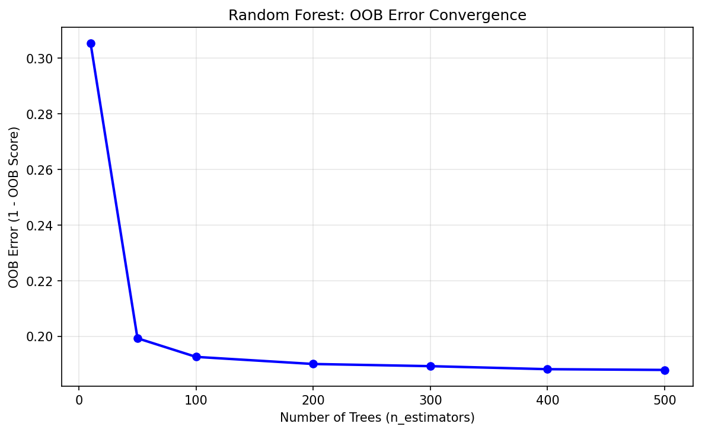

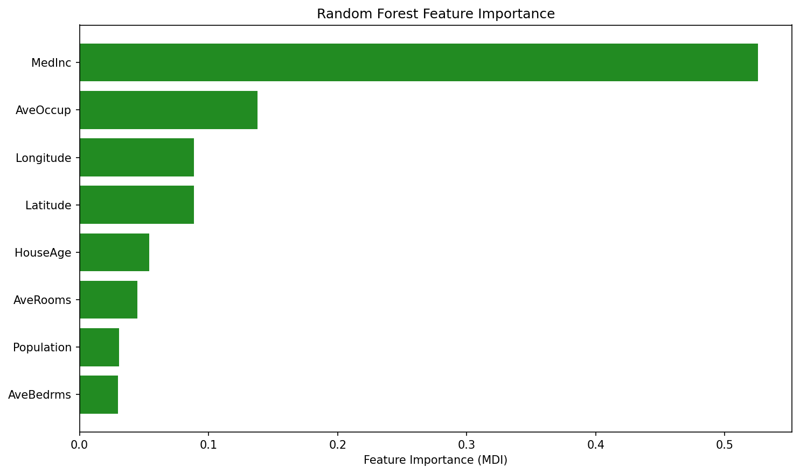

#### Step 3 — 직접 코딩

**프롬프트 1**: max_features 변경으로 다양성-정확도 트레이드오프 관찰

> `5-2-random-forest.py`의 California Housing 데이터에서 RandomForestRegressor의 max_features를 0.3, 0.5, 'sqrt', 0.7, 1.0으로 바꾸며 OOB Score, Test RMSE, 학습 시간을 비교하는 표를 출력하는 코드를 작성해줘. n_estimators=300으로 고정해줘.

결과를 기록한다:

| max_features | OOB Score | Test RMSE | 학습 시간(초) |
| ------------ | --------- | --------- | ------------- |
| 0.3 | | | |
| 0.5 | | | |
| sqrt | | | |
| 0.7 | | | |
| 1.0 | | | |

- max_features가 작을수록 트리 간 다양성은 높아지지만 개별 트리 성능은 떨어진다. 최적 균형점은 어디인가?
- max_features=1.0(전체 특성 사용)일 때와 sqrt일 때 성능 차이는 어떤가?

---

### 5.3 그래디언트 부스팅

그래디언트 부스팅은 이전 모델의 **잔차(오차)**를 새로운 모델이 학습하는 방식으로 순차적으로 성능을 개선한다. 비유하면, 첫 시험에서 틀린 문제를 정리하고, 다음 시험에서 그 부분을 집중 공부하는 것과 같다.

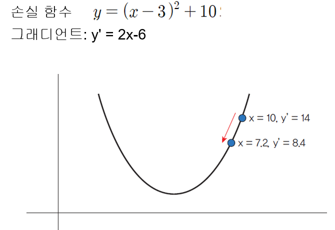

#### 3대 라이브러리

| 특성 | XGBoost | LightGBM | CatBoost |
| ---- | ------- | -------- | -------- |
| 트리 성장 | 레벨 중심 | 리프 중심 (손실 감소 최대 노드 우선) | 대칭 트리 |
| 학습 속도 | 중간 | 빠름 (GOSS + EFB) | 중간 |
| 추론 속도 | 중간 | 빠름 | 매우 빠름 |
| 범주형 처리 | 수동 인코딩 필요 | 기본 지원 | 최적화 (Ordered Target Encoding) |
| 과적합 제어 | 정규화(L1/L2) | max_depth 필수 | Ordered Boosting |
| 최적 사용 사례 | 범용, 안정성 | 대규모 데이터 | 범주형 특성 다수 |

**XGBoost 핵심**: 예측 오차(손실) + 모델 복잡도(정규화)를 동시에 최적화한다. 정규화 항이 트리가 불필요하게 복잡해지는 것을 방지한다.

**LightGBM 핵심**: GOSS(오차 큰 샘플 위주로 학습)와 EFB(희소 특성 묶기)로 계산 효율을 높인다. 리프 중심 성장으로 같은 리프 수에서 더 낮은 손실을 얻지만, max_depth 제한이 필수다.

**CatBoost 핵심**: Ordered Target Encoding으로 범주형 특성의 데이터 누수를 방지한다. 대칭 트리로 추론 속도가 매우 빠르다.

---

### 🔬 실습 2: 그래디언트 부스팅 3종 비교

#### Step 1 — 실행

`practice/chapter5/code/5-3-boosting-comparison.py`를 실행한다.

```bash
python 5-3-boosting-comparison.py
```

출력에서 아래 표를 채운다.

**성능 비교** (동일 하이퍼파라미터: n_estimators=200, max_depth=6, learning_rate=0.1):

| 모델 | RMSE | R2 | 학습 시간(초) |
| ---- | ---- | -- | ------------- |
| XGBoost | | | |
| LightGBM | | | |
| CatBoost | | | |

#### Step 2 — 이해

코드의 핵심 구조를 확인한다.

```python
# 공정 비교를 위해 동일한 하이퍼파라미터 사용
COMMON_PARAMS = {"n_estimators": 200, "max_depth": 6, "learning_rate": 0.1}

xgb_model = xgb.XGBRegressor(**COMMON_PARAMS, random_state=42)
lgb_model = lgb.LGBMRegressor(**COMMON_PARAMS, verbose=-1, random_state=42)
cat_model = CatBoostRegressor(iterations=200, depth=6, learning_rate=0.1, verbose=0)
```

- 세 라이브러리의 RMSE가 비슷한 이유: 동일 원리(그래디언트 부스팅)를 구현하므로 기본 성능이 유사
- LightGBM이 가장 빠른 이유: 히스토그램 기반 최적화(데이터를 구간으로 나누어 분할점 탐색)
- CatBoost가 가장 느린 이유: 대칭 트리 구조의 학습 비용. 대신 추론(예측) 시에는 가장 빠름
- 어떤 상황에서 어떤 라이브러리를 선택하겠는가?

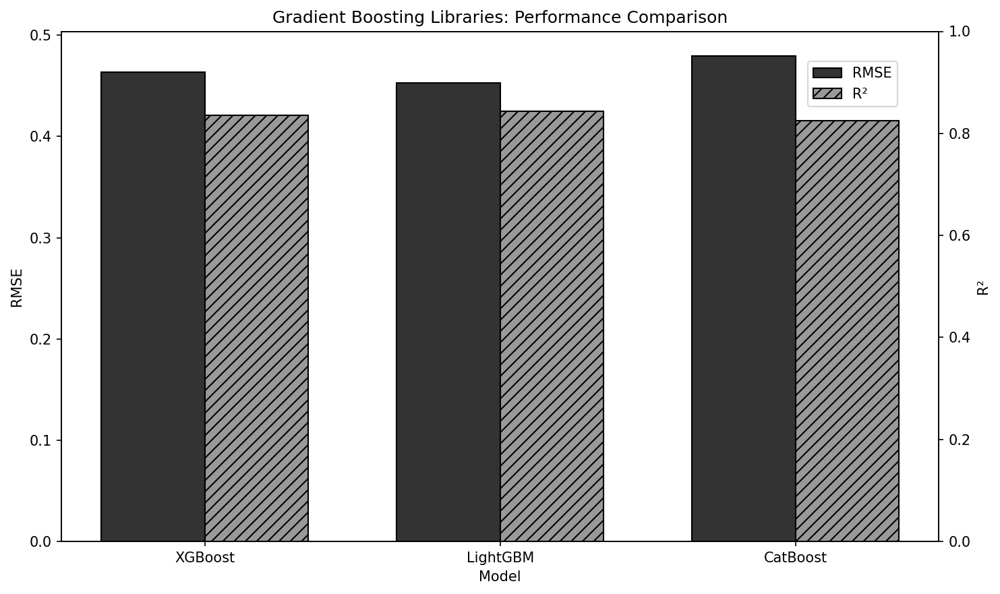

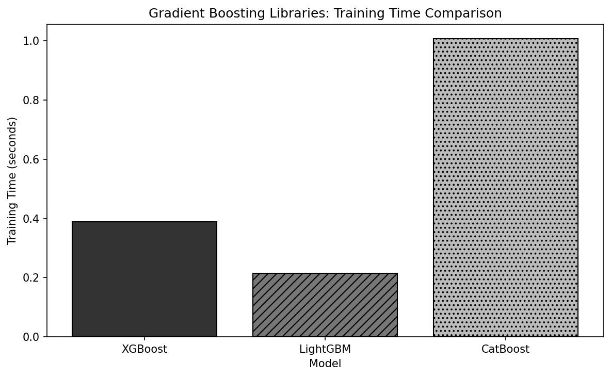

#### Step 3 — 직접 코딩

**프롬프트 2**: learning_rate 변경 실험

> `5-3-boosting-comparison.py`를 수정해서, XGBoost의 learning_rate를 0.01, 0.05, 0.1, 0.2, 0.3으로 바꾸며 RMSE와 학습 시간을 비교하는 표를 출력하는 코드를 작성해줘. n_estimators=200, max_depth=6으로 고정해줘.

결과를 기록한다:

| learning_rate | RMSE | 학습 시간(초) |
| ------------- | ---- | ------------- |
| 0.01 | | |
| 0.05 | | |
| 0.1 | | |
| 0.2 | | |
| 0.3 | | |

- learning_rate가 너무 낮으면 200개 트리로는 수렴하지 못해 RMSE가 높다. 왜인가?
- learning_rate가 너무 높으면 어떤 문제가 발생하는가? (힌트: 과적합)
- 실무에서는 learning_rate를 낮추고 n_estimators를 높이되, 조기 종료를 활용한다

---

### 5.4 하이퍼파라미터 최적화

하이퍼파라미터 탐색 방법은 크게 세 가지다.

| 방법 | 원리 | 효율 | 적합한 상황 |
| ---- | ---- | ---- | ----------- |
| 그리드 서치 | 모든 조합 시도 | 낮음 | 파라미터 2-3개 |
| 랜덤 서치 | 무작위 조합 | 중간 | 빠른 초기 탐색 |
| 베이지안 최적화 | 이전 결과 기반 지능적 선택 | 높음 | 학습 비용 큰 모델 |

**Optuna**: 베이지안 최적화 기반 프레임워크. "좋은 결과가 나왔던 영역을 더 집중 탐색"하여 효율적으로 최적 파라미터를 찾는다. 성능이 낮은 시도는 중간에 자동 중단(Pruning)하여 시간을 절약한다.

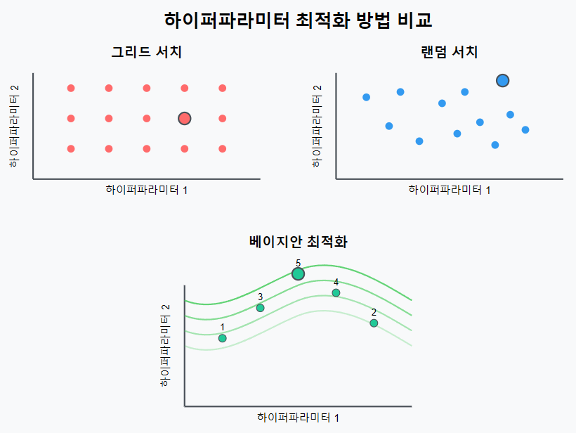

**XGBoost 튜닝 우선순위**:
1. 높음: learning_rate (0.01-0.3), max_depth (3-10), n_estimators (100-1000)
2. 중간: subsample (0.6-1.0), colsample_bytree (0.6-1.0), min_child_weight (1-10)
3. 낮음: reg_alpha, reg_lambda (1e-8~10)

---

### 🔬 실습 3: Optuna 하이퍼파라미터 최적화

#### Step 1 — 실행

`practice/chapter5/code/5-4-optuna-tuning.py`를 실행한다.

```bash
python 5-4-optuna-tuning.py
```

출력에서 아래 표를 채운다.

**최적화 결과**:

| 모델 | RMSE | R2 | 개선율(RMSE) |
| ---- | ---- | -- | ------------ |
| XGBoost 기본 | | | - |
| XGBoost 최적화 | | | |
| LightGBM 기본 | | | - |
| LightGBM 최적화 | | | |

**XGBoost 최적 파라미터** (주요 3개):

| 파라미터 | 최적값 |
| -------- | ------ |
| learning_rate | |
| max_depth | |
| n_estimators | |

#### Step 2 — 이해

코드의 핵심 구조를 확인한다.

```python
def objective(trial):
    params = {
        'n_estimators': trial.suggest_int('n_estimators', 100, 500),
        'max_depth': trial.suggest_int('max_depth', 3, 10),
        'learning_rate': trial.suggest_float('learning_rate', 0.01, 0.3, log=True),
        # ...
    }
    model = xgb.XGBRegressor(**params)
    scores = cross_val_score(model, X_train, y_train, cv=5, scoring='neg_root_mean_squared_error')
    return -scores.mean()

study = optuna.create_study(direction='minimize')
study.optimize(objective, n_trials=30)
```

- `trial.suggest_float(..., log=True)`로 learning_rate를 탐색하는 이유: 0.01~0.3 범위에서 균등 탐색하면 대부분이 큰 값에 집중됨. 로그 스케일로 작은 값도 충분히 탐색
- `cross_val_score`로 5-fold CV를 사용하는 이유: 단일 train/test 분할보다 안정적인 성능 추정
- 시각화(`optuna_optimization_history.png`)에서 초기에 RMSE 변동이 크고 후반에 수렴하는 이유: 초기에는 넓게 탐색, 후반에는 좋은 영역을 집중 탐색

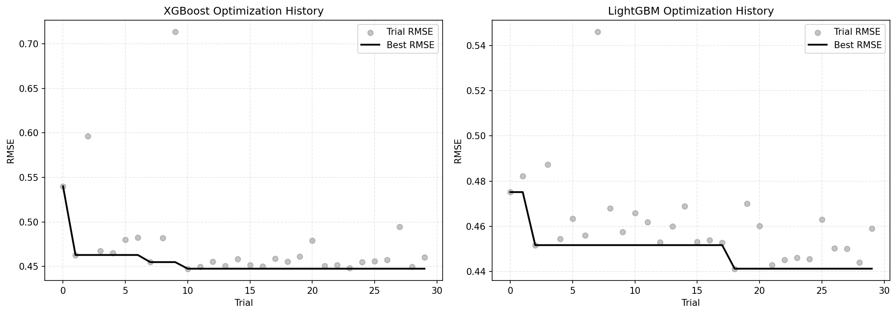

#### Step 3 — 직접 코딩

**프롬프트 3**: 조기 종료를 활용한 XGBoost 튜닝

> California Housing 데이터에서 XGBoost의 n_estimators=1000으로 크게 설정하고, early_stopping_rounds=50으로 조기 종료를 적용하여 학습하는 코드를 작성해줘. 검증 세트의 RMSE가 50라운드 동안 개선되지 않으면 자동 중단하도록 해줘. 최종 best_iteration과 테스트 RMSE를 출력해줘.

| 항목 | 값 |
| ---- | -- |
| n_estimators(설정) | 1000 |
| best_iteration(실제 사용) | |
| 테스트 RMSE | |

- 조기 종료를 사용하면 n_estimators를 직접 튜닝할 필요가 없어진다. 왜인가?
- best_iteration이 n_estimators보다 훨씬 작다면 무엇을 의미하는가?

---

### 5.5 모델 해석: SHAP, PDP, Permutation Importance

앙상블 모델은 "블랙박스"라는 인식이 있지만, 해석 기법을 적용하면 예측 근거를 파악할 수 있다.

#### 세 가지 해석 방법

| 방법 | 원리 | 장점 | 단점 |
| ---- | ---- | ---- | ---- |
| MDI (불순도 감소) | 트리 분할에서 불순도 감소량 | 빠름, 학습 시 자동 계산 | 카디널리티 높은 특성에 편향 |
| Permutation Importance | 특성값을 섞었을 때 성능 하락 | 모델 무관, 성능 기반 | 상관 특성에 분산, 계산 비용 |
| SHAP | 게임 이론의 Shapley 값 | 공정한 기여도, 개별 예측 해석 | 계산 비용 (TreeSHAP은 빠름) |

**SHAP의 핵심**: "이 예측에 각 특성이 얼마나, 어떤 방향으로 기여했는가"를 수치로 보여준다. 예: MedInc(소득)의 SHAP 값이 +0.8이면 소득이 예측값을 0.8만큼 올렸다는 뜻이다.

**PDP(부분 의존도)**: "특정 특성을 변화시킬 때 예측의 평균적 변화"를 보여주는 전역 해석 도구.

**ICE(개별 조건 기대)**: PDP의 개별 버전. 각 샘플별 곡선으로 이질성과 상호작용을 확인한다.

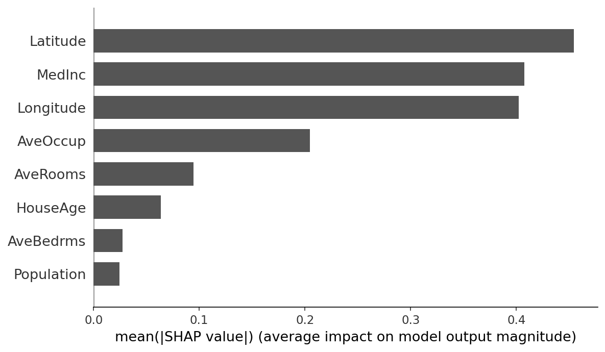

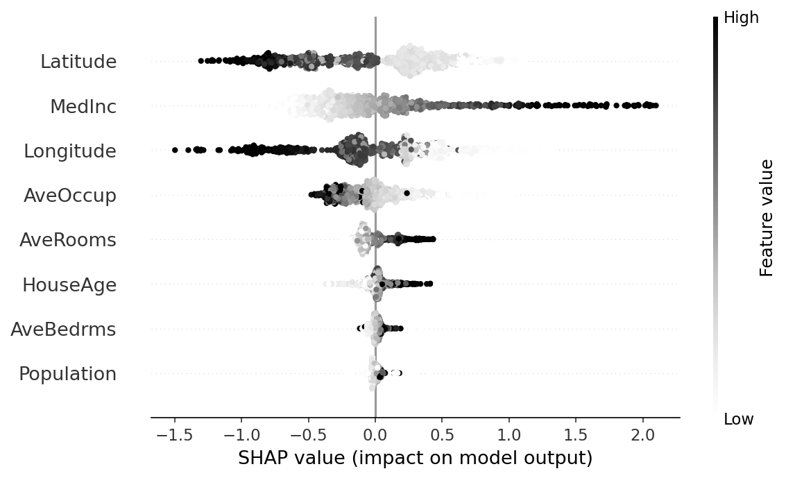

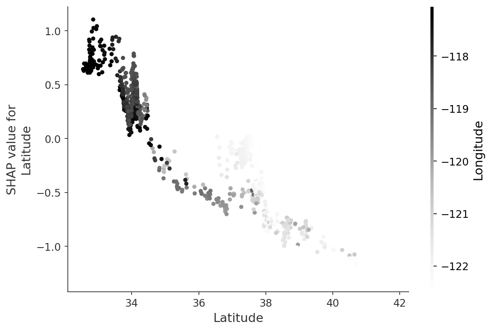

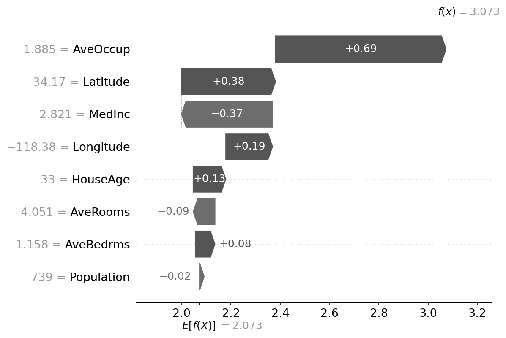

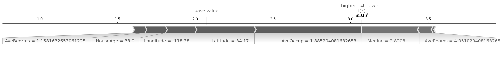

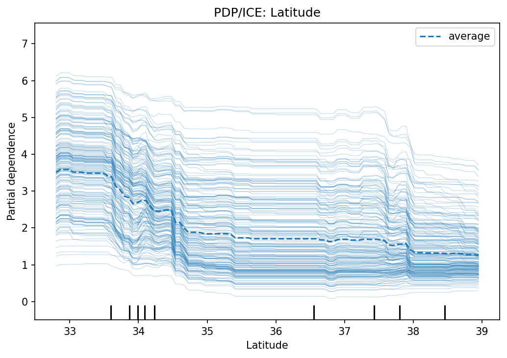

---

### 🔬 실습 4: 모델 해석 (SHAP, PDP, Permutation Importance)

#### Step 1 — 실행

`practice/chapter5/code/5-5-model-interpretation.py`를 실행한다.

```bash
python 5-5-model-interpretation.py
```

출력에서 아래 표를 채운다.

**모델 성능**:

| 항목 | 값 |
| ---- | -- |
| 테스트 RMSE | |
| 테스트 R2 | |
| SHAP 전역 중요도 Top-1 | |

**특성 중요도 비교 (상위 5개)**:

| 특성 | SHAP (평균\|값\|) | MDI (Gain) | Permutation |
| ---- | ----------------- | ---------- | ----------- |
| | | | |
| | | | |
| | | | |
| | | | |
| | | | |

#### Step 2 — 이해

코드의 핵심 구조를 확인한다.

```python
# TreeSHAP: 트리 구조를 이용한 효율적 SHAP 계산
explainer = shap.TreeExplainer(model)
shap_values = explainer.shap_values(X_sample)

# 전역 중요도 = 각 특성의 평균 |SHAP|
global_importance = np.abs(shap_values).mean(axis=0)
```

- SHAP 기준으로 Latitude(위도)가 1위이지만 MDI(Gain) 기준으로는 MedInc(소득)이 1위인 이유: MDI는 분할 빈도에 편향되고, SHAP은 기여도를 공정하게 배분
- 생성된 시각화 파일들을 확인한다:
  - `shap_summary_bar.png`: 전역 특성 중요도
  - `shap_dependence_top_feature.png`: 특성값과 SHAP의 관계
  - `pdp_ice_top_feature.png`: PDP(평균 효과)와 ICE(개별 효과)
  - `shap_waterfall_sample0.png`: 개별 예측의 단계별 분해
- PDP/ICE 그래프에서 ICE 곡선들이 넓게 퍼져 있으면 무엇을 의미하는가? (힌트: 샘플 간 이질성, 상호작용 존재)

#### Step 3 — 직접 코딩

**프롬프트 4**: SHAP 의존도 분석

> `5-5-model-interpretation.py`의 California Housing 모델에서 MedInc(중위소득) 특성에 대한 SHAP dependence plot을 그리되, 상호작용 특성을 자동으로 선택하도록 shap.dependence_plot을 사용하는 코드를 작성해줘. 그래프에서 MedInc 값과 SHAP 값의 관계, 색상으로 표시된 상호작용 특성을 해석해줘.

- MedInc가 증가할 때 SHAP 값은 어떤 패턴을 보이는가?
- 상호작용 특성(색상)은 무엇이고, 어떤 영향을 미치는가?

**프롬프트 5** (선택): 개별 예측 해석 (Waterfall Plot)

> California Housing 모델에서 테스트 데이터의 첫 5개 샘플에 대해 각각 SHAP waterfall plot을 생성하고, 가장 기여도가 큰 특성 3개를 표로 정리하는 코드를 작성해줘.

---

### 5.6 반사실적 설명 (Counterfactual Explanations)

SHAP이 "왜 이런 예측이 나왔는가"를 설명한다면, 반사실적 설명은 **"무엇을 바꾸면 예측이 달라지는가"**를 설명한다. 두 관점은 보완적이다.

**DiCE**: 여러 개의 다양한 반사실 후보를 생성한다. 같은 목표를 달성하더라도 바꿀 수 있는 변수가 여러 개일 수 있기 때문이다. 예: 대출 거절 → "소득을 500만 원 올리면 승인" 또는 "신용점수를 50점 올리면 승인" 같이 여러 대안을 제시한다.

---

### 🔬 실습 5: DiCE 반사실적 설명

#### Step 1 — 실행

`practice/chapter5/code/5-6-dice-counterfactual.py`를 실행한다.

```bash
python 5-6-dice-counterfactual.py
```

출력에서 아래 표를 채운다.

**모델 성능** (Breast Cancer 데이터):

| 항목 | 값 |
| ---- | -- |
| Accuracy | |
| ROC AUC | |
| 선택된 쿼리 인스턴스 예측 | malignant (0) |

**Counterfactual 변화량 (주요 특성)**:

| 변수 | 원본값 | counterfactual 값 | 변화량 |
| ---- | ------ | ----------------- | ------ |
| | | | |
| | | | |
| | | | |

#### Step 2 — 이해

코드의 핵심 구조를 확인한다.

```python
# DiCE: "현재 예측의 반대 클래스"로 바꾸는 counterfactual 3개 생성
dice_data = dice_ml.Data(dataframe=train_df, continuous_features=feature_cols, outcome_name="target")
dice_model = dice_ml.Model(model=model, backend="sklearn")
dice = dice_ml.Dice(dice_data, dice_model, method="random")

exp = dice.generate_counterfactuals(query_x, total_CFs=3, desired_class="opposite")
```

- malignant(악성)에서 benign(양성)으로 바뀌기 위해 가장 크게 변해야 하는 특성은? 그 이유는?
- 3개의 counterfactual이 서로 다른 특성 조합을 변경하는 이유: "다양한" 반사실을 생성하여 실현 가능한 옵션을 제시
- 실무에서 counterfactual의 활용: "대출 거절된 고객에게 어떤 조건을 개선하면 승인될 수 있는지" 안내

#### Step 3 — 직접 코딩

**프롬프트 6**: 특정 특성 고정 counterfactual

> `5-6-dice-counterfactual.py`를 수정해서, counterfactual 생성 시 worst_area와 worst_perimeter 특성은 변경하지 못하도록 제약(features_to_vary 또는 permitted_range)을 두고, 나머지 특성만으로 malignant→benign으로 바꾸는 counterfactual 5개를 생성하는 코드를 작성해줘. 변경된 특성과 변화량을 표로 출력해줘.

| cf_id | 변경된 특성 | 원본값 | counterfactual 값 | 변화량 |
| ----- | ----------- | ------ | ----------------- | ------ |
| | | | | |
| | | | | |

- 실무에서 특정 특성을 고정해야 하는 이유: "나이"처럼 조정 불가능한 변수는 제외해야 실현 가능한 제안이 됨
- 제약을 둔 counterfactual이 제약 없는 것보다 변화량이 큰 이유는?

---

### 5.7 정형 데이터: XGBoost vs 딥러닝

정형 데이터(tabular data)에서는 트리 기반 부스팅이 딥러닝보다 일관되게 우수하거나 경쟁력 있다는 연구 결과가 다수 보고되었다.

**XGBoost가 강한 이유**:
- 트리 분할이 "연소득 5천만 원 이상이면 대출 승인" 같은 임계값 기반 패턴과 잘 맞음
- 특성 간 상호작용을 트리 분할로 자연스럽게 포착
- 결측값과 이상치를 별도 전처리 없이 처리
- 수천~수만 개 샘플로도 좋은 성능

**딥러닝이 유리한 상황**:
- 샘플 수 100,000 이상 + 많은 특성
- 텍스트/이미지 등 비정형 특성과 정형 특성이 함께 존재 (멀티모달)
- 온라인 학습이 필요한 실시간 업데이트 환경

| 상황 | 권장 모델 |
| ---- | --------- |
| 샘플 < 10,000 | XGBoost/LightGBM |
| 범주형 특성 다수 | CatBoost > XGBoost |
| 텍스트/이미지 포함 | 딥러닝 (멀티모달) |
| 해석 가능성 필요 | XGBoost + SHAP |
| 빠른 프로토타이핑 | XGBoost |

---

### 5.8 앙상블 + LLM 결합 전략

LLM 임베딩을 정형 특성과 결합하면 텍스트에 담긴 감정, 의도 신호를 활용할 수 있다. 파이프라인: 텍스트 → LLM 임베딩 → PCA 차원 축소 → 정형 특성과 결합 → XGBoost 학습.

**핵심 포인트**:
- Sentence-BERT 같은 로컬 모델로 텍스트를 384차원 벡터로 변환
- PCA로 50차원으로 축소 (분산 97%+ 보존, 과적합 방지)
- 정형 특성(수치+범주) + 임베딩을 결합하여 XGBoost 입력으로 활용

---

### 🔬 실습 6: LLM 임베딩 + XGBoost 하이브리드

#### Step 1 — 실행

`practice/chapter5/code/5-8-llm-xgboost.py`를 실행한다.

```bash
pip install sentence-transformers  # 최초 1회
python 5-8-llm-xgboost.py
```

출력에서 아래 표를 채운다.

**성능 비교** (이커머스 구매 예측):

| 입력 구성 | Accuracy | ROC AUC | F1 Score |
| --------- | -------- | ------- | -------- |
| 정형 특성만 | | | |
| 정형+임베딩(하이브리드) | | | |
| 변화량 | | | |

| 항목 | 값 |
| ---- | -- |
| 전체 샘플 수 | |
| 구매 비율 | |
| 임베딩 차원 (원본) | |
| PCA 축소 후 차원 | |
| PCA 분산 설명 비율 합 | |
| 임베딩 추출 시간 | |

#### Step 2 — 이해

코드의 핵심 구조를 확인한다.

```python
# 텍스트 임베딩 추출
embedder = SentenceTransformer("all-MiniLM-L6-v2")
emb_train = embedder.encode(train_df["combined_text"].tolist())

# PCA 차원 축소: 384 → 50
pca = PCA(n_components=50)
emb_train_reduced = pca.fit_transform(emb_train)

# 정형 + 임베딩 결합
X_hybrid_train = np.hstack([X_tab_train, emb_train_reduced])
```

- Accuracy는 하락했지만 ROC AUC와 F1은 개선된 이유: 임베딩이 확률 순위와 양성 탐지에는 기여하지만, 임계값 0.5 기준의 정확도에는 노이즈로 작용 가능
- F1이 크게 개선된 이유: 리뷰 감정, 검색 키워드의 구매 의도, 문의 내용 등 텍스트 신호가 양성(구매) 탐지에 실질적 정보 제공
- PCA로 384→50으로 축소해도 분산 97%+가 보존되는 이유: 임베딩 차원 간 상관이 높아 정보가 소수 주성분에 집중

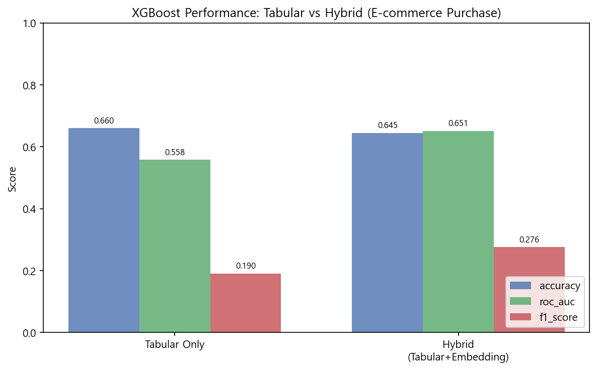

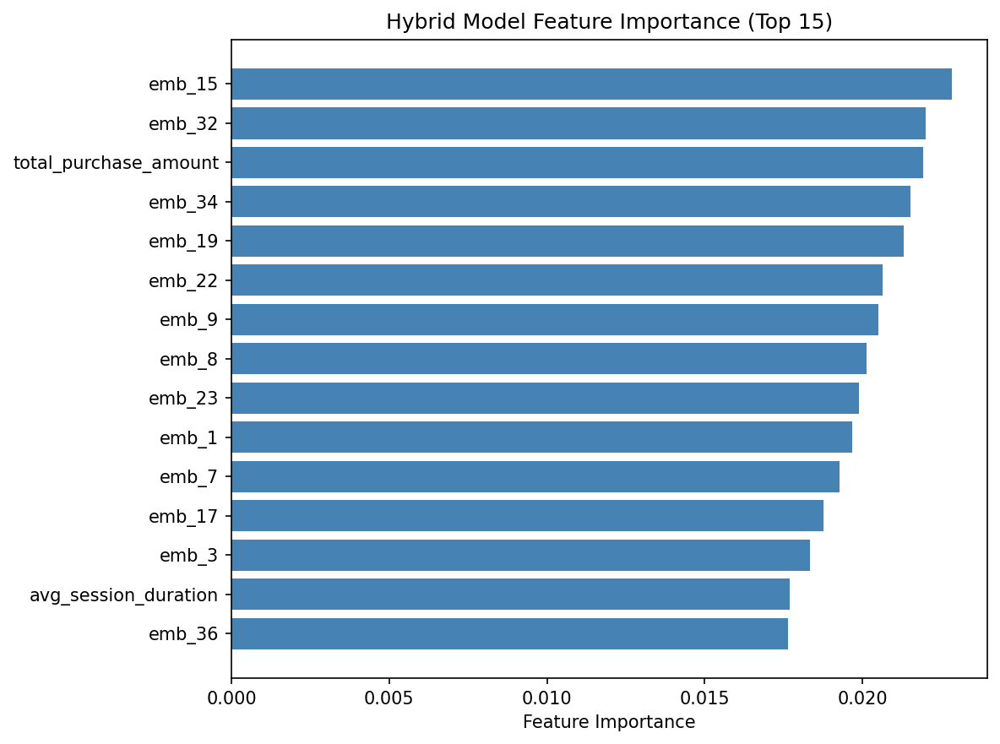

#### Step 3 — 직접 코딩

**프롬프트 7**: PCA 차원 수 변경 실험

> `5-8-llm-xgboost.py`를 수정해서, PCA n_components를 10, 20, 50, 100, 200으로 바꾸며 하이브리드 모델의 accuracy, roc_auc, f1_score를 비교하는 표를 출력하는 코드를 작성해줘.

결과를 기록한다:

| n_components | 분산 설명 비율 | Accuracy | ROC AUC | F1 Score |
| ------------ | -------------- | -------- | ------- | -------- |
| 10 | | | | |
| 20 | | | | |
| 50 | | | | |
| 100 | | | | |
| 200 | | | | |

- 차원이 너무 적으면 텍스트 정보 손실, 너무 많으면 과적합. 최적 차원은 어디인가?
- 정형 특성 수(13개)보다 임베딩 차원이 훨씬 많으면 어떤 문제가 발생하는가? (힌트: 임베딩이 모델을 지배)

**프롬프트 8** (선택): 텍스트 특성별 기여도 분석

> 이커머스 데이터에서 텍스트 특성을 (1) review_text만, (2) inquiry_text만, (3) search_keywords만, (4) 세 가지 모두 결합한 경우의 하이브리드 모델 성능을 비교하는 코드를 작성해줘. 어떤 텍스트가 구매 예측에 가장 기여하는지 분석해줘.

---

### 핵심 정리

```text
1. 배깅은 분산을 줄이고(불안정한 모델 안정화), 부스팅은 편향을 줄인다(단순한 모델 강화).
2. 랜덤 포레스트는 특성 무작위 선택으로 트리 간 다양성을 확보한다.
   OOB 평가로 별도 검증 세트 없이 일반화 성능을 추정할 수 있다.
3. XGBoost, LightGBM, CatBoost는 유사한 성능이지만 속도·범주형 처리에서 차이가 있다.
   데이터 특성과 운영 환경에 맞게 선택한다.
4. Optuna 베이지안 최적화는 그리드/랜덤 서치보다 효율적으로 최적 파라미터를 탐색한다.
5. SHAP은 공정한 기여도 배분, PDP/ICE는 전역/개별 효과 확인, Permutation은 성능 기반 중요도.
   세 방법을 함께 확인하여 일관된 패턴을 찾는다.
6. Counterfactual은 "무엇을 바꾸면 결과가 달라지는가"를 제시하여 실현 가능한 대안을 안내한다.
7. LLM 임베딩은 텍스트의 감정·의도 신호를 포착하여 정형 모델 성능을 보완할 수 있다.
   차원 축소와 운영 비용 관리가 필수다.
```

---

### 제출 기준

- ✓ 6개 제공 코드를 모두 실행하고 결과 수치를 기록했다
- ✓ Step 3의 프롬프트 중 최소 4개 이상을 AI 도구로 코드를 작성하고 실행했다
- ✓ 직접 작성한 코드와 실행 결과를 포함했다
- ✓ 각 실습의 결과를 왜 그런 결과가 나왔는지 1~2문장으로 해석했다

### 바이브 코딩 팁

- AI 도구에 프롬프트를 줄 때, **데이터와 목표를 구체적으로** 적을수록 좋은 코드가 나온다
- 생성된 코드를 그대로 실행하지 말고, **코드를 읽고 이해한 뒤** 실행한다
- 에러가 나면 에러 메시지를 AI에 다시 붙여넣어 수정을 요청한다
- 결과가 예상과 다르면 왜 다른지 AI에게 물어본다
- **AI가 생성한 코드의 결과도 반드시 검증**한다 — 이것이 이론에서 배운 원칙의 실천이다
