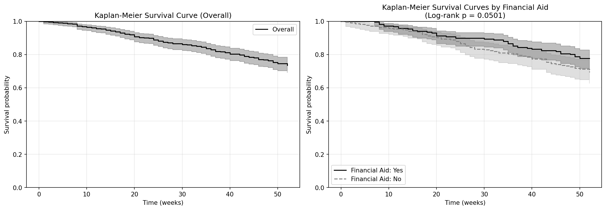
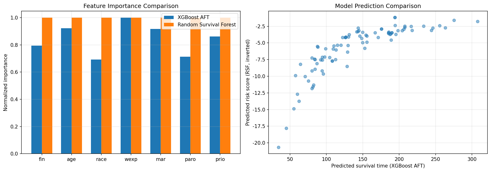

## 10주차: 생존 분석 — 이론과 실습

> **미션**: 시간-사건 데이터의 특수성을 이해하고, 중도절단을 포함한 생존 분석을 Kaplan-Meier부터 DeepSurv까지 직접 구현하고 해석할 수 있다

### 학습목표

이 수업을 마치면 다음을 수행할 수 있다:

1. 생존 분석의 개념(중도절단, 생존 함수, 위험 함수)을 설명하고, 일반 회귀/분류와의 차이를 이해한다
2. Kaplan-Meier 곡선을 해석하고 로그순위 검정으로 그룹 간 생존 차이를 비교할 수 있다
3. Cox 비례위험 모형의 위험비(Hazard Ratio)를 해석하고, 비례위험 가정을 검정할 수 있다
4. XGBoost AFT와 Random Survival Forest로 비선형 생존 분석을 수행할 수 있다
5. DeepSurv의 구조와 Cox 부분 우도 손실을 이해하고, 전통 모형 대비 장단점을 설명할 수 있다
6. 여러 생존 분석 모형의 C-index를 비교하고 상황에 맞는 모형을 선택할 수 있다

### 실습 방식

실습은 **실행 → 이해 → 직접 코딩** 3단계로 진행한다.

1. **실행**: 제공된 코드를 그대로 실행해 결과를 확인한다
2. **이해**: 코드 구조와 결과를 읽고 왜 그런 결과가 나왔는지 파악한다
3. **직접 코딩**: AI 코딩 도구(Copilot, Claude, ChatGPT 등)에 프롬프트를 주어 코드를 수정하거나 새로 작성한다

**제출 형태**: 개별 제출 — 실행 결과 + 직접 작성한 코드 + 해석

**실습 환경 준비**:

```bash
pip install lifelines scikit-survival xgboost numpy pandas matplotlib
pip install torch  # 실습 4 (DeepSurv), 실습 5 (모형 비교)
```

---

### 10.1 생존 분석 개념: "언제" 사건이 일어나는가

일반적인 분류는 "이탈할 것인가?"에만 답한다. 생존 분석은 **"언제 이탈할 것인가?"**에 답할 수 있다. 핵심은 **중도절단(Censoring)** — 아직 사건을 경험하지 않은 불완전한 관측을 버리지 않고 체계적으로 활용하는 것이다.

**비유**: 마라톤 대회에서 결승선을 통과한 사람의 기록은 정확히 안다. 하지만 중간에 퇴장한 사람은 "최소한 15km까지는 뛰었다"는 정보만 남긴다. 이 불완전한 정보를 버리면 전체 기록 분포가 왜곡된다. 생존 분석은 이 정보를 살린다.

#### 중도절단의 유형

| 유형 | 설명 | 예시 |
| ---- | ---- | ---- |
| 우측 중도절단 | 관측 종료 시점까지 사건 미발생 (가장 흔함) | 연구 종료 시 생존 환자 |
| 좌측 중도절단 | 사건이 관측 시작 이전에 이미 발생 | 감염 시점을 모르는 환자 |
| 구간 중도절단 | 사건이 두 관측 시점 사이에 발생 | 정기 검진 사이 발병 |

#### 생존 함수와 위험 함수

**생존 함수** S(t) = P(T > t): 시간 t까지 사건이 발생하지 않을 확률. S(0) = 1에서 시작하여 시간이 지나면 감소한다.

**위험 함수** h(t): 시간 t까지 생존한 대상이 바로 그 순간에 사건을 경험할 순간 확률. "지금까지 무사히 버텼는데, 바로 다음 순간에 사건이 일어날 확률은?"이라는 조건부 개념이다.

두 함수의 관계: S(t) = exp(-H(t)), 여기서 H(t) = 누적 위험 함수

#### 왜 일반 회귀/분류로는 안 되는가

| 방법 | 문제점 |
| ---- | ------ |
| 이진 분류 ("6개월 내 이탈 여부") | 아직 6개월이 안 된 고객을 처리할 수 없음 (중도절단 무시) |
| 회귀 ("생존 시간 직접 예측") | 중도절단 대상의 실제 시간을 모르므로 평균이 과소추정됨 |
| 생존 분석 | 중도절단을 체계적으로 처리하고, 시간에 따른 확률 분포를 제공 |

#### 실무 응용 분야

| 분야 | 사건 정의 | 시간 변수 | 활용 목적 |
| ---- | --------- | --------- | --------- |
| 의료 | 사망, 재발 | 진단 후 경과 시간 | 치료 효과 비교, 예후 예측 |
| 마케팅 | 고객 이탈 | 가입 후 기간 | 이탈 예측, LTV 추정 |
| 제조업 | 장비 고장 | 가동 시간 | 예방 정비 최적화 |
| 금융 | 대출 부도 | 대출 실행 후 기간 | 신용 위험 평가 |

---

### 10.2 Kaplan-Meier 추정: 분포 가정 없이 생존 곡선 그리기

Kaplan-Meier(KM) 추정량은 특정 분포를 가정하지 않는 **비모수적** 방법이다. 핵심 아이디어는 "각 사건 발생 시점에서의 조건부 생존 확률을 곱하여 누적 생존 확률을 계산"하는 것이다.

**수식**: S(t) = 각 위험 시점을 무사히 통과할 확률들의 곱

| 개념 | 의미 |
| ---- | ---- |
| 위험 집합(risk set) | 해당 시점 직전까지 생존해 있는 대상 수 |
| 중도절단 처리 | 중도절단 시점까지는 위험 집합에 포함, 이후 제외 |
| 계단 형태 | 사건 발생 시점에서만 생존 확률이 떨어짐 |
| 중앙 생존 시간 | S(t) = 0.5가 되는 시점. 50%가 사건을 경험하는 데 걸리는 시간 |

**로그순위 검정(Log-Rank Test)**: 두 그룹의 생존 곡선이 통계적으로 다른지 비교하는 비모수 검정. p-value < 0.05이면 두 그룹의 생존 경험이 유의하게 다르다고 판단한다.



---

### 🔬 실습 1: Kaplan-Meier 생존 곡선과 로그순위 검정

#### Step 1 — 실행

`practice/chapter10/code/10-2-kaplan-meier.py`를 실행한다.

```bash
cd practice/chapter10/code
python 10-2-kaplan-meier.py
```

출력에서 아래 표를 채운다.

**데이터 개요**:

| 항목 | 값 |
| ---- | -- |
| 전체 관측치 | |
| 사건 발생(재범) | |
| 중도절단 | |
| 관측 기간 | |

**주요 시점별 생존 확률**:

| 시점(주) | 전체 | 재정 지원 O | 재정 지원 X |
| -------- | ---- | ----------- | ----------- |
| 12 | | | |
| 26 | | | |
| 39 | | | |
| 52 | | | |

**로그순위 검정**:

| 항목 | 값 |
| ---- | -- |
| 검정 통계량 | |
| p-value | |
| 결론 | |

#### Step 2 — 이해

코드의 핵심 구조를 확인한다.

```python
# KaplanMeierFitter: 분포 가정 없이 생존 함수를 추정
kmf = KaplanMeierFitter()
kmf.fit(durations=data['week'], event_observed=data['arrest'])
```

- `durations`: 관측 시간 (사건 발생 또는 중도절단까지의 시간)
- `event_observed`: 사건 발생 여부 (1=재범, 0=중도절단)
- 생존 곡선이 계단식인 이유: 사건 발생 시점에서만 생존 확률이 변하기 때문
- 재정 지원 그룹의 생존 확률이 높은 이유: 경제적 안정이 재범 위험을 낮춤
- 곡선 후반부에서 신뢰구간이 넓어지는 이유: 위험 집합이 작아져 추정 불확실성이 커짐

#### Step 3 — 직접 코딩

**프롬프트 1**: 나이 그룹별 생존 곡선 비교

> `10-2-kaplan-meier.py`를 참고해서, Rossi 데이터의 나이(age)를 25세 미만/25세 이상으로 나누고, 두 그룹의 Kaplan-Meier 생존 곡선을 한 그래프에 그리고 로그순위 검정을 수행하는 코드를 작성해줘. 주요 시점(12, 26, 52주)의 생존 확률도 출력해줘.

결과를 기록한다:

| 시점(주) | 25세 미만 | 25세 이상 |
| -------- | --------- | --------- |
| 12 | | |
| 26 | | |
| 52 | | |

| 항목 | 값 |
| ---- | -- |
| 로그순위 검정 p-value | |
| 결론 | |

- 나이가 많을수록 재범 없이 생존할 확률이 높은가?
- 이 결과가 재정 지원 그룹 비교와 어떤 공통점이 있는가?

---

### 10.3 Cox 비례위험 모형: 공변량이 위험에 미치는 영향 정량화

Cox 비례위험 모형은 생존 분석에서 가장 널리 사용되는 회귀 모형이다. 핵심 아이디어: "개인의 위험 = 기본 위험 × 공변량 효과"

**모형**: h(t|X) = h₀(t) × exp(β₁X₁ + β₂X₂ + ... + βₚXₚ)

| 요소 | 의미 |
| ---- | ---- |
| h₀(t) | 기저 위험 함수. 분포를 가정하지 않음 (반모수적) |
| exp(βⱼ) | 위험비(Hazard Ratio). 변수 1단위 증가 시 위험 배수 |
| HR = 1 | 위험에 영향 없음 |
| HR > 1 | 위험 증가 |
| HR < 1 | 위험 감소 |

**비유**: 마라톤에서 "누가 먼저 완주하는지" 순위만 관찰해도 "나이가 많을수록 순위가 밀린다"는 패턴을 파악할 수 있다. Cox 모형도 사건 발생 시점에서의 상대적 비교만으로 공변량 효과를 추정한다. 기저 위험은 분자와 분모에서 약분되어 사라진다.

**비례위험 가정**: 위험비가 시간에 따라 일정해야 한다. Schoenfeld 잔차 검정으로 이 가정을 확인한다. p-value < 0.05이면 가정이 위반될 가능성이 있다.

가정 위반 시 대안:

| 대안 | 설명 |
| ---- | ---- |
| 층화 Cox 모형 | 위반 변수를 층화하여 각 층 내에서만 비례위험 가정 |
| 시간-공변량 상호작용 | 위험비가 시간에 따라 변하도록 허용 |
| AFT 모형 | 위험 대신 생존 시간 자체를 모형화 |

---

### 🔬 실습 2: Cox 비례위험 모형으로 재범 위험 요인 분석

#### Step 1 — 실행

`practice/chapter10/code/10-3-cox.py`를 실행한다.

```bash
python 10-3-cox.py
```

출력에서 아래 표를 채운다.

**Cox 모형 결과**:

| 변수 | 계수 | 위험비 | 95% CI | p-value |
| ---- | ---- | ------ | ------ | ------- |
| fin | | | | |
| age | | | | |
| race | | | | |
| wexp | | | | |
| mar | | | | |
| paro | | | | |
| prio | | | | |

**적합도**:

| 지표 | 값 |
| ---- | -- |
| C-index | |
| Log-Likelihood | |
| AIC | |

#### Step 2 — 이해

코드의 핵심 구조를 확인한다.

```python
# CoxPHFitter: 반모수적 Cox 비례위험 모형
cph = CoxPHFitter()
cph.fit(data, duration_col='week', event_col='arrest')
```

- 위험비 0.684(fin)의 의미: 재정 지원을 받은 출소자의 재범 위험이 31.6% 낮다 (1 - 0.684)
- 위험비 1.096(prio)의 의미: 전과가 1회 늘어날 때마다 재범 위험이 9.6% 증가
- 95% 신뢰구간이 1을 포함하는 변수(race, wexp, mar, paro)는 통계적으로 유의하지 않다
- C-index 0.64는 "보통 수준"의 예측력. 두 대상 중 누가 먼저 재범하는지를 64% 확률로 맞춤

#### Step 3 — 직접 코딩

**프롬프트 2**: 전과 횟수 그룹별 예측 생존 곡선

> `10-3-cox.py`의 Cox 모형을 사용해서, 전과 횟수(prio)를 0, 3, 6, 10으로 설정했을 때의 예측 생존 곡선을 한 그래프에 그리는 코드를 작성해줘. `plot_partial_effects_on_outcome`을 사용하고, 52주 시점의 생존 확률도 출력해줘.

결과를 기록한다:

| 전과 횟수 | 52주 생존 확률 |
| --------- | -------------- |
| 0 | |
| 3 | |
| 6 | |
| 10 | |

- 전과가 많을수록 생존 곡선이 어떻게 변하는가?
- 이 결과가 위험비(HR=1.096)와 일치하는가?

---

### 10.4 머신러닝 생존 분석: 비선형 관계 포착

Cox 모형은 공변량과 log-위험 간의 **선형 관계**를 가정한다. 현실에서는 비선형 관계와 복잡한 상호작용이 존재할 수 있다. 머신러닝 기반 방법은 이런 가정 없이 학습한다.

#### XGBoost AFT (Accelerated Failure Time)

생존 시간 자체의 스케일 변화를 모형화한다. 중도절단을 하한/상한(lower/upper bound)으로 표현하는 방식이 핵심이다.

- 사건 관측: 하한 = 상한 = 관측 시간
- 우측 중도절단: 하한 = 관측 시간, 상한 = 무한대 (실제 사건은 더 나중에 발생)

#### Random Survival Forest

의사결정나무의 앙상블을 생존 분석에 적용한 것이다. 각 노드에서 로그순위 검정 통계량을 기준으로 분할한다.

| 모형 | 특징 | 장점 | 단점 |
| ---- | ---- | ---- | ---- |
| XGBoost AFT | 부스팅 기반, 시간 예측 | 비선형 포착, 구현 간결 | 생존 함수 직접 출력 어려움 |
| Random Survival Forest | 앙상블 기반, 위험 점수 | 안정적, 변수 중요도 제공 | 학습 속도 느림 |



---

### 🔬 실습 3: XGBoost AFT와 Random Survival Forest

#### Step 1 — 실행

`practice/chapter10/code/10-4-ml-survival.py`를 실행한다.

```bash
python 10-4-ml-survival.py
```

출력에서 아래 표를 채운다.

**모델 성능**:

| 모형 | C-index |
| ---- | ------- |
| XGBoost AFT | |
| Random Survival Forest | |

**XGBoost AFT 변수 중요도 (상위 3개)**:

| 변수 | 중요도 |
| ---- | ------ |
| | |
| | |
| | |

#### Step 2 — 이해

코드의 핵심 구조를 확인한다.

```python
# XGBoost AFT: 중도절단을 lower/upper bound로 표현
y_lower = time.copy().astype(float)
y_upper = np.where(event == 1, time, np.inf).astype(float)

dtrain = xgb.DMatrix(X_train)
dtrain.set_float_info('label_lower_bound', y_lower_train)
dtrain.set_float_info('label_upper_bound', y_upper_train)
```

- `label_upper_bound`가 `np.inf`인 경우: 중도절단 대상으로, 실제 사건 시점은 관측 시간 이후
- Cox 모형에서 유의했던 변수(fin, age, prio)와 ML 모형의 변수 중요도를 비교해 본다
- 두 ML 모형의 C-index가 Cox와 비슷한 이유: Rossi 데이터는 432명, 7개 변수로 ML의 이점이 크지 않음

#### Step 3 — 직접 코딩

**프롬프트 3** (선택): Cox vs ML 모형 C-index 비교

> Rossi 데이터에서 Cox PH (lifelines), XGBoost AFT, Random Survival Forest 3가지 모형의 테스트 C-index를 비교하는 표를 출력하는 코드를 작성해줘. 동일한 train/test 분할(test_size=0.2, random_state=42)을 사용하고, Cox PH의 C-index도 sksurv의 `concordance_index_censored`로 계산해줘.

| 모형 | C-index |
| ---- | ------- |
| Cox PH | |
| XGBoost AFT | |
| Random Survival Forest | |

- 어떤 모형의 C-index가 가장 높은가?
- 데이터 규모가 작을 때 ML 모형이 반드시 유리한 것은 아닌 이유는?

---

### 10.5 DeepSurv: Cox 모형의 딥러닝 확장

DeepSurv는 Cox 비례위험 모형의 선형 예측자를 **심층 신경망**으로 대체한 것이다. 비선형 관계와 고차원 상호작용을 표현할 수 있다.

**구조**: 입력 → 완전연결층 + ReLU + Dropout → ... → 단일 스칼라(위험 점수)

**손실 함수**: Cox 부분 우도의 음의 로그. "사건이 발생한 시점에서, 해당 대상의 위험이 위험 집합 내 다른 대상들보다 높도록 학습"한다.

| 항목 | Cox PH | DeepSurv |
| ---- | ------ | -------- |
| 예측자 | 선형 (β₁X₁ + β₂X₂ + ...) | 신경망 f(X) |
| 비선형 관계 | 불가 | 가능 |
| 해석 가능성 | 위험비로 명확 | 낮음 (블랙박스) |
| 데이터 요구량 | 적음 | 많음 (수천 건 이상) |
| 과적합 위험 | 낮음 | 높음 (정규화 필요) |

#### 딥러닝 생존 분석 방법 비교

| 방법 | 위험 함수 | 비례위험 가정 | 적합한 상황 |
| ---- | --------- | ------------- | ----------- |
| DeepSurv | 연속 | 필요 | 비선형 관계, 중간 규모 데이터 |
| DeepHit | 이산 | 불필요 | 경쟁 위험, 비비례 위험 |
| MTLR | 이산 | 불필요 | 확률 보정 중요할 때 |
| Cox-CC | 연속 | 필요 | 대규모 데이터 |

---

### 🔬 실습 4: DeepSurv 딥러닝 생존 분석

#### Step 1 — 실행

`practice/chapter10/code/10-5-deepsurv.py`를 실행한다.

```bash
python 10-5-deepsurv.py
```

출력에서 아래 표를 채운다.

**데이터 개요**:

| 항목 | 값 |
| ---- | -- |
| 표본 수 | |
| 특성 수 | |
| 사건 발생률 | |

**성능 비교**:

| 모형 | C-index |
| ---- | ------- |
| Cox PH (테스트) | |
| DeepSurv (검증) | |
| DeepSurv (테스트) | |
| 성능 향상 | %p |

#### Step 2 — 이해

코드의 핵심 구조를 확인한다.

```python
# DeepSurv: 신경망으로 위험 점수 출력
net = nn.Sequential(
    nn.Linear(d_in, 64), nn.ReLU(), nn.Dropout(0.2),
    nn.Linear(64, 32), nn.ReLU(), nn.Dropout(0.2),
    nn.Linear(32, 16), nn.ReLU(), nn.Dropout(0.2),
    nn.Linear(16, 1)
)
risk = net(x).squeeze(-1)
loss = cox_partial_likelihood_loss(risk, time, event)
```

- 합성 데이터에 사인파, 이차 함수, S자 곡선 등 비선형 관계가 포함되어 Cox PH가 포착하기 어려움
- DeepSurv가 Cox보다 C-index가 높은 이유: 신경망이 비선형 패턴을 학습
- 검증 C-index와 테스트 C-index가 비슷하면 과적합이 없다는 신호
- 조기 종료(early stopping)가 과적합 방지에 중요한 역할

#### Step 3 — 직접 코딩

**프롬프트 4**: DeepSurv 은닉층 구조 변경 실험

> `10-5-deepsurv.py`를 수정해서, 은닉층 구조를 [32, 16], [64, 32, 16], [128, 64, 32]로 바꾸며 테스트 C-index를 비교하는 표를 출력하는 코드를 작성해줘. 각 구조의 파라미터 수도 함께 출력해줘.

결과를 기록한다:

| 은닉층 구조 | 파라미터 수 | 테스트 C-index |
| ----------- | ----------- | -------------- |
| [32, 16] | | |
| [64, 32, 16] | | |
| [128, 64, 32] | | |

- 모델이 커질수록 성능이 항상 좋아지는가?
- 데이터 크기 대비 모델 복잡도가 과적합에 미치는 영향은?

**프롬프트 5** (선택): 학습 곡선 시각화

> `10-5-deepsurv.py`의 학습 히스토리를 사용해서, 에폭별 훈련 손실과 검증 C-index를 하나의 그래프에 이중 y축으로 시각화하는 코드를 작성해줘. Cox PH의 C-index를 기준선(가로 점선)으로 표시해줘.

---

### 10.6 모형 비교 및 선택 가이드

실무에서는 단일 방법만 사용하기보다 여러 방법을 비교하여 최적의 모형을 선택한다. **C-index**(Concordance Index)는 생존 분석의 대표적 평가 지표로, 두 대상 중 누가 먼저 사건을 경험하는지를 올바르게 예측하는 비율이다. 0.5는 무작위, 1.0은 완벽한 예측이다.

#### 상황별 모형 선택 가이드

| 상황 | 추천 모형 | 이유 |
| ---- | --------- | ---- |
| 해석이 중요 (의료, 금융 규제) | Cox PH | 위험비로 명확한 해석 가능 |
| 예측력 우선, 중간 규모 데이터 | XGBoost AFT | 비선형 포착, 구현/운영 단순 |
| 대규모 데이터, 비정형 결합 | DeepSurv | 딥러닝의 표현력 활용 |
| 빠른 프로토타이핑 | Cox PH | 빠른 학습, 해석 용이 |
| 비례위험 가정 위반 | AFT 계열 | 시간 스케일 관점 |

---

### 🔬 실습 5: 4가지 모형 종합 비교

#### Step 1 — 실행

먼저 합성 데이터를 생성한 후 비교 코드를 실행한다.

```bash
python generate_survival_data.py
python 10-7-model-comparison.py
```

출력에서 아래 표를 채운다.

**모형 성능 비교**:

| 모형 | 테스트 C-index | 학습 시간(초) |
| ---- | -------------- | ------------- |
| Cox 비례위험 | | |
| XGBoost AFT | | |
| Random Survival Forest | | |
| DeepSurv | | |

| 항목 | 값 |
| ---- | -- |
| 최고 C-index 모형 | |
| 가장 빠른 모형 | |
| 데이터 크기 (N) | |
| 특성 수 (p) | |

#### Step 2 — 이해

코드의 핵심 구조를 확인한다.

```python
# C-index 계산: 모든 모형에 동일한 평가 기준 적용
risk = cph.predict_partial_hazard(test_df[feature_cols]).values
c_index = concordance_index_censored(
    test_df["event"].astype(bool), test_df["time"], risk
)[0]
```

- 고차원(100개 특성) + 비선형 합성 데이터에서 DeepSurv가 유리한 이유: 복잡한 패턴을 학습할 용량이 있음
- 성능 차이가 크지 않은 이유: 합성 데이터라도 노이즈가 존재하고, C-index는 상한이 있음
- 학습 시간도 모형 선택의 중요한 기준: Random Survival Forest가 가장 느림
- 실무에서는 예측력, 해석 가능성, 운영 비용의 균형이 중요

#### Step 3 — 직접 코딩

**프롬프트 6**: 모형별 C-index 막대 그래프

> `10-7-model-comparison.py` 실행 결과의 4가지 모형 C-index를 matplotlib 막대 그래프로 시각화하는 코드를 작성해줘. 0.5(무작위 기준선)를 가로 점선으로 표시하고, 각 막대 위에 C-index 값을 표시해줘.

| 모형 | C-index |
| ---- | ------- |
| Cox PH | |
| XGBoost AFT | |
| Random Survival Forest | |
| DeepSurv | |

- 어떤 모형이 가장 높은 C-index를 보이는가?
- 해석이 중요한 의료 연구에서도 DeepSurv를 선택할 것인가? 왜 그런가?

**프롬프트 7**: Rossi 데이터에서 4가지 모형 비교

> Rossi 재범 데이터(lifelines.datasets.load_rossi)에서 Cox PH, XGBoost AFT, Random Survival Forest, DeepSurv 4가지 모형의 테스트 C-index를 비교하는 코드를 작성해줘. 동일한 train/test 분할(test_size=0.2, random_state=42)을 사용해줘.

| 모형 | C-index (Rossi) |
| ---- | --------------- |
| Cox PH | |
| XGBoost AFT | |
| Random Survival Forest | |
| DeepSurv | |

- 합성 데이터와 Rossi 데이터에서 모형 순위가 다른가?
- 데이터가 작고(432명) 관계가 단순할 때 어떤 모형이 유리한가?

**프롬프트 8** (선택): 학습 데이터 크기에 따른 성능 변화

> 합성 데이터에서 학습 데이터 크기를 500, 1000, 2000, 4000으로 변경하며 Cox PH와 DeepSurv의 테스트 C-index를 비교하는 코드를 작성해줘. 테스트 데이터는 동일하게 1000명으로 고정해줘.

| 학습 데이터 크기 | Cox PH C-index | DeepSurv C-index |
| ---------------- | -------------- | ---------------- |
| 500 | | |
| 1000 | | |
| 2000 | | |
| 4000 | | |

- 데이터가 적을 때 어떤 모형이 더 안정적인가?
- DeepSurv가 Cox PH를 추월하는 데이터 크기의 임계점은 어디인가?

---

### 핵심 정리

```text
1. 생존 분석은 "언제" 사건이 발생하는지를 분석하며, 중도절단을 체계적으로 처리한다.
2. Kaplan-Meier는 분포 가정 없이 생존 곡선을 추정하고, 로그순위 검정으로 그룹을 비교한다.
3. Cox 비례위험 모형은 위험비(HR)로 변수의 영향을 해석한다. HR > 1이면 위험 증가.
4. ML 모형(XGBoost AFT, RSF)은 비선형 관계를 포착하지만, 데이터가 적으면 이점이 크지 않다.
5. DeepSurv는 데이터가 충분하고(수천 건+) 비선형 관계가 존재할 때 전통 모형을 초과할 수 있다.
6. 모형 선택은 예측력만이 아니라 해석 가능성, 학습 시간, 운영 비용을 함께 고려해야 한다.
```

---

### 제출 기준

- ✓ 5개 제공 코드를 모두 실행하고 결과 수치를 기록했다
- ✓ Step 3의 프롬프트 중 최소 4개 이상을 AI 도구로 코드를 작성하고 실행했다
- ✓ 직접 작성한 코드와 실행 결과를 포함했다
- ✓ 각 실습의 결과를 왜 그런 결과가 나왔는지 1~2문장으로 해석했다

### 바이브 코딩 팁

- AI 도구에 프롬프트를 줄 때, **데이터와 목표를 구체적으로** 적을수록 좋은 코드가 나온다
- 생성된 코드를 그대로 실행하지 말고, **코드를 읽고 이해한 뒤** 실행한다
- 에러가 나면 에러 메시지를 AI에 다시 붙여넣어 수정을 요청한다
- 결과가 예상과 다르면 왜 다른지 AI에게 물어본다
- **AI가 생성한 코드의 결과도 반드시 검증**한다 — 이것이 이론에서 배운 원칙의 실천이다
