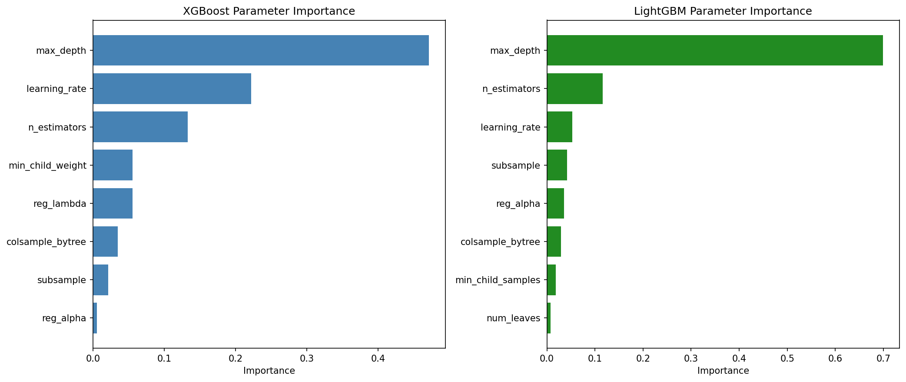

# 5장. 앙상블과 모델 해석: 정형 데이터에서 성능과 설명을 함께 잡는 법

**학습 목표: 랜덤 포레스트와 그래디언트 부스팅의 차이를 이해하고, 하이퍼파라미터 최적화, SHAP 해석, counterfactual 설명, LLM 보조 피처 설계를 하나의 정형 데이터 분석 흐름으로 연결하기**

## 이 장에서 다룰 흐름

- 앙상블이 왜 단일 모델보다 강한가
- 랜덤 포레스트와 부스팅이 편향과 분산을 어떻게 다르게 다루는가
- 하이퍼파라미터 튜닝이 성능을 어떻게 바꾸는가
- 모델 해석에서 "왜 이런 예측이 나왔는가"를 어떻게 읽는가
- counterfactual과 LLM 보조 피처가 실무에서 왜 필요한가

---

## 5.1 앙상블은 한 개의 완벽한 모델보다 여러 개의 괜찮은 모델을 잘 결합하는 발상이다

정형 데이터 분석에서 트리 기반 앙상블이 강한 이유는 단순하다. 단일 나무는 직관적이지만 불안정하다. 학습 데이터가 조금만 바뀌어도 분기 구조가 달라질 수 있다. 반대로 여러 나무를 적절히 결합하면, 한 나무의 흔들림을 다른 나무들이 평균화해 준다.

쉽게 말하면 다음과 같다.

- 단일 모델: 한 명의 전문가 의견
- 앙상블: 여러 전문가의 의견을 종합한 결론

여기서 핵심은 "많이 모으기"가 아니라 "서로 조금씩 다르게 판단하는 모델을 결합하기"다. 모든 모델이 똑같이 틀리면 앙상블도 같이 틀린다.

### 5.1.1 배깅과 부스팅은 무엇이 다른가

앙상블의 두 축은 배깅과 부스팅이다.

- **배깅(Bagging)**: 서로 다른 샘플로 여러 모델을 독립적으로 학습한 뒤 평균 또는 투표
- **부스팅(Boosting)**: 앞선 모델의 실수를 뒤의 모델이 순차적으로 보완

비유하면,

- 배깅은 각자 따로 문제를 푼 뒤 답을 모으는 방식이다.
- 부스팅은 앞사람이 틀린 문제를 다음 사람이 이어받아 고쳐 가는 방식이다.

그래서 일반적으로 다음 성격을 가진다.

<표 5-1: 배깅과 부스팅의 차이>

| 구분 | 배깅 | 부스팅 |
| ---- | ---- | ------ |
| 학습 방식 | 병렬 | 순차 |
| 주된 효과 | 분산 감소 | 편향 감소 |
| 대표 모델 | 랜덤 포레스트 | XGBoost, LightGBM, CatBoost |
| 노이즈 민감도 | 비교적 낮음 | 비교적 높음 |
| 튜닝 난이도 | 중간 | 상대적으로 높음 |

이 장에서는 정형 데이터에서 가장 많이 쓰이는 흐름을 따라간다. 먼저 랜덤 포레스트로 안정적인 베이스라인을 잡고, 이후 부스팅으로 성능을 더 끌어올리며, 마지막으로 해석과 행동 가능한 설명까지 연결한다.

---

## 5.2 랜덤 포레스트: 불안정한 나무를 많이 모아 안정성을 얻는 방법

랜덤 포레스트는 여러 개의 의사결정나무를 부트스트랩 샘플 위에서 학습시키고, 각 분할 시 일부 특성만 보게 하여 트리 간 상관을 줄인다.

이 설명이 처음에는 복잡해 보이지만 직관은 단순하다.

1. 데이터를 조금씩 다르게 뽑는다.
2. 각 트리가 볼 수 있는 특성도 조금씩 다르게 제한한다.
3. 결과를 평균낸다.

이 과정을 거치면 특정 샘플이나 특정 강한 변수 하나에 지나치게 의존하는 문제가 줄어든다.

### 5.2.1 OOB 평가는 왜 유용한가

랜덤 포레스트의 실무적 장점 하나는 OOB(Out-of-Bag) 평가다. 부트스트랩 샘플링에서는 평균적으로 일부 샘플이 특정 트리 학습에 포함되지 않는다. 그 샘플은 그 트리 입장에서는 "처음 보는 데이터"가 된다. 이를 이용해 별도의 검증 세트를 만들지 않고도 대략적인 일반화 성능을 추정할 수 있다.

즉, OOB 평가는 학습 과정 안에서 자연스럽게 생기는 작은 검증 세트다.

### 5.2.2 실습: 랜덤 포레스트로 베이스라인 만들기

[5-2-random-forest.py](/Users/callii/Documents/dataScience/practice/chapter05/code/5-2-random-forest.py)는 이 장의 가장 좋은 출발점이다.

```python
from sklearn.ensemble import RandomForestClassifier

rf = RandomForestClassifier(
    n_estimators=300,
    max_depth=None,
    oob_score=True,
    random_state=42,
)
rf.fit(X_train, y_train)
```

이 실습에서 중요한 것은 "트리를 많이 썼다"가 아니라 다음 세 가지다.

- OOB 점수가 테스트 성능과 얼마나 비슷한가
- 특성 중요도가 어떤 변수를 앞세우는가
- 단일 트리보다 결과가 얼마나 안정적인가

정형 데이터 수업에서 랜덤 포레스트를 먼저 확인하는 이유는, 이 모델이 복잡한 전처리 없이도 강한 베이스라인을 제공하기 때문이다. 또한 이후의 부스팅 결과를 비교할 기준선 역할도 한다.


이 그림을 볼 때는 트리 수가 늘수록 OOB 성능이 어느 지점에서 안정되는지, 그리고 상위 중요 변수가 도메인 직관과 얼마나 맞는지를 함께 확인해야 한다.

---

## 5.3 그래디언트 부스팅: 이전 모델의 실수를 다음 모델이 줄여 가는 방식

그래디언트 부스팅은 랜덤 포레스트보다 더 공격적으로 성능을 추구한다. 기본 발상은 이전 모델이 설명하지 못한 잔차를 다음 모델이 학습하는 것이다.


이를 수업 시간에 직관적으로 말하면 이렇다.

- 첫 번째 모델이 큰 윤곽을 맞춘다.
- 두 번째 모델은 첫 번째 모델이 틀린 부분을 더 본다.
- 세 번째 모델은 그 남은 오차를 다시 줄인다.

이 과정이 반복되면 전체 예측이 점점 정교해진다. 대신 잘못 조절하면 노이즈까지 집요하게 따라가며 과적합될 수 있다.

### 5.3.1 XGBoost, LightGBM, CatBoost는 어떤 차이가 있는가

세 라이브러리는 모두 강력하지만 성격이 조금씩 다르다.

<표 5-2: 대표적인 부스팅 라이브러리 비교>

| 모델 | 특징 | 강점 |
| ---- | ---- | ---- |
| XGBoost | 가장 널리 쓰이는 범용 부스팅 | 안정성, 생태계, 문서화 |
| LightGBM | 히스토그램 기반 학습으로 빠름 | 대규모 데이터에서 효율적 |
| CatBoost | 범주형 처리에 강함 | 범주형 특성이 많은 데이터에 유리 |

실무에서는 "무조건 최고인 모델"을 찾기보다, 데이터 특성과 운영 환경에 맞는 모델을 찾는 것이 더 현실적이다.

### 5.3.2 실습: 부스팅 3종 비교

[5-3-boosting-comparison.py](/Users/callii/Documents/dataScience/practice/chapter05/code/5-3-boosting-comparison.py)는 같은 데이터에서 부스팅 라이브러리들의 성능과 속도를 비교한다.

```python
xgb_model = xgb.XGBRegressor(n_estimators=200, max_depth=6, learning_rate=0.1)
lgb_model = lgb.LGBMRegressor(n_estimators=200, max_depth=6, learning_rate=0.1)
cat_model = CatBoostRegressor(iterations=200, depth=6, learning_rate=0.1, verbose=0)
```

실습에서 중요하게 읽어야 할 것은 두 가지다.

- 성능 차이가 실제로 얼마나 큰가
- 그 차이를 위해 학습 시간이 얼마나 더 필요한가


강의에서는 이 그림을 보고 "최고 성능"만 고르지 말고, **성능-시간-운영 복잡도**를 같이 보도록 해야 한다. 0.003의 성능 향상을 위해 학습 시간이 5배 늘어난다면, 그 선택은 상황에 따라 합리적이지 않을 수 있다.

---

## 5.4 튜닝은 옵션이 아니라 모델을 제 성능으로 쓰기 위한 과정이다

같은 XGBoost라도 하이퍼파라미터 설정에 따라 결과가 크게 달라진다. 학생들은 종종 "모델을 골랐으니 끝났다"고 생각하지만, 실제로는 그 다음이 더 중요하다.

하이퍼파라미터 튜닝은 악기의 줄을 맞추는 과정과 비슷하다. 좋은 악기도 튜닝이 엉망이면 제 소리를 못 낸다.

### 5.4.1 어떤 파라미터가 중요한가

부스팅 계열에서는 다음 파라미터가 자주 핵심 역할을 한다.

- `n_estimators`: 트리 수
- `learning_rate`: 한 번의 수정 폭
- `max_depth`: 각 트리의 복잡도
- `subsample`, `colsample_bytree`: 샘플과 특성의 부분 사용 비율
- `min_child_weight`, `reg_lambda` 등: 과적합 억제

이 파라미터들은 서로 독립적이지 않다. 예를 들어 학습률을 낮추면 보통 트리 수를 늘려야 한다. 깊은 트리를 쓰면 과적합 위험이 커지므로 서브샘플링과 정규화를 같이 봐야 한다.

### 5.4.2 실습: Optuna로 더 효율적인 탐색 수행하기

[5-4-optuna-tuning.py](/Users/callii/Documents/dataScience/practice/chapter05/code/5-4-optuna-tuning.py)는 이 장의 핵심 실습 중 하나다. 전체 조합을 무작정 시도하는 대신, 이전 결과를 바탕으로 유망한 영역을 더 자주 탐색하는 흐름을 보여 준다.

```python
import optuna

study = optuna.create_study(direction="maximize")
study.optimize(objective, n_trials=50)
best_params = study.best_params
```




이 실습을 읽을 때는 다음 순서가 좋다.

1. 기본 모델의 점수 확인
2. 탐색 과정에서 점수가 어떻게 개선되는지 확인
3. 어떤 파라미터가 성능에 가장 크게 기여했는지 확인
4. 최적화된 모델이 테스트셋에서도 개선을 유지하는지 확인

튜닝 실습에서 특히 강조해야 할 점은, 검증셋에서 좋아졌다고 바로 성공이 아니라는 것이다. 테스트셋에서도 개선이 유지되어야 진짜로 일반화 성능이 좋아진 것이다.

---

## 5.5 성능이 높아도 설명할 수 없으면 현업에서는 막히는 경우가 많다

모델이 높은 점수를 냈다고 해서 바로 배포할 수 있는 것은 아니다. 특히 금융, 의료, 공공, 운영 의사결정에서는 다음 질문이 거의 반드시 나온다.

- 왜 이런 예측이 나왔는가
- 어떤 변수가 특히 크게 작용했는가
- 이 결과를 바꾸려면 무엇이 달라져야 하는가

이 질문에 답하지 못하면, 모델은 성능이 좋아도 신뢰를 얻기 어렵다.

### 5.5.1 실습: SHAP으로 예측 근거 읽기

[5-5-model-interpretation.py](/Users/callii/Documents/dataScience/practice/chapter05/code/5-5-model-interpretation.py)는 전역 해석과 국소 해석을 함께 보여 준다.

```python
import shap

explainer = shap.TreeExplainer(model)
shap_values = explainer.shap_values(X_test)
```

SHAP을 읽을 때는 크게 두 가지를 나눠야 한다.

- **전역 해석**: 전체 데이터에서 어떤 변수가 자주 중요했는가
- **국소 해석**: 특정 샘플 하나에서 어떤 변수가 예측을 올리거나 내렸는가


이 그림들을 볼 때는 "중요한 변수 목록"만 보는 데서 멈추면 안 된다. 어떤 값의 방향이 예측을 올리는지, 특정 구간에서 효과가 급격히 바뀌는지, 변수 간 상호작용이 보이는지를 함께 봐야 한다.

### 5.5.2 PDP와 ICE는 왜 같이 봐야 하는가

부분 의존도(PDP)는 한 변수가 평균적으로 예측을 어떻게 바꾸는지 보여 준다. 그러나 평균만 보면 개별 샘플 간 차이가 사라질 수 있다. ICE는 각 샘플이 그 변수 변화에 어떻게 반응하는지 보여 준다. 즉, PDP는 전체 경향을, ICE는 개별 반응의 다양성을 보여 준다.

이 차이를 이해하면 "평균적으로는 그렇다"와 "개별적으로는 다를 수 있다"를 동시에 말할 수 있다.


---

## 5.6 counterfactual 설명은 "왜"를 넘어서 "무엇을 바꾸면 되는가"를 묻는다

SHAP은 예측의 원인을 설명하는 데 강하다. 그러나 현업 사용자는 종종 다른 질문을 한다.

**그럼 결과를 바꾸려면 무엇을 얼마나 바꾸면 되는가?**

이 질문에 답하는 것이 counterfactual explanation이다.

예를 들어 대출 거절 예측이 나왔을 때,

- 소득이 얼마나 더 높아져야 하는가
- 기존 부채가 얼마나 줄어야 하는가
- 신용 사용률이 얼마나 낮아져야 하는가

같은 질문에 답할 수 있다. 이런 설명은 단순 해석보다 훨씬 행동 가능하다.

### 5.6.1 실습: DiCE로 counterfactual 생성하기

[5-6-dice-counterfactual.py](/Users/callii/Documents/dataScience/practice/chapter05/code/5-6-dice-counterfactual.py)는 모델 예측을 뒤집는 최소 변화 조합을 찾는다.

강의에서 이 실습을 볼 때는 다음을 확인해야 한다.

- 제안된 변화가 현실적으로 가능한가
- 너무 많은 변수를 동시에 바꾸라고 하지는 않는가
- 변경 폭이 실제 업무 규칙과 충돌하지 않는가

counterfactual은 매우 직관적이지만, 항상 실행 가능한 조언을 주는 것은 아니다. 예를 들어 "나이를 줄이세요" 같은 비현실적인 제안이 나올 수 있다. 따라서 허용 가능한 변수와 고정해야 할 변수를 함께 설계해야 한다.

---

## 5.7 LLM은 정형 데이터 모델의 대체재라기보다 보조 엔진에 가깝다

LLM이 강력하다고 해서 정형 데이터 모델을 바로 대체하는 것은 아니다. 정형 데이터 예측에서는 여전히 XGBoost나 LightGBM이 매우 강력하다. 대신 LLM은 다음 역할에서 유용하다.

- 텍스트 설명을 구조화된 피처로 바꾸기
- 새로운 피처 아이디어를 제안하기
- 해석 결과를 사람이 읽기 쉬운 문장으로 정리하기

즉, LLM은 모델 그 자체라기보다 **모델 주변의 입력 설계와 해석을 보조하는 도구**로 보는 것이 현실적이다.

### 5.7.1 실습: LLM 보조 피처와 XGBoost 결합

[5-8-llm-xgboost.py](/Users/callii/Documents/dataScience/practice/chapter05/code/5-8-llm-xgboost.py)는 LLM이나 텍스트 임베딩에서 얻은 정보를 정형 데이터 피처와 결합해 성능과 해석을 어떻게 바꿀 수 있는지 보여 준다.


이 실습에서 핵심은 "LLM을 썼다"가 아니라, **텍스트의 의미를 구조화된 입력으로 바꾸어 트리 모델에 연결했다**는 점이다.

강의에서는 이 질문을 분명히 해야 한다.

- 원래 정형 변수만으로는 놓치던 정보를 텍스트가 보완했는가
- LLM이 만든 피처가 안정적인가
- 운영 환경에서 같은 피처를 계속 재현할 수 있는가

---

## 5.8 정리

정형 데이터 분석에서 좋은 모델링은 높은 점수만으로 끝나지 않는다. 성능을 올리고, 과적합을 제어하고, 결과를 설명하고, 실제 행동으로 연결해야 한다.

```text
1. 앙상블은 여러 모델의 판단을 결합해 단일 모델의 약점을 줄인다.
2. 랜덤 포레스트는 안정적 베이스라인, 그래디언트 부스팅은 높은 성능 추구에 강하다.
3. 튜닝은 선택이 아니라 모델을 제 성능으로 쓰기 위한 과정이다.
4. SHAP과 PDP/ICE는 예측 근거를 읽는 데 중요하다.
5. counterfactual 설명은 결과를 바꾸기 위한 최소 변화를 제안한다.
6. LLM은 정형 데이터 모델을 대체하기보다 피처 설계와 해석을 보조하는 데 강하다.
```

## 실습 연결

이 장의 실습은 아래 순서로 읽으면 자연스럽다.

1. [5-2-random-forest.py](/Users/callii/Documents/dataScience/practice/chapter05/code/5-2-random-forest.py): 안정적인 베이스라인과 OOB 평가
2. [5-3-boosting-comparison.py](/Users/callii/Documents/dataScience/practice/chapter05/code/5-3-boosting-comparison.py): 부스팅 모델의 성능과 속도 비교
3. [5-4-optuna-tuning.py](/Users/callii/Documents/dataScience/practice/chapter05/code/5-4-optuna-tuning.py): 튜닝으로 성능을 다듬는 과정
4. [5-5-model-interpretation.py](/Users/callii/Documents/dataScience/practice/chapter05/code/5-5-model-interpretation.py): 전역 해석과 국소 해석
5. [5-6-dice-counterfactual.py](/Users/callii/Documents/dataScience/practice/chapter05/code/5-6-dice-counterfactual.py): 행동 가능한 설명
6. [5-8-llm-xgboost.py](/Users/callii/Documents/dataScience/practice/chapter05/code/5-8-llm-xgboost.py): LLM 보조 피처의 활용
