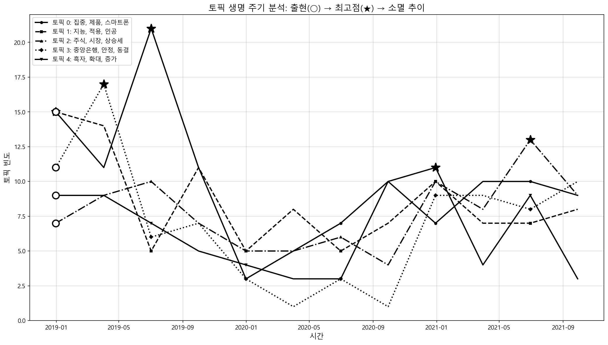

# 6장. 토픽 모델링: 문서 더미에서 주제를 읽는 방법

**학습 목표: 토픽 모델링이 군집화와 무엇이 다른지 이해하고, LDA, BERTopic, LLM 라벨링, 동적 토픽, 멀티모달 토픽 분석을 실제 문서 분석 흐름으로 연결하기**

## 이 장에서 다룰 흐름

- 토픽 모델링이 어떤 문제를 해결하는가
- 군집화와 토픽 모델링은 무엇이 다른가
- LDA가 단어 빈도로 주제를 추론하는 방법
- BERTopic이 의미 기반으로 토픽을 찾는 방법
- LLM과 멀티모달 정보가 토픽 분석을 어떻게 확장하는가

---

## 6.1 토픽 모델링은 많은 문서를 짧은 지도로 바꾸는 작업이다

문서가 수천 건을 넘기면 사람이 하나씩 읽는 방식은 곧 한계에 부딪힌다. 고객 리뷰, 민원, 뉴스, 논문 초록처럼 텍스트가 대량으로 쌓이는 문제에서는 먼저 "무슨 이야기가 반복되고 있는가"를 요약할 필요가 있다. 토픽 모델링은 바로 이 질문에 답하는 방법이다.

쉽게 말하면 토픽 모델링은 문서 더미를 큰 선반 몇 개로 정리하는 일이다. 도서관 사서가 책을 읽고 경제, 교육, 의료, 스포츠 선반을 만드는 것과 비슷하다.

하지만 군집화와 완전히 같지는 않다. 토픽 모델링은 단순히 비슷한 문서를 묶는 것에 그치지 않고, **그 묶음을 어떤 주제로 설명할 수 있는가**까지 함께 본다.

### 6.1.1 군집화와 토픽 모델링의 차이

4장에서 배운 군집화는 보통 한 문서를 하나의 군집에 넣는 하드 할당에 가깝다. 반면 토픽 모델링은 한 문서가 여러 토픽의 혼합일 수 있다고 본다.

예를 들어,

- "배송은 늦었지만 품질은 만족한다"는 리뷰는
- 배송 토픽과 품질 토픽을 동시에 가진다.

<표 6-1: 군집화와 토픽 모델링 비교>

| 구분 | 군집화 | 토픽 모델링 |
| ---- | ------ | ----------- |
| 기본 질문 | 어떤 그룹으로 묶을 것인가 | 어떤 주제들이 섞여 있는가 |
| 문서 할당 | 보통 하나의 군집 | 여러 토픽의 혼합 가능 |
| 핵심 산출물 | 군집 레이블 | 토픽-단어 분포, 문서-토픽 분포 |
| 대표 방법 | K-Means, HDBSCAN | LDA, BERTopic |

즉, 군집화는 "어느 방에 넣을 것인가"에 가깝고, 토픽 모델링은 "이 문서는 어떤 재료가 섞인 글인가"를 보는 데 더 가깝다.

### 6.1.2 토픽 모델링이 실제로 중요한 이유

토픽 모델링은 다음과 같은 장면에서 바로 쓰인다.

- VOC 분석: 고객 불만이 배송, 품질, 가격, CS 중 어디에 몰리는가
- 뉴스 분석: 어떤 이슈가 최근 부상하는가
- 논문 분석: 어떤 연구 주제가 늘고 줄어드는가
- 커뮤니티 분석: 반복되는 질문과 불만 유형이 무엇인가

핵심은 단순 요약이 아니다. 많은 문서를 읽기 전에 **문제 공간을 구조화해 주는 전처리 지도**라는 점이 중요하다.

---

## 6.2 LDA: 단어가 함께 나오는 패턴으로 숨은 토픽을 추론하는 고전적 방법

LDA는 토픽 모델링의 출발점이다. 아이디어는 의외로 직관적이다.

- 각 문서는 여러 토픽의 혼합이다.
- 각 토픽은 특정 단어들이 자주 함께 나타나는 패턴이다.

예를 들어 "금리, 대출, 은행, 투자"가 함께 자주 나타나면 금융 토픽으로, "학생, 수업, 교사, 시험"이 자주 나타나면 교육 토픽으로 볼 수 있다.

### 6.2.1 LDA를 비유로 이해하기

문서를 하나의 요리라고 생각해 보자.

- 토픽은 재료 묶음이다.
- 문서는 여러 재료를 섞어 만든 요리다.

어떤 요리는 금융 재료가 70%, 정책 재료가 30%일 수 있다. 어떤 글은 교육 재료와 정치 재료가 섞여 있을 수 있다. LDA는 완성된 요리만 보고 "어떤 재료가 어느 정도 들어갔는지"를 거꾸로 추정한다.

이 비유를 이해하면 LDA의 핵심을 대부분 이해한 것이다.

### 6.2.2 LDA의 장점과 한계

LDA는 지금도 중요한 출발점이다. 이유는 명확하다.

- 확률적 해석이 가능하다
- 문서가 여러 토픽의 혼합이라는 구조를 잘 보여 준다
- 계산 비용이 비교적 낮다

하지만 한계도 분명하다.

- Bag-of-Words 기반이라 문맥을 잘 반영하지 못한다
- 짧은 문서에서는 단어 통계가 부족해 불안정하다
- 토픽 수 `K`를 보통 미리 정해야 한다

즉, LDA는 "같이 자주 나오는 단어"에는 강하지만, "비슷한 의미를 다른 표현으로 쓰는 문장"에는 약하다.

### 6.2.3 실습: LDA 기본 흐름 확인

[6-2-lda-basics.py](/Users/callii/Documents/dataScience/practice/chapter06/code/6-2-lda-basics.py)는 토픽 모델링의 가장 전통적인 흐름을 보여 준다.

```python
from gensim import corpora
from gensim.models import LdaModel

dictionary = corpora.Dictionary(tokenized_docs)
corpus = [dictionary.doc2bow(doc) for doc in tokenized_docs]
lda = LdaModel(corpus=corpus, id2word=dictionary, num_topics=5)
```

이 실습을 볼 때는 다음을 확인해야 한다.

1. 토픽별 상위 단어가 얼마나 일관적인가
2. 한 문서가 여러 토픽의 혼합으로 읽히는가
3. `num_topics`를 바꾸면 결과가 얼마나 달라지는가

LDA 결과를 읽을 때 학생들이 자주 실수하는 부분은, 상위 키워드를 보고 너무 빨리 토픽 이름을 단정하는 것이다. 단어 목록은 힌트이지 최종 해석이 아니다. 대표 문서를 함께 읽어야 한다.

---

## 6.3 BERTopic: 의미가 가까운 문서를 먼저 묶고 그 묶음을 토픽으로 읽는 접근

LDA가 단어 빈도 기반이라면 BERTopic은 의미 기반 접근에 가깝다. 문장을 임베딩으로 바꾸고, 그 임베딩 공간에서 비슷한 문서를 군집화한 뒤, 각 군집을 대표하는 키워드를 뽑아 토픽으로 해석한다.

즉, BERTopic은 한 문장으로 정리하면 다음 흐름이다.

**임베딩 -> 차원 축소 -> HDBSCAN 군집화 -> c-TF-IDF 키워드 추출**

이 구조 때문에 BERTopic은 4장에서 배운 임베딩 기반 군집화와 6장의 토픽 해석이 결합된 형태로 이해하면 좋다.

### 6.3.1 BERTopic이 LDA보다 유리한 경우

BERTopic은 다음 상황에서 특히 강하다.

- 짧은 리뷰, 댓글, 트윗처럼 문서가 짧을 때
- 같은 뜻을 다른 단어로 표현하는 경우가 많을 때
- 토픽 수를 미리 알기 어려울 때
- 문맥 차이를 반영하고 싶을 때

반대로 임베딩 생성 비용이 크고, 군집화와 후처리 과정이 추가되므로 계산량은 더 무겁다.

<표 6-2: LDA와 BERTopic의 직관적 비교>

| 항목 | LDA | BERTopic |
| ---- | --- | -------- |
| 입력 표현 | 단어 빈도 | 문장 임베딩 |
| 문맥 반영 | 약함 | 강함 |
| 짧은 문서 처리 | 불리함 | 비교적 유리함 |
| 토픽 수 결정 | 보통 사전 지정 | 자동 결정 가능 |
| 계산 비용 | 상대적으로 낮음 | 상대적으로 높음 |

### 6.3.2 실습: BERTopic으로 현대적 토픽 분석 수행하기

[6-3-bertopic-intro.py](/Users/callii/Documents/dataScience/practice/chapter06/code/6-3-bertopic-intro.py)는 BERTopic의 전형적인 흐름을 보여 준다.

```python
from bertopic import BERTopic

topic_model = BERTopic(language="multilingual")
topics, probs = topic_model.fit_transform(documents)
```

이 실습에서는 단순히 "토픽 몇 개가 나왔는가"보다 다음이 더 중요하다.

- `-1` 노이즈 토픽이 얼마나 나오는가
- 각 토픽의 대표 단어가 실제 대표 문서와 맞는가
- 비슷한 토픽이 과하게 쪼개지지는 않았는가

BERTopic은 내부적으로 HDBSCAN을 쓰기 때문에, 모든 문서를 억지로 토픽에 넣지 않는다. 이것은 단점이 아니라 장점일 수 있다. 애매한 문서를 노이즈로 남겨 두면 더 정직한 토픽 구조가 나온다.

---

## 6.4 토픽 이름 붙이기는 자동화할 수 있지만, 검토는 여전히 사람이 해야 한다

LDA나 BERTopic 결과는 보통 키워드 목록으로 나온다.

- `배송, 지연, 택배, 도착`
- `품질, 불량, 만족, 재구매`

사람은 이를 보고 "배송 이슈", "품질 평가" 같은 이름을 붙인다. 이 과정은 생각보다 손이 많이 간다. 그래서 LLM을 활용한 자동 라벨링이 등장한다.

### 6.4.1 실습: LLM으로 토픽 라벨링 보조하기

[6-4-llm-labeling.py](/Users/callii/Documents/dataScience/practice/chapter06/code/6-4-llm-labeling.py)는 토픽 키워드와 대표 문서를 바탕으로 사람이 읽기 쉬운 토픽 이름을 생성하는 과정을 보여 준다.

강의에서 이 실습을 설명할 때는 다음을 분명히 해야 한다.

- LLM이 붙인 이름은 편리하지만 정답은 아니다
- 지나치게 그럴듯한 이름을 붙이며 과잉 해석할 수 있다
- 따라서 키워드와 대표 문서로 반드시 교차 검토해야 한다

즉, LLM은 라벨링을 자동화하지만, **의미를 최종 승인하는 역할까지 대신하지는 않는다.**

### 6.4.2 BERTopic과 LLM을 결합하면 무엇이 달라지는가

[6-5-bertopic-gpt.py](/Users/callii/Documents/dataScience/practice/chapter06/code/6-5-bertopic-gpt.py)는 의미 기반 토픽 구조와 생성형 라벨링을 결합한다.

이 흐름의 장점은 명확하다.

- 토픽 구조는 데이터 기반으로 만들고
- 토픽 이름은 사람 친화적으로 정리할 수 있다

다만 주의할 점도 분명하다.

- 토픽 수가 너무 많으면 라벨링 비용이 커진다
- 대표 문서 선택이 편향되면 라벨도 왜곡된다
- 동일한 토픽도 프롬프트에 따라 이름이 달라질 수 있다

---

## 6.5 시간 축을 넣으면 "무슨 주제가 있는가"에서 "언제 커졌는가"까지 보인다

토픽 분석이 정말 유용해지는 순간은 시간 축이 들어갈 때다. 단순히 "무슨 주제가 있는가"만 보는 것이 아니라, "어떤 주제가 언제 커지고 줄어드는가"를 볼 수 있게 된다.

예를 들어,

- 배송 불만이 특정 월에 급증했는가
- 특정 사건 이후 안전 이슈가 증가했는가
- 연구 초록에서 생성형 AI 관련 토픽이 언제부터 급증했는가

이 질문은 단순 키워드 빈도보다 더 강한 인사이트를 준다.



이 그림은 토픽 모델링이 정적인 분류표가 아니라, 시간에 따라 움직이는 흐름도라는 점을 보여 준다.

---

## 6.6 멀티모달 토픽 분석은 텍스트만으로 설명되지 않는 차이를 보완한다

어떤 데이터는 텍스트만 보면 충분하지 않다. 패션 상품을 예로 들면 "검은 드레스"와 "격식 있는 드레스"라는 설명만으로는 스타일 차이가 다 드러나지 않을 수 있다. 이미지까지 보면 소재, 실루엣, 포멀함이 더 잘 드러난다.

그래서 최근 토픽 분석은 텍스트와 이미지를 함께 보는 멀티모달 방향으로 확장된다.

### 6.6.1 실습: 텍스트와 이미지 정보를 함께 사용하기

[6-6-multimodal-topics.py](/Users/callii/Documents/dataScience/practice/chapter06/code/6-6-multimodal-topics.py)는 텍스트 설명과 이미지 정보를 같이 활용해 더 풍부한 토픽 구조를 만든다. 이 실습은 단순 성능 경쟁보다, **어떤 정보가 빠져 있었는지를 확인하는 실습**으로 읽는 것이 좋다.

예를 들어 텍스트로는 모두 "가방"이라고 적혀 있어도, 이미지 정보가 들어가면 토트백, 크로스백, 클러치처럼 더 자연스럽게 분리될 수 있다.

강의에서는 이 질문을 던지면 좋다.

- 텍스트만으로 헷갈리던 항목이 이미지로 분리되는가
- 반대로 이미지가 비슷하지만 설명 문구가 다른 경우는 어떻게 처리되는가
- 분석 목적이 기능 분류인지, 스타일 분류인지에 따라 어떤 모달이 더 중요한가

---

## 6.7 토픽 모델링 결과를 해석할 때 자주 생기는 착시

토픽 모델링은 보기 좋은 결과를 만들기 쉬운 대신, 과신하기도 쉽다. 다음 세 가지를 특히 경계해야 한다.

### 6.7.1 키워드 몇 개만 보고 토픽을 단정하는 착시

상위 키워드는 출발점일 뿐이다. 대표 문서를 함께 읽지 않으면 토픽 해석이 빗나갈 수 있다.

### 6.7.2 토픽 수가 많을수록 정교하다고 착각하는 문제

토픽을 너무 많이 만들면 실제로는 같은 주제가 잘게 쪼개질 수 있다. 반대로 너무 적으면 다른 주제가 섞인다. 적절한 토픽 수는 일관성 점수와 해석 가능성의 균형에서 정해진다.

### 6.7.3 보기 좋은 이름이 실제 구조를 가리는 문제

LLM이 멋진 라벨을 붙여도, 그 라벨이 실제 문서 집합을 충실히 설명하는지는 별개의 문제다.

결국 토픽 분석은 "자동 요약"이 아니라 **자동 구조화 + 사람의 검토**로 이해하는 것이 정확하다.

---

## 6.8 정리

토픽 모델링은 대량의 텍스트를 읽기 전, 문제 공간을 먼저 구조화하는 방법이다. 이 장의 핵심은 각 방법이 주제를 어떤 방식으로 발견하는지 이해하는 데 있다.

```text
1. 토픽 모델링은 많은 문서를 몇 개의 주제로 요약해 읽기 쉽게 만든다.
2. LDA는 단어 빈도 기반이라 해석이 직관적이지만 문맥 반영에는 한계가 있다.
3. BERTopic은 임베딩과 군집화를 결합해 의미 기반 토픽을 찾는다.
4. LLM은 토픽 라벨링을 자동화할 수 있지만 과잉 해석을 경계해야 한다.
5. 시간 축을 넣으면 토픽의 등장과 쇠퇴를 함께 읽을 수 있다.
6. 멀티모달 토픽 분석은 텍스트만으로 놓치던 구조를 보완한다.
```

## 실습 연결

이 장의 실습은 아래 순서로 읽으면 흐름이 자연스럽다.

1. [6-2-lda-basics.py](/Users/callii/Documents/dataScience/practice/chapter06/code/6-2-lda-basics.py): 단어 빈도 기반 토픽 추론
2. [6-3-bertopic-intro.py](/Users/callii/Documents/dataScience/practice/chapter06/code/6-3-bertopic-intro.py): 의미 기반 토픽 발견
3. [6-4-llm-labeling.py](/Users/callii/Documents/dataScience/practice/chapter06/code/6-4-llm-labeling.py): 자동 라벨링 보조
4. [6-5-bertopic-gpt.py](/Users/callii/Documents/dataScience/practice/chapter06/code/6-5-bertopic-gpt.py): BERTopic과 생성형 AI 결합
5. [6-6-multimodal-topics.py](/Users/callii/Documents/dataScience/practice/chapter06/code/6-6-multimodal-topics.py): 텍스트와 이미지의 통합 토픽 분석
