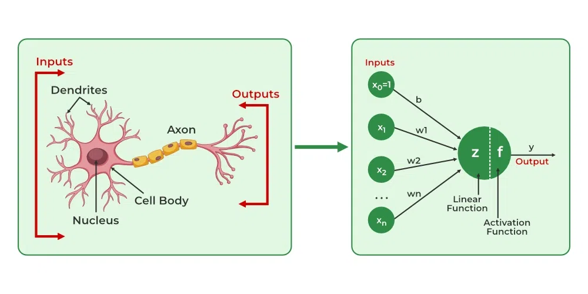
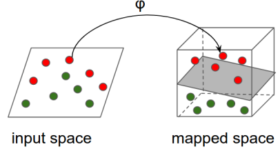
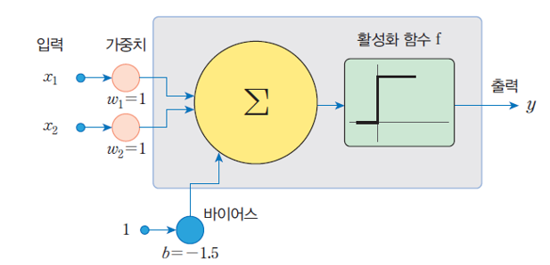
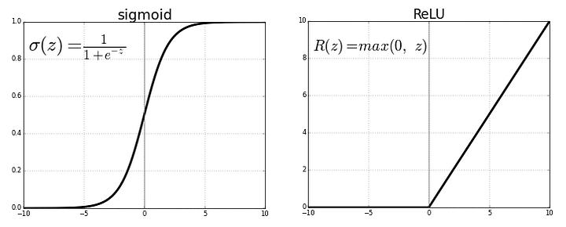
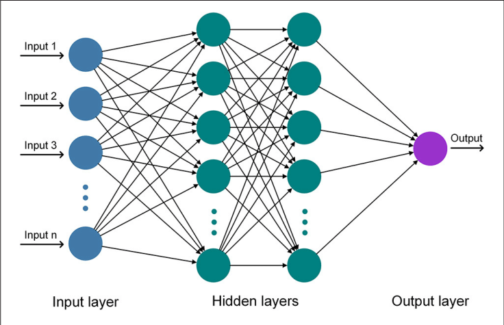
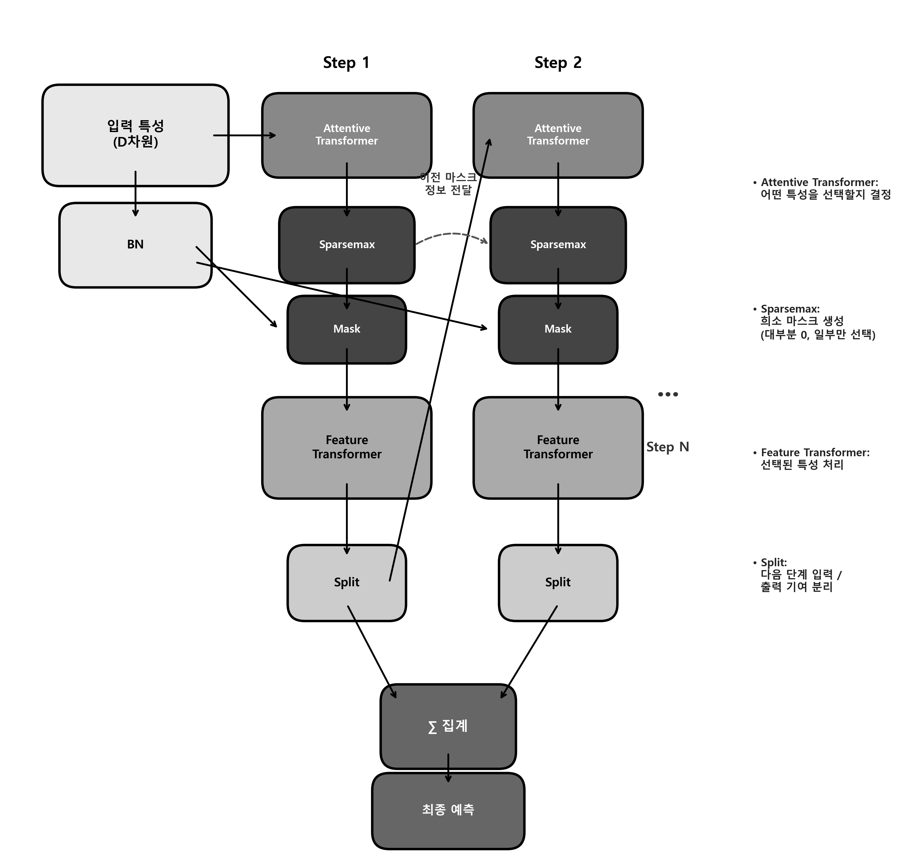
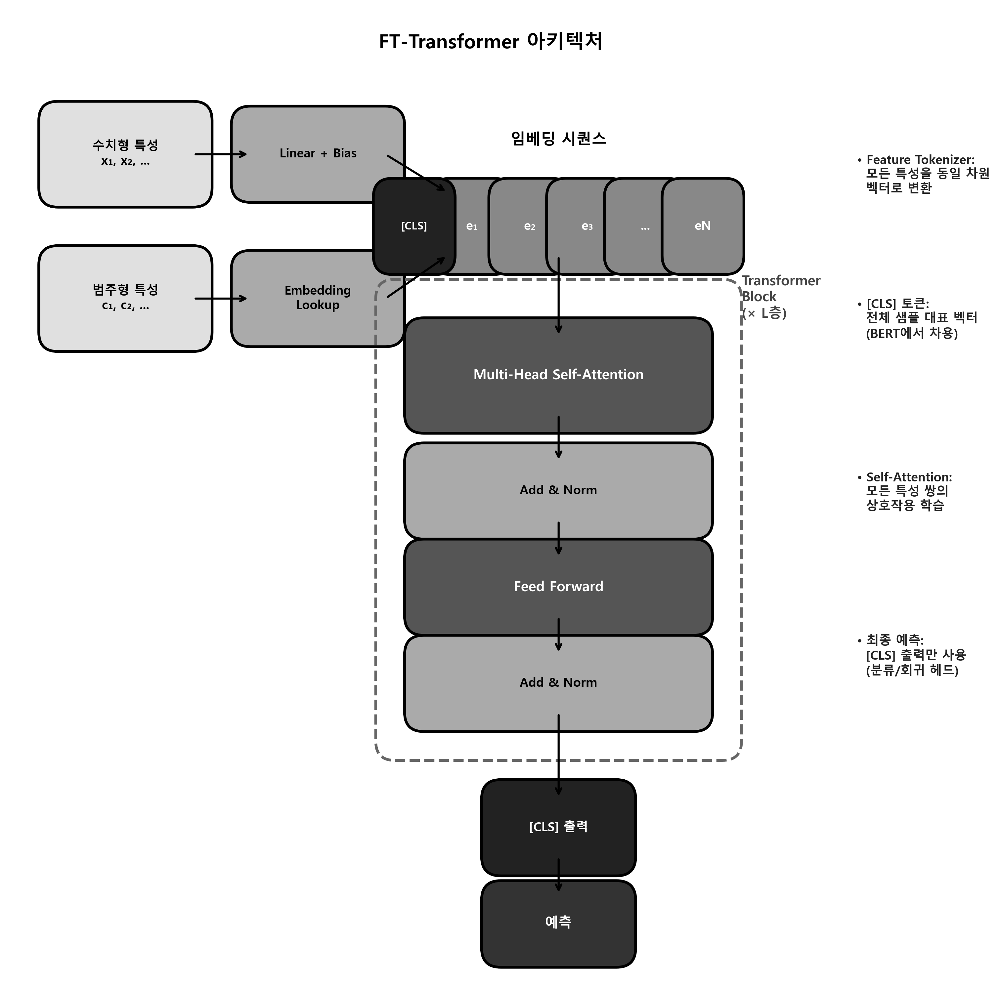
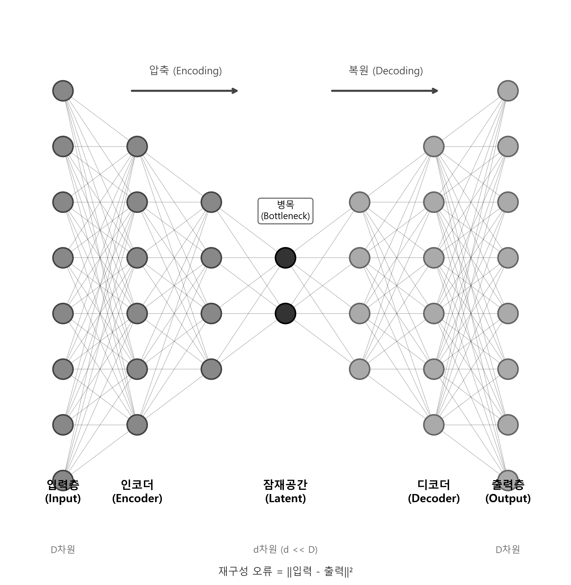
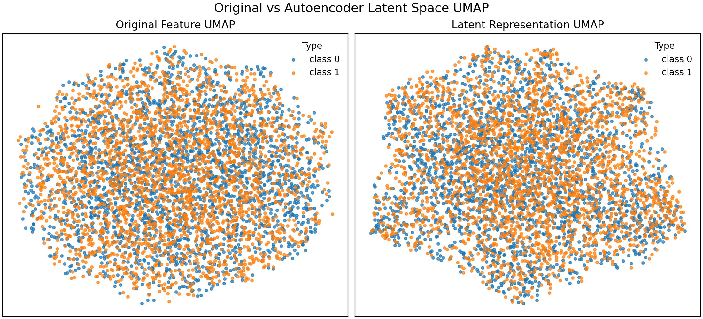

# 7장. 신경망과 표현 학습: 딥러닝을 데이터 분석의 언어로 읽는 법

**학습 목표: 신경망의 학습 원리를 직관적으로 이해하고, 활성화 함수, 역전파, 정형 데이터 딥러닝, 오토인코더, PyTorch 실습을 하나의 데이터 분석 흐름으로 연결하기**

## 이 장에서 다룰 흐름

- 신경망이 왜 비선형 패턴을 학습할 수 있는가
- 활성화 함수와 역전파가 왜 필요한가
- 정형 데이터에서 딥러닝이 항상 정답이 아닌 이유
- 오토인코더와 표현 학습이 어떤 역할을 하는가
- PyTorch 기반 실험 파이프라인을 어떻게 읽어야 하는가

---

## 7.1 신경망은 입력을 여러 번 변환해 더 나은 표현을 만드는 구조다

신경망을 처음 배우면 수식 때문에 멀게 느껴진다. 하지만 직관은 단순하다.

1. 입력을 받는다.
2. 가중치를 곱하고 합친다.
3. 비선형 함수를 통과시킨다.
4. 결과가 틀리면 가중치를 조금 수정한다.

이 과정을 여러 층에 걸쳐 반복하면, 원래 입력으로는 보이지 않던 패턴이 점차 드러난다.



쉽게 말하면 신경망은 데이터를 바로 예측하는 기계라기보다, **예측하기 좋은 형태로 점점 다시 표현하는 기계**에 가깝다.

### 7.1.1 퍼셉트론에서 다층 신경망으로

퍼셉트론은 가장 단순한 형태의 신경망이다. 입력에 가중치를 곱한 뒤 한 번 판단한다. 그런데 단층 퍼셉트론은 직선 하나로 분리할 수 있는 문제에만 강하다. XOR처럼 비선형 문제가 나오면 한계가 드러난다.



은닉층이 추가되면 상황이 달라진다. 은닉층은 입력 공간을 다시 휘고 늘여서, 원래는 직선으로 나눌 수 없던 패턴을 나눌 수 있는 공간으로 바꾼다.

이때 중요한 관점은 이것이다.

- 신경망은 단순히 경계를 찾는 것이 아니라
- **경계를 쉽게 찾을 수 있는 표현 공간을 만들어 간다**

### 7.1.2 왜 "표현 학습"이라고 부르는가

전통적인 머신러닝에서는 사람이 피처를 설계하는 경우가 많았다. 반면 신경망은 여러 층을 통과하는 과정에서 유용한 표현을 스스로 만든다. 이미지에서는 가장자리를, 텍스트에서는 문맥 관계를, 정형 데이터에서는 복잡한 상호작용을 점점 더 잘 드러내는 내부 표현을 배운다.

이 표현 학습 관점이 있어야 이후의 BERT 임베딩, 오토인코더, TabNet을 하나의 줄기로 이해할 수 있다.

---

## 7.2 활성화 함수가 없으면 깊게 쌓아도 결국 단순한 선형 모델과 크게 다르지 않다

신경망에서 활성화 함수는 비선형성을 넣는 역할을 한다. 이것이 왜 중요한지는 다음 비유로 이해하면 쉽다.

- 직선 자만으로는 곡선을 그리기 어렵다.
- 구부릴 수 있는 자가 있어야 복잡한 곡선을 그릴 수 있다.

활성화 함수가 바로 그 "구부릴 수 있는 자" 역할을 한다.



### 7.2.1 주요 활성화 함수를 어떤 감각으로 이해할까

<표 7-1: 주요 활성화 함수의 직관>

| 함수 | 직관 | 장점 | 주의점 |
| ---- | ---- | ---- | ------ |
| Sigmoid | 0과 1 사이로 눌러 준다 | 확률 해석이 쉽다 | 깊은 층에서는 기울기 소실 |
| Tanh | -1과 1 사이로 눌러 준다 | 중심이 0에 가깝다 | 여전히 기울기 소실 가능 |
| ReLU | 음수는 0, 양수는 그대로 둔다 | 계산이 빠르고 학습이 잘 된다 | Dead ReLU 가능 |
| Leaky ReLU | 음수 영역에도 작은 기울기 유지 | Dead ReLU 완화 | 추가 설정 필요 |

### 7.2.2 실습: 활성화 함수 모양과 학습 감각 연결하기

[7-2-activation-functions.py](/Users/callii/Documents/dataScience/practice/chapter07/code/7-2-activation-functions.py)는 함수 모양을 눈으로 보게 해 준다.

```python
import torch
import torch.nn.functional as F

x = torch.linspace(-3, 3, 200)
relu = F.relu(x)
sigmoid = torch.sigmoid(x)
```

이 실습을 볼 때는 함수 공식을 외우기보다, 각 함수가 입력을 어떻게 바꾸는지 보는 것이 중요하다.

- Sigmoid는 큰 입력도 좁은 범위로 압축한다.
- ReLU는 양수 영역 정보를 비교적 잘 보존한다.
- 이 차이가 학습 속도와 깊은 네트워크의 안정성에 영향을 준다.



---

## 7.3 역전파는 "틀린 이유를 거꾸로 따라가며 수정량을 계산하는 과정"이다

신경망 학습은 예측을 하고 끝나는 것이 아니다. 틀렸다면 어느 가중치를 얼마나 바꿔야 하는지를 계산해야 한다. 이때 쓰는 것이 역전파다.

쉽게 말하면 역전파는 시험을 본 뒤 틀린 문제를 채점표를 따라 거꾸로 추적하는 과정이다.

- 출력이 얼마나 틀렸는지 본다.
- 그 오류에 각 층이 얼마나 기여했는지 나눈다.
- 각 가중치를 조금씩 수정한다.

이 과정을 반복하면 손실이 줄어드는 방향으로 모델이 이동한다.

### 7.3.1 경사 하강법은 왜 "내리막길 찾기"로 설명하는가

손실 함수는 현재 파라미터가 얼마나 나쁜지를 나타내는 지형이라고 생각할 수 있다. 경사 하강법은 그 지형에서 아래쪽으로 조금씩 걸어 내려가는 과정이다.

- 기울기: 가장 가파르게 올라가는 방향
- 기울기의 반대 방향: 가장 빨리 내려가는 방향

학습률은 한 걸음의 크기다.

- 너무 크면 골짜기를 지나쳐 발산할 수 있다.
- 너무 작으면 매우 느리게 움직인다.

역전파의 흐름도는 [7-6-backpropagation.html](/Users/callii/Documents/dataScience/content/graphics/ch07/7-6-backpropagation.html)에서 인터랙티브하게 확인할 수 있다.

강의에서는 이 부분을 수식보다 흐름으로 이해시키는 것이 중요하다. 신경망 학습은 결국 "오류를 보고 수정한다"는 매우 익숙한 반복 구조다.

---

## 7.4 Attention은 모든 입력을 똑같이 보지 않고, 더 중요한 부분에 더 집중하게 만든다

최근 딥러닝에서 가장 중요한 개념 중 하나가 Attention이다. 기본 생각은 단순하다. 입력의 모든 부분이 항상 똑같이 중요하지는 않다. 어떤 순간에는 특정 단어가, 어떤 문제에서는 특정 특성이 더 중요하다.

즉, Attention은 **중요도를 동적으로 다르게 두는 장치**다.

### 7.4.1 실습: Attention 시각화로 중요도 읽기

[7-1-attention-visualization.py](/Users/callii/Documents/dataScience/practice/chapter07/code/7-1-attention-visualization.py)는 Attention이 어떤 입력에 더 많은 가중을 두는지 시각적으로 보여 준다.

이 실습을 읽을 때는 Attention 점수를 "설명 그 자체"로 받아들이기보다, 모델이 정보를 어떻게 모으는지 보여 주는 단서로 보는 것이 좋다.



Attention은 이후 TabNet, FT-Transformer, 그리고 언어모델 전반을 이해하는 연결고리 역할을 한다.

---

## 7.5 정형 데이터에서는 딥러닝이 항상 정답이 아니다

학생들이 자주 하는 오해는 "딥러닝이 최신이므로 정형 데이터에서도 항상 더 좋다"는 생각이다. 실제로는 그렇지 않다. 많은 정형 데이터 문제에서는 여전히 XGBoost, LightGBM 같은 트리 기반 모델이 매우 강하다.

그 이유는 다음과 같다.

- 데이터 크기가 아주 크지 않은 경우가 많다
- 결측치, 범주형, 비선형 상호작용을 트리 모델이 잘 처리한다
- 튜닝 비용 대비 성능이 매우 좋다

그렇다고 정형 데이터에서 딥러닝이 쓸모없다는 뜻은 아니다. 다음 상황에서는 딥러닝이 유리해질 수 있다.

- 특성 수가 많고 상호작용이 복잡할 때
- 텍스트, 이미지, 테이블이 함께 있는 멀티모달 환경일 때
- 대규모 데이터가 있을 때
- 사전학습 표현을 활용할 수 있을 때

### 7.5.1 실습: 트리 모델과 정형 데이터 딥러닝 비교

[7-3-tabular-dl-comparison.py](/Users/callii/Documents/dataScience/practice/chapter07/code/7-3-tabular-dl-comparison.py)는 XGBoost, MLP, TabNet, FT-Transformer를 같은 데이터에서 비교한다.

이 실습의 핵심은 어느 모델이 "이겼는가"보다, **어떤 데이터에서 누가 유리한가**를 읽는 것이다.

<표 7-2: 정형 데이터 모델 비교에서 확인할 질문>

| 질문 | 의미 |
| ---- | ---- |
| 성능 차이가 큰가 | 딥러닝 도입의 실익 확인 |
| 학습 시간 차이가 큰가 | 운영 비용 확인 |
| 데이터 크기가 충분한가 | 딥러닝의 조건 확인 |
| 특성 상호작용이 복잡한가 | 딥러닝 장점 발휘 여부 확인 |

### 7.5.2 실습: 합성 데이터로 조건이 바뀌면 결과도 바뀌는지 보기

[7-3b-synthetic-comparison.py](/Users/callii/Documents/dataScience/practice/chapter07/code/7-3b-synthetic-comparison.py)는 고차원, 복잡 상호작용 상황을 만들어 조건을 바꿔 본다. 이 실습은 매우 중요하다. Adult 같은 비교적 단순한 데이터에서는 트리 모델이 우세해도, 특성 간 구조가 복잡한 합성 데이터에서는 TabNet이나 MLP가 상대적으로 더 좋아질 수 있기 때문이다.

이 실습을 통해 학생들은 모델 선택이 유행의 문제가 아니라 **데이터 구조의 문제**임을 이해하게 된다.

---

## 7.6 TabNet과 FT-Transformer는 정형 데이터 딥러닝의 대표적인 두 방향이다

정형 데이터 딥러닝에서 자주 나오는 두 모델이 TabNet과 FT-Transformer다.

### 7.6.1 TabNet: 단계적으로 중요한 특성을 선택하는 방향

TabNet은 Attention을 이용해 각 단계에서 어떤 특성을 더 볼지 선택한다. 즉, 모든 변수를 한꺼번에 같은 비중으로 처리하지 않고, 예측에 중요한 특성을 순차적으로 강조한다.

```text
입력 특성 -> 단계별 특성 선택 -> 의사결정 단계 누적 -> 최종 예측
```



[7-5-tabnet.py](/Users/callii/Documents/dataScience/practice/chapter07/code/7-5-tabnet.py)와 [7-3d-tabnet-tuning.py](/Users/callii/Documents/dataScience/practice/chapter07/code/7-3d-tabnet-tuning.py)는 TabNet의 기본 사용과 튜닝 흐름을 보여 준다.

TabNet을 읽을 때는 다음을 보자.

- 어떤 특성이 단계별로 반복 선택되는가
- 해석 가능성이 실제로 어느 정도 확보되는가
- XGBoost 대비 비용 대비 효과가 있는가

### 7.6.2 FT-Transformer: 특성 간 관계를 Attention으로 학습하는 방향

FT-Transformer는 각 특성을 토큰처럼 다루고, Attention으로 특성 간 상호작용을 학습한다. 이는 NLP의 Transformer를 정형 데이터로 가져온 접근이라고 보면 된다.



[7-3c-ft-transformer-tuning.py](/Users/callii/Documents/dataScience/practice/chapter07/code/7-3c-ft-transformer-tuning.py)는 이 모델이 얼마나 민감하게 튜닝에 반응하는지 보여 준다.

이 모델에서 중요한 것은 "Transformer를 썼다"가 아니라, **특성 간 상호작용을 더 유연하게 학습하려는 시도**라는 점이다.

---

## 7.7 표현 학습의 대표 예: BERT 임베딩과 오토인코더

표현 학습은 딥러닝의 핵심 언어다. 이 장에서는 두 가지 대표 예를 함께 보는 것이 좋다.

- BERT 임베딩: 텍스트 표현 학습
- 오토인코더: 입력 자체를 압축하며 잠재 표현 학습

### 7.7.1 실습: BERT 임베딩은 왜 강한가

[7-3-bert-embeddings.py](/Users/callii/Documents/dataScience/practice/chapter07/code/7-3-bert-embeddings.py)는 문장을 벡터로 바꾸고, 그 벡터가 다운스트림 분석에 어떤 도움을 주는지 보여 준다.

이 실습의 핵심은 단어를 세는 것이 아니라, 문맥을 포함한 표현을 만든다는 점이다. 2장의 텍스트 임베딩, 6장의 BERTopic과도 자연스럽게 연결된다.

### 7.7.2 오토인코더는 입력을 압축하면서 중요한 구조를 남긴다

오토인코더는 입력을 작은 잠재 공간으로 압축했다가 다시 복원한다. 이 과정에서 복원에 필요한 핵심 정보가 잠재 표현에 담긴다.



쉽게 말하면 긴 문장을 한 줄 요약으로 압축했다가 다시 복원하는 과정과 비슷하다. 요약이 잘 되려면 핵심이 남아 있어야 한다.

### 7.7.3 실습: 오토인코더 기반 이상 탐지

[7-4a-autoencoder-anomaly.py](/Users/callii/Documents/dataScience/practice/chapter07/code/7-4a-autoencoder-anomaly.py)는 재구성 오차를 이상 탐지에 활용한다.

이 방법의 직관은 분명하다.

- 정상 패턴은 잘 복원된다.
- 낯선 패턴은 복원이 잘 안 된다.
- 복원 오차가 크면 이상으로 의심한다.

### 7.7.4 실습: 오토인코더와 XGBoost를 결합하면 무엇이 달라지는가

다음 실습들은 오토인코더 잠재 표현을 다른 모델과 결합하는 방향을 보여 준다.

- [7-4b-ae-xgboost-hybrid.py](/Users/callii/Documents/dataScience/practice/chapter07/code/7-4b-ae-xgboost-hybrid.py)
- [7-4b-ae-xgboost-redundant.py](/Users/callii/Documents/dataScience/practice/chapter07/code/7-4b-ae-xgboost-redundant.py)
- [7-4b-ae-xgboost-semisupervised.py](/Users/callii/Documents/dataScience/practice/chapter07/code/7-4b-ae-xgboost-semisupervised.py)
- [7-4b-ae-xgboost-tfidf.py](/Users/callii/Documents/dataScience/practice/chapter07/code/7-4b-ae-xgboost-tfidf.py)

이 실습들이 보여 주는 공통된 메시지는 하나다.

**딥러닝 표현과 전통적인 강한 예측기를 결합하는 하이브리드 접근이 실무적으로 유용할 수 있다.**

즉, 딥러닝과 XGBoost는 경쟁만 하는 것이 아니라 서로 보완할 수 있다.

### 7.7.5 실습: 잠재 공간을 눈으로 보기

[7-4c-latent-umap.py](/Users/callii/Documents/dataScience/practice/chapter07/code/7-4c-latent-umap.py)는 잠재 표현을 UMAP으로 줄여 시각화한다.



이 그림을 읽을 때는 다음을 본다.

- 같은 클래스나 유사 샘플이 잠재 공간에서 가까이 모이는가
- 원래 공간보다 구조가 더 잘 드러나는가
- 이상치가 분리되어 보이는가

---

## 7.8 PyTorch 파이프라인은 모델 하나보다 실험 시스템을 이해하는 데 중요하다

신경망을 공부할 때 모델 구조만 외우면 실무에서 금방 막힌다. 실제로는 데이터셋, 배치, 손실 함수, 옵티마이저, 검증 루프, 저장 로직이 하나의 파이프라인으로 움직인다.

### 7.8.1 실습: PyTorch 학습 루프를 한 번에 읽기

[7-5-pytorch-pipeline.py](/Users/callii/Documents/dataScience/practice/chapter07/code/7-5-pytorch-pipeline.py)는 기본적인 실무형 흐름을 보여 준다.

```python
for epoch in range(num_epochs):
    model.train()
    for batch_x, batch_y in train_loader:
        optimizer.zero_grad()
        loss = criterion(model(batch_x), batch_y)
        loss.backward()
        optimizer.step()
```

이 루프에서 정말 알아야 할 것은 네 줄이다.

- `zero_grad()`: 이전 기울기 초기화
- `loss.backward()`: 역전파
- `optimizer.step()`: 가중치 갱신
- `model.train()` / `model.eval()`: 학습과 평가 모드 구분

이 부분이 익숙해지면 새로운 모델을 보더라도 구조를 훨씬 빨리 이해할 수 있다.

### 7.8.2 실습: 감성 분석 비교로 표현 학습의 효과 확인

[7-5-sentiment-comparison.py](/Users/callii/Documents/dataScience/practice/chapter07/code/7-5-sentiment-comparison.py)는 딥러닝 표현이 실제 텍스트 분류에 어떤 차이를 만드는지 보여 준다.

이 실습은 6장의 토픽 모델링과도 이어진다. 토픽 모델링이 문서 구조를 요약하는 데 초점을 맞췄다면, 여기서는 그 표현을 실제 분류 성능으로 연결해 본다.

---

## 7.9 정리

이 장의 핵심은 딥러닝을 신비한 블랙박스로 보는 것이 아니라, 표현을 학습하고 실험을 운영하는 방법으로 이해하는 데 있다.

```text
1. 신경망은 입력을 더 예측하기 좋은 표현으로 반복 변환하며 학습한다.
2. 활성화 함수는 비선형성을, 역전파는 수정 방향을 제공한다.
3. 정형 데이터에서는 딥러닝이 항상 최선은 아니며 트리 기반 모델과 비교가 필요하다.
4. TabNet과 FT-Transformer는 정형 데이터 딥러닝의 대표적 두 방향이다.
5. 오토인코더와 BERT 임베딩은 표현 학습의 중요한 예다.
6. 실무에서는 모델 구조만큼 PyTorch 파이프라인 운영 감각이 중요하다.
```

## 실습 연결

이 장의 실습은 아래 순서로 읽으면 흐름이 잘 이어진다.

1. [7-2-activation-functions.py](/Users/callii/Documents/dataScience/practice/chapter07/code/7-2-activation-functions.py): 비선형성의 직관
2. [7-1-attention-visualization.py](/Users/callii/Documents/dataScience/practice/chapter07/code/7-1-attention-visualization.py): Attention의 의미
3. [7-3-tabular-dl-comparison.py](/Users/callii/Documents/dataScience/practice/chapter07/code/7-3-tabular-dl-comparison.py): 정형 데이터 모델 비교
4. [7-3b-synthetic-comparison.py](/Users/callii/Documents/dataScience/practice/chapter07/code/7-3b-synthetic-comparison.py): 데이터 조건 변화에 따른 결과 변화
5. [7-3c-ft-transformer-tuning.py](/Users/callii/Documents/dataScience/practice/chapter07/code/7-3c-ft-transformer-tuning.py): FT-Transformer 튜닝
6. [7-3d-tabnet-tuning.py](/Users/callii/Documents/dataScience/practice/chapter07/code/7-3d-tabnet-tuning.py): TabNet 튜닝
7. [7-4a-autoencoder-anomaly.py](/Users/callii/Documents/dataScience/practice/chapter07/code/7-4a-autoencoder-anomaly.py): 재구성 오차 기반 이상 탐지
8. [7-4b-ae-xgboost-hybrid.py](/Users/callii/Documents/dataScience/practice/chapter07/code/7-4b-ae-xgboost-hybrid.py), [7-4b-ae-xgboost-redundant.py](/Users/callii/Documents/dataScience/practice/chapter07/code/7-4b-ae-xgboost-redundant.py), [7-4b-ae-xgboost-semisupervised.py](/Users/callii/Documents/dataScience/practice/chapter07/code/7-4b-ae-xgboost-semisupervised.py), [7-4b-ae-xgboost-tfidf.py](/Users/callii/Documents/dataScience/practice/chapter07/code/7-4b-ae-xgboost-tfidf.py): 표현 학습과 트리 모델 결합
9. [7-4c-latent-umap.py](/Users/callii/Documents/dataScience/practice/chapter07/code/7-4c-latent-umap.py): 잠재 공간 시각화
10. [7-5-pytorch-pipeline.py](/Users/callii/Documents/dataScience/practice/chapter07/code/7-5-pytorch-pipeline.py), [7-5-sentiment-comparison.py](/Users/callii/Documents/dataScience/practice/chapter07/code/7-5-sentiment-comparison.py), [7-5-tabnet.py](/Users/callii/Documents/dataScience/practice/chapter07/code/7-5-tabnet.py): 실무형 학습 파이프라인과 응용
