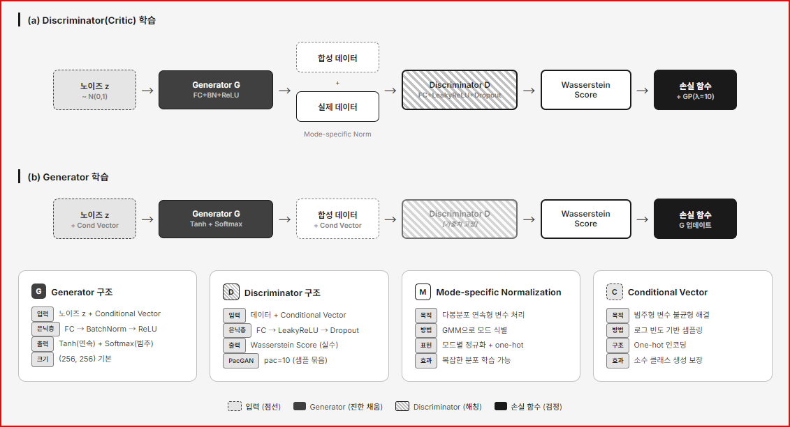
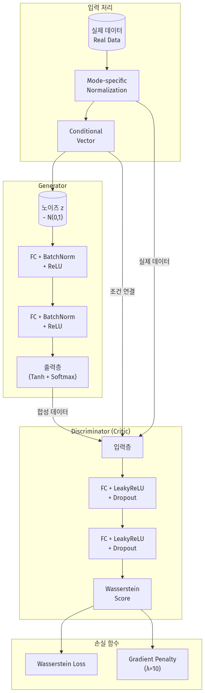
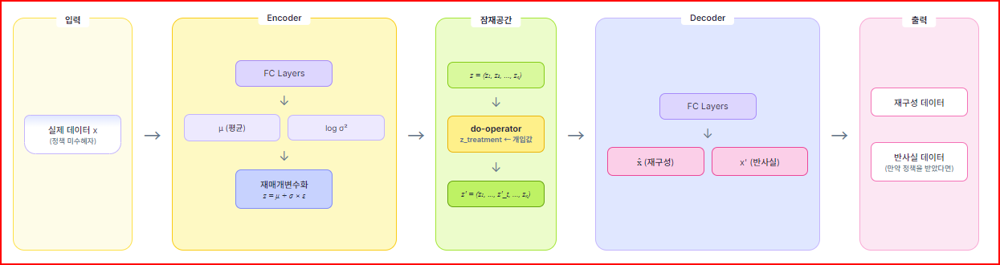
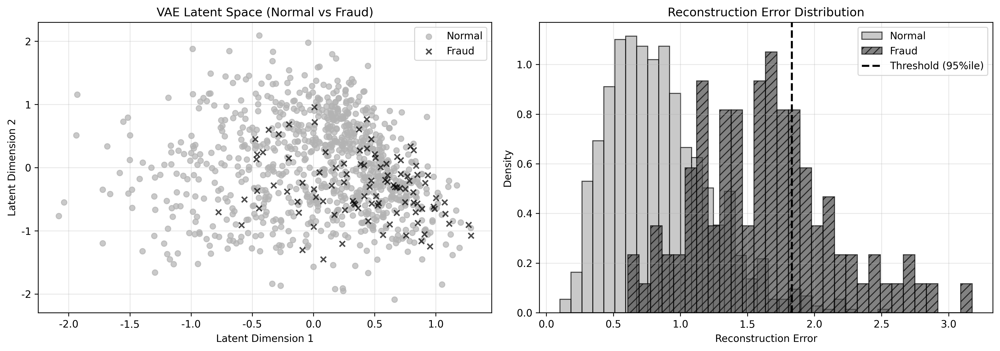
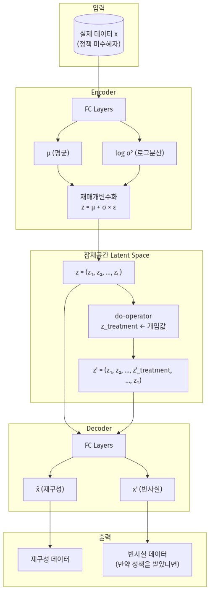
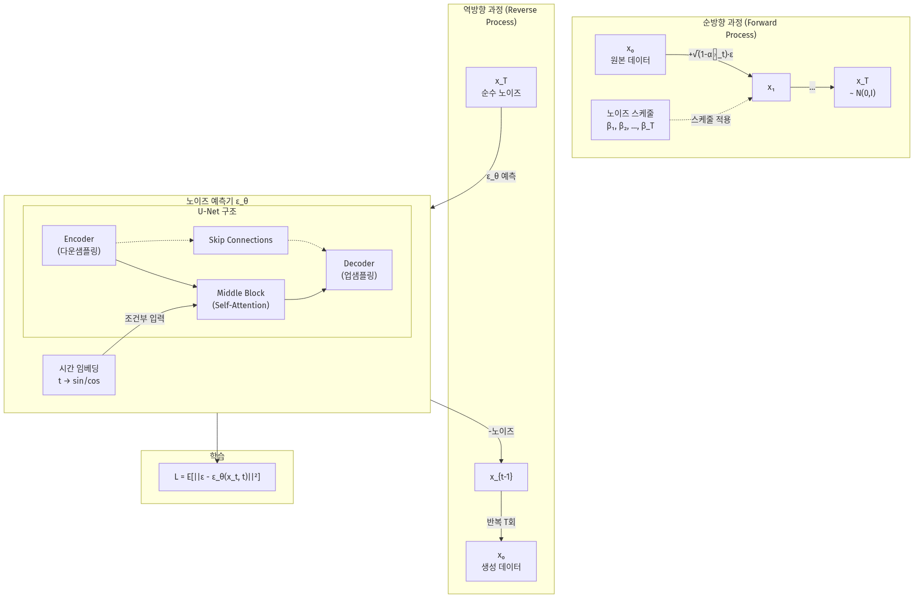
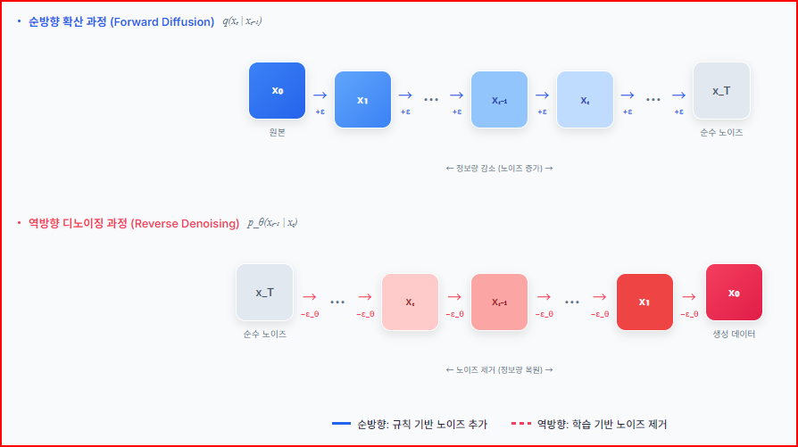
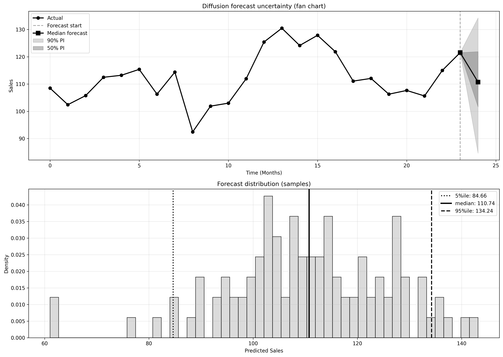

# 8장. 생성 모델: 새 데이터를 만드는 기술을 데이터 분석에 연결하는 법

**학습 목표: 생성 모델이 단순히 콘텐츠를 만드는 기술이 아니라, 합성 데이터 생성, 데이터 증강, 이상 탐지, 예측 불확실성 정량화에 쓰이는 분석 도구라는 점을 이해하기**

## 이 장에서 다룰 흐름

- 생성 모델이 판별 모델과 어떻게 다른가
- GAN과 CTGAN이 정형 데이터 합성에 어떻게 쓰이는가
- VAE가 표현 학습, 증강, 이상 탐지를 함께 다루는 방식
- Diffusion Model이 불확실성과 시나리오 분석에 왜 유용한가

---

## 8.1 생성 모델은 "정답을 맞히는 모델"이 아니라 "데이터 분포를 흉내 내는 모델"이다

3장부터 7장까지에서 자주 본 모델은 대체로 입력 `X`가 주어졌을 때 출력 `Y`를 맞히는 판별 모델이었다. 생성 모델은 질문이 다르다.

- 판별 모델: "이 입력은 어느 클래스인가?"
- 생성 모델: "이런 데이터는 보통 어떤 모습으로 나타나는가?"

즉, 생성 모델은 데이터의 분포 자체를 학습하려고 한다. 그래서 한 번 학습되면 원래 데이터와 비슷한 새 표본을 만들어낼 수 있다.

이 점이 실무에서 매우 중요하다. 생성 모델은 단지 그림을 그리거나 문장을 쓰는 기술이 아니라, 다음과 같은 분석 과제를 해결하는 데 직접 연결된다.

- 개인정보를 직접 공개하지 않고 합성 데이터 제공
- 극단적 불균형 문제에서 소수 클래스 증강
- 정상 패턴을 학습해 이상치 탐지
- 미래 경로를 여러 번 샘플링해 불확실성 정량화

<표 8-1: 생성 모델이 분석에서 기여하는 대표 역할>

| 역할 | 질문 | 대표 기법 |
| ---- | ---- | --------- |
| 합성 데이터 | 원본과 비슷한 새 데이터를 만들 수 있는가 | GAN, CTGAN |
| 데이터 증강 | 적은 데이터를 보강해 학습을 안정화할 수 있는가 | VAE, GAN |
| 이상 탐지 | 정상과 다른 패턴을 복원 오차나 밀도로 구분할 수 있는가 | VAE |
| 불확실성 분석 | 가능한 미래 경로를 여러 개 생성할 수 있는가 | Diffusion |

생성 모델을 배울 때 가장 중요한 기준은 "얼마나 그럴듯한가"만이 아니다.  
**분석 목적에 맞게 얼마나 유용한 표본을 만들 수 있는가**가 더 중요하다.

---

## 8.2 GAN은 경쟁 구조를 통해 점점 더 그럴듯한 표본을 만든다

GAN의 핵심 구조는 잘 알려져 있다.

- 생성자(Generator): 가짜 데이터를 만든다.
- 판별자(Discriminator): 진짜와 가짜를 구분한다.

이 둘이 경쟁하면서 함께 성능이 올라간다. 생성자는 판별자를 속일 정도로 더 그럴듯한 데이터를 만들고, 판별자는 더 예민하게 진짜와 가짜를 구분하려 한다.

쉽게 말하면 위조지폐 제작자와 감식관이 동시에 실력을 높여 가는 구조다.



### 8.2.1 정형 데이터에서는 왜 기본 GAN만으로 부족한가

이미지에서는 픽셀 값이 비교적 규칙적이다. 반면 정형 데이터는 다음처럼 훨씬 까다롭다.

- 연속형 변수와 범주형 변수가 섞여 있다
- 변수별 분포 모양이 크게 다르다
- 희귀 범주와 불균형이 심하다

예를 들어 연봉, 나이, 직업, 교육 수준, 대출 여부가 함께 있는 데이터를 생각해 보자. 이미지처럼 모든 입력을 같은 방식으로 다루기 어렵다. 그래서 정형 데이터에는 CTGAN 같은 변형이 더 자주 쓰인다.

### 8.2.2 실습: GAN의 기본 경쟁 구조 보기

[8-2-simple-gan-practice.py](/Users/callii/Documents/dataScience/practice/chapter08/code/8-2-simple-gan-practice.py)는 GAN의 가장 기본적인 감각을 익히기 위한 실습이다.

이 실습에서 봐야 하는 것은 생성자와 판별자 손실이 무조건 0으로 가는가가 아니다. 오히려 두 네트워크가 어느 정도 균형을 이루며 경쟁하는지가 중요하다.

- 판별자가 너무 강하면 생성자가 학습 신호를 받지 못한다
- 생성자가 너무 강하면 다양성이 줄고 특정 모드만 반복할 수 있다

즉, GAN 실습은 정확한 예측 모델처럼 읽는 것이 아니라, **균형이 맞는 학습 게임으로 읽어야 한다.**

### 8.2.3 실습: CTGAN으로 정형 데이터 합성하기

[8-2-ctgan-synthetic.py](/Users/callii/Documents/dataScience/practice/chapter08/code/8-2-ctgan-synthetic.py)는 정형 데이터 합성의 핵심 실습이다. CTGAN은 범주형 변수와 복잡한 분포를 더 잘 처리하도록 설계된 GAN 계열 모델이다.



CTGAN 실습을 볼 때는 다음을 반드시 확인해야 한다.

1. 생성 데이터의 변수 분포가 원본과 비슷한가
2. 범주형 변수 비율이 무너지지 않았는가
3. 희귀 범주가 완전히 사라지거나 과도하게 늘어나지 않았는가
4. 생성 데이터를 써서 학습한 모델의 성능이 어느 정도 유지되는가

실무에서는 단순히 "표본이 그럴듯해 보인다"는 이유만으로 합성 데이터를 쓰면 안 된다.  
분포 보존, 하위 집단 보존, 다운스트림 성능 보존을 함께 확인해야 한다.

---

## 8.3 합성 데이터는 개인정보 보호와 희귀 사례 보강에 특히 중요하다

의료, 금융, 공공 데이터는 원본을 그대로 공유하기 어렵다. 그러나 연구와 교육에는 비슷한 구조의 데이터가 필요하다. 이때 합성 데이터가 실질적인 대안이 된다.

예를 들어,

- 실제 환자 기록 대신 유사 분포를 가진 합성 환자 데이터
- 실제 고객 정보 대신 통계적 패턴만 유지한 합성 고객 데이터
- 소수 사기 거래를 보강한 학습 데이터

이런 용도가 가능해진다.

하지만 여기서도 중요한 경계가 있다. 합성 데이터는 원본을 완전히 대체하는 것이 아니라, **분석과 실험을 가능하게 하는 근사 도구**다. 원본 데이터의 정책적 의미나 실제 인과 구조를 자동으로 보장하지는 않는다.

---

## 8.4 VAE는 압축과 생성을 동시에 수행하는 더 구조화된 접근이다

GAN이 경쟁 구조에 기반한다면, VAE는 입력을 잠재 공간으로 압축했다가 다시 복원하는 구조에 가깝다.

간단히 정리하면,

1. 입력을 잠재 변수로 압축한다.
2. 그 잠재 변수에서 다시 원래 데이터를 복원한다.
3. 잠재 공간이 너무 불규칙해지지 않도록 정규화한다.

그래서 VAE는 생성 모델이면서 동시에 표현 학습 모델이기도 하다.



### 8.4.1 왜 잠재 공간이 중요한가

VAE의 장점은 잠재 공간이 비교적 연속적이고 구조화된다는 점이다. 이 공간에서 가까운 점들은 비슷한 데이터를 의미하고, 중간을 보간하면 자연스러운 변형도 만들 수 있다.

쉽게 말하면 복잡한 원본 데이터를 몇 개의 핵심 좌표로 압축한 다음, 그 좌표를 조금 움직이며 새로운 사례를 생성하는 방식이다.

이 성질 덕분에 VAE는 다음 작업과 잘 맞는다.

- 데이터 증강
- 잠재 공간 시각화
- 재구성 오차 기반 이상 탐지
- counterfactual 탐색

### 8.4.2 실습: VAE로 증강과 이상 탐지를 함께 보기

[8-3-vae-practice.py](/Users/callii/Documents/dataScience/practice/chapter08/code/8-3-vae-practice.py)는 이 장의 핵심 실습이다. 소수 클래스가 적은 상황에서 VAE로 합성 샘플을 만들고, 동시에 재구성 오차를 이상 탐지에 활용한다.



실습을 볼 때는 두 개의 질문을 분리해서 읽어야 한다.

1. 합성 샘플이 소수 클래스 분포를 어느 정도 보강하는가
2. 재구성 오차가 정상/이상 패턴을 얼마나 구분하는가

이 두 질문은 연결되어 있지만 같지는 않다. 합성 샘플이 잘 만들어졌다고 해서 이상 탐지도 자동으로 잘 되는 것은 아니다.

### 8.4.3 재구성 오차는 왜 이상 탐지에 쓰일 수 있는가

VAE가 정상 데이터를 주로 학습했다고 하자. 그러면 정상 데이터는 비교적 잘 압축하고 복원할 수 있다. 반면 낯선 패턴은 복원이 잘 안 된다. 따라서 복원 오차가 큰 샘플은 이상치 후보가 된다.

이 아이디어는 직관적이고 강력하지만, 주의점도 있다.

- 정상 데이터 범위가 매우 넓으면 이상치도 잘 복원될 수 있다
- 임계값 설정에 따라 오탐과 미탐이 크게 달라진다
- 이상의 종류가 여러 개면 단일 오차 기준만으로 부족할 수 있다

즉, VAE 이상 탐지는 최종 판정보다 **후보 추출과 구조 이해에 더 적합한 경우가 많다.**

### 8.4.4 counterfactual 관점에서 VAE를 보는 법

VAE 잠재 공간은 "조금 달랐다면 어떤 사례가 되었을까"를 탐색하는 데도 유용하다. 잠재 벡터를 움직이면 원본과 유사하지만 일부 속성이 다른 사례를 생성할 수 있기 때문이다.



이것은 단순 생성보다 한 걸음 더 나아간 관점이다. 생성 모델이 미래를 예언한다기보다, **가능한 데이터 공간을 탐색하게 해 준다**는 점이 중요하다.

---

## 8.5 Diffusion Model은 "점진적 복원"을 통해 불확실성을 더 풍부하게 표현한다

Diffusion Model은 최근 가장 주목받는 생성 모델 중 하나다. 직관은 다음과 같다.

1. 원래 데이터에 노이즈를 조금씩 더해 완전히 흐리게 만든다.
2. 그 반대 과정, 즉 노이즈를 조금씩 제거하는 법을 학습한다.
3. 순수 노이즈에서 시작해 단계적으로 복원하면 새 샘플이 생성된다.





이 방식의 장점은 한 번의 점 추정이 아니라, 여러 가능한 결과를 샘플링해 분포 전체를 볼 수 있다는 점이다.

### 8.5.1 왜 데이터 분석에서 Diffusion이 중요한가

Diffusion Model은 이미지 생성으로 유명해졌지만, 데이터 분석에서 더 흥미로운 용도는 불확실성 정량화다.

예를 들어 매출 예측에서 하나의 숫자만 받는 것과, 다음 세 달의 가능한 경로 100개를 받는 것은 의사결정의 질을 크게 바꾼다.

- 최악의 5% 시나리오
- 중간 시나리오
- 낙관적 시나리오

를 함께 볼 수 있기 때문이다.

### 8.5.2 실습: Diffusion으로 미래 경로와 위험 시나리오 만들기

[8-4-diffusion-practice.py](/Users/callii/Documents/dataScience/practice/chapter08/code/8-4-diffusion-practice.py)는 시계열적 상황에서 미래 경로를 여러 번 생성해 불확실성을 시각화한다.



실습에서 중요한 해석 포인트는 다음과 같다.

- 예측 평균만 보지 말고 분산도 같이 본다
- 어느 시점부터 불확실성이 빠르게 커지는지 본다
- 극단 시나리오가 실제 운영 리스크와 연결되는지 본다

Diffusion 실습은 9장의 시계열 예측과도 자연스럽게 연결된다. 9장에서는 모델이 점 예측과 예측 구간을 어떻게 내는지 본다면, 8장에서는 생성 모델 관점에서 **가능한 미래 전체를 샘플링하는 방식**을 이해하게 된다.

---

## 8.6 생성 모델 결과를 해석할 때 특히 조심해야 할 점

생성 모델은 결과물이 그럴듯해 보여서 과신하기 쉽다. 다음 세 가지는 반드시 점검해야 한다.

### 8.6.1 모양이 비슷하다고 구조가 보존된 것은 아니다

분포 그래프가 비슷해 보여도 변수 간 의존 구조가 깨질 수 있다.

### 8.6.2 희귀하지만 중요한 사례가 사라질 수 있다

불균형 데이터에서는 생성 모델이 다수 패턴만 학습하고 희귀 패턴을 놓치기 쉽다.

### 8.6.3 생성 결과가 곧 정책적 타당성을 보장하지는 않는다

합성 데이터는 원본 세계를 근사할 뿐이다. 인과 해석이나 제도 효과를 바로 주장할 수는 없다.

---

## 8.7 정리

생성 모델은 데이터 과학에서 점점 더 중요한 도구가 되고 있다. 이 장의 핵심은 모델 이름보다, 각 생성 방식이 어떤 분석 목적에 맞는지 구분하는 데 있다.

```text
1. 생성 모델은 데이터 분포를 학습하여 새 표본을 만들 수 있다.
2. GAN과 CTGAN은 합성 데이터 생성에 강하고, 정형 데이터에서는 CTGAN이 특히 중요하다.
3. VAE는 잠재 공간을 학습하여 증강, 이상 탐지, 표현 학습을 함께 다룰 수 있다.
4. Diffusion Model은 여러 가능한 경로를 생성해 불확실성을 풍부하게 표현한다.
5. 생성 결과는 그럴듯함보다 분포 보존, 구조 보존, 다운스트림 유용성으로 평가해야 한다.
```

## 실습 연결

이 장의 실습은 아래 순서로 읽으면 자연스럽다.

1. [8-2-simple-gan-practice.py](/Users/callii/Documents/dataScience/practice/chapter08/code/8-2-simple-gan-practice.py): GAN의 경쟁 구조 이해
2. [8-2-ctgan-synthetic.py](/Users/callii/Documents/dataScience/practice/chapter08/code/8-2-ctgan-synthetic.py): 정형 데이터 합성
3. [8-3-vae-practice.py](/Users/callii/Documents/dataScience/practice/chapter08/code/8-3-vae-practice.py): 증강과 이상 탐지
4. [8-4-diffusion-practice.py](/Users/callii/Documents/dataScience/practice/chapter08/code/8-4-diffusion-practice.py): 시나리오 생성과 불확실성 정량화
