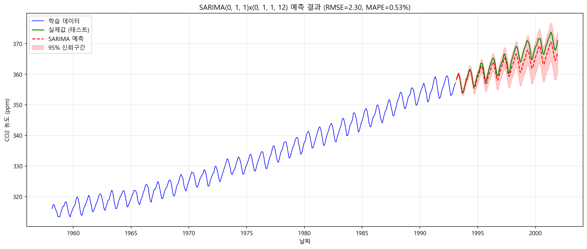
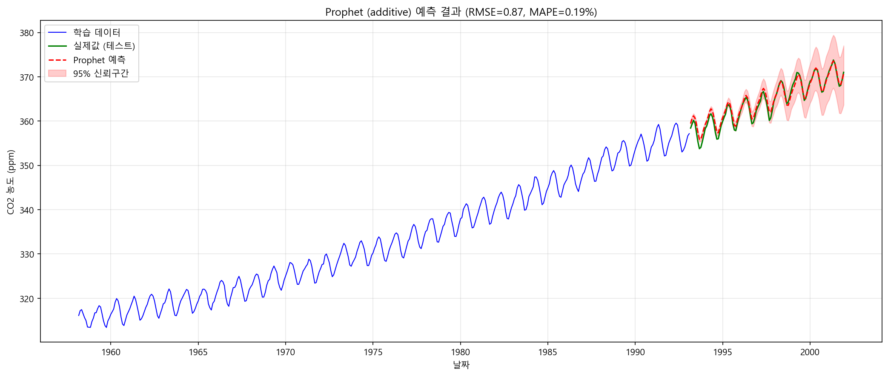
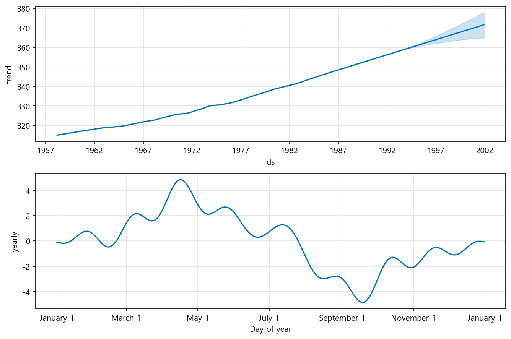
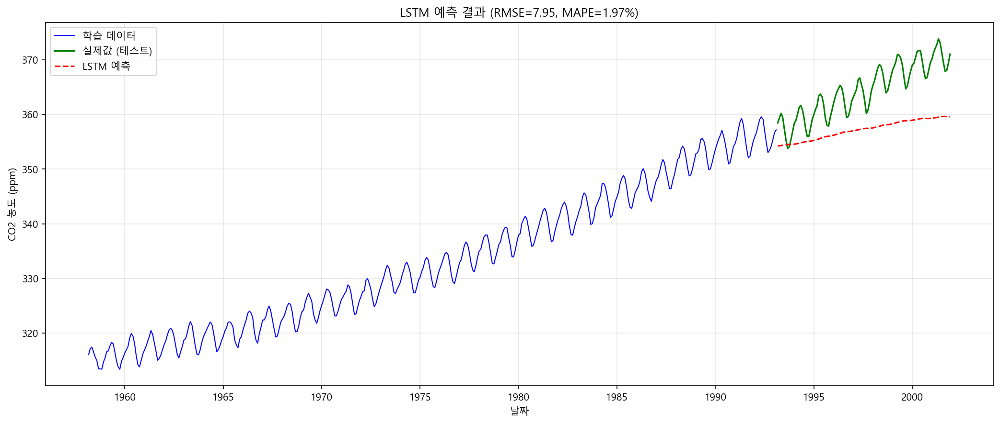
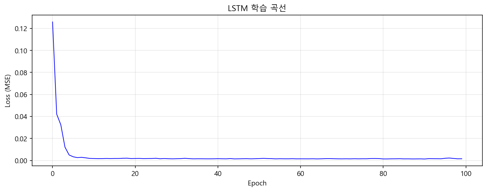
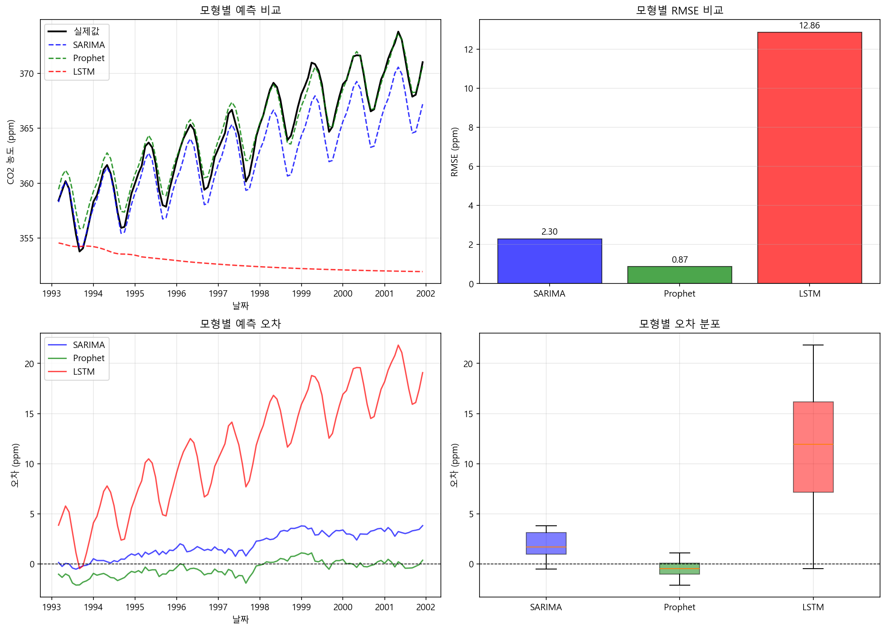
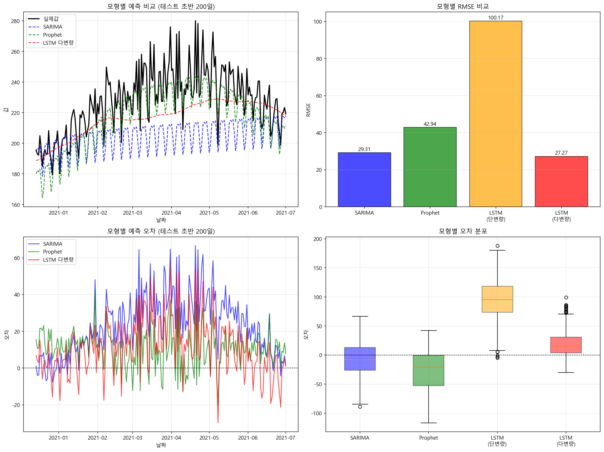

# 9장. 시계열 분석: 순서가 있는 데이터를 읽고 예측하는 법

**학습 목표: 시계열 데이터가 일반 표 데이터와 어떻게 다른지 이해하고, 분해, 정상성, ARIMA, Prophet, LSTM, TimeGPT 비교를 실제 예측 문제의 흐름으로 연결하기**

## 이 장에서 다룰 흐름

- 시계열 데이터에서 시간 순서가 왜 핵심 정보인가
- 추세, 계절성, 잔차를 먼저 읽어야 하는 이유
- ARIMA와 Prophet이 각각 어떤 철학으로 예측하는가
- LSTM과 Attention 기반 모델이 언제 유리한가
- 기반 모델까지 포함해 어떤 기준으로 예측기를 선택할 것인가

---

## 9.1 시계열은 "값"만이 아니라 "순서"가 정보인 데이터다

일반 표 데이터에서는 행 순서를 섞어도 큰 문제가 없는 경우가 많다. 반면 시계열에서는 순서를 섞는 순간 의미가 무너진다.

- 월별 매출
- 일별 전력 수요
- 시간대별 센서 값
- 분 단위 주가

이런 데이터에서는 "무엇이 먼저 왔는가"가 구조의 핵심이다.

쉽게 말하면 시계열은 데이터 표라기보다 리듬이 있는 기록에 가깝다.  
그래서 예측에 들어가기 전에 먼저 리듬을 읽어야 한다.

### 9.1.1 시계열 분석이 실제로 필요한 장면

- 수요 예측: 다음 달 판매량은 어느 정도인가
- 자원 계획: 콜센터 인력이나 발전량을 얼마로 잡아야 하는가
- 이상 탐지: 센서 패턴이 정상 범위를 벗어났는가
- 금융 분석: 가격 수준보다 변동성과 추세 전환이 중요한가

이때 중요한 점은 미래를 "정답 하나"로만 보는 것이 아니라, 과거 패턴이 어떤 구조로 반복되는지를 읽는 것이다.

---

## 9.2 예측 전에 먼저 데이터의 구조를 분해해서 봐야 한다

시계열을 처음 보면 선 하나만 보인다. 하지만 그 선 안에는 서로 다른 성질이 섞여 있다.

- 추세: 장기적으로 올라가거나 내려가는 방향
- 계절성: 일정 주기로 반복되는 패턴
- 잔차: 나머지 흔들림과 잡음

음악으로 비유하면,

- 추세는 곡 전체의 흐름
- 계절성은 반복되는 박자
- 잔차는 작은 흔들림과 잡음

이다.

### 9.2.1 실습: 시계열 분해를 눈으로 읽기

[9-2-3-decomposition-png.py](/Users/callii/Documents/dataScience/practice/chapter09/code/9-2-3-decomposition-png.py)는 시계열을 추세, 계절성, 잔차로 나누어 보여 준다.

이 장에서 가장 먼저 이 실습을 보는 이유는, 모델보다 구조를 먼저 읽는 습관을 만들기 위해서다.

시계열 분해 결과는 [9-2-3-decomposition-viz.html](/Users/callii/Documents/dataScience/content/graphics/ch09/9-2-3-decomposition-viz.html)에서도 확인할 수 있다.

실습을 읽을 때는 다음 순서가 좋다.

1. 장기적으로 우상향/우하향하는가
2. 계절 패턴의 진폭이 일정한가
3. 특정 구간에 급격한 구조 변화가 있는가
4. 잔차에 아직 설명되지 않은 패턴이 남아 있는가

이 단계 없이 바로 예측 모델로 들어가면, 예측 오차를 모델 탓으로만 해석하기 쉽다.

### 9.2.2 정상성은 왜 중요한가

많은 전통 시계열 모형은 평균과 분산, 자기상관 구조가 시간에 따라 크게 변하지 않는다는 가정을 바탕으로 한다. 이를 정상성이라고 부른다.

상승 추세가 강한 데이터는 대개 그대로는 정상적이지 않다. 그래서 차분(differencing) 같은 처리가 필요하다.

### 9.2.3 실습: 정상성 확인과 차분

[9-2-4-stationarity-png.py](/Users/callii/Documents/dataScience/practice/chapter09/code/9-2-4-stationarity-png.py)는 차분 전후 패턴과 정상성 검정을 보여 준다.

학생들이 자주 하는 오해는 "차분을 하면 데이터가 망가지는 것 아닌가"라는 생각이다. 실제로는 원래 수준(level)을 버리는 것이 아니라, 변화량 구조를 더 잘 보이게 만드는 과정에 가깝다.

---

## 9.3 ARIMA는 과거 값과 오차의 구조를 이용하는 가장 전통적인 예측 도구다

ARIMA는 오래된 방법이지만 지금도 중요한 이유가 있다. 구조가 비교적 명확하고, 진단 절차와 해석 기준이 잘 정리되어 있기 때문이다.

이름의 세 부분은 각각 다음을 뜻한다.

- AR: 과거 값의 자기회귀
- I: 차분을 통한 정상화
- MA: 과거 오차의 이동평균

즉, ARIMA는 단순히 과거 값을 보는 것이 아니라, **과거 값의 패턴과 예측 오차의 패턴을 함께 본다.**

### 9.3.1 ACF와 PACF는 왜 보는가

ARIMA를 공부할 때 학생들이 가장 부담스러워하는 것이 ACF와 PACF다. 하지만 직관은 간단하다.

- ACF: 얼마나 멀리 떨어진 과거와도 여전히 상관이 있는가
- PACF: 중간 효과를 제거하고 직접 연결된 지연이 얼마나 강한가

이 그래프를 보면 `p`, `q` 후보를 좁히는 데 도움이 된다.

### 9.3.2 실습: ARIMA 적합과 결과 읽기

[9-3-arima.py](/Users/callii/Documents/dataScience/practice/chapter09/code/9-3-arima.py)와 [9-3-3-arima-viz-png.py](/Users/callii/Documents/dataScience/practice/chapter09/code/9-3-3-arima-viz-png.py)는 전통 시계열 예측의 기준선을 잡아 준다.



실습 결과를 읽을 때는 다음을 확인한다.

- 추세와 계절성을 얼마나 안정적으로 따라가는가
- 예측 구간이 지나치게 넓거나 좁지 않은가
- 잔차에 패턴이 남지 않는가

ARIMA 계열의 장점은 "왜 이런 구조를 썼는지"를 비교적 분명하게 말할 수 있다는 점이다.  
복잡한 딥러닝 모델을 쓰기 전에 이런 해석 가능한 기준선을 잡아 두는 것이 중요하다.

SARIMA 인터랙티브 결과는 [9-1-sarima-forecast.html](/Users/callii/Documents/dataScience/content/graphics/ch09/9-1-sarima-forecast.html)에서도 확인할 수 있다.

---

## 9.4 Prophet은 추세와 계절성을 실무 친화적으로 분해해서 다루는 접근이다

Prophet은 ARIMA보다 사용이 직관적인 편이다. 데이터 안의 구조를 다음처럼 나누어 본다.

- 추세
- 계절성
- 휴일이나 이벤트 효과

그래서 비즈니스 시계열처럼 설명 가능한 요소가 필요한 상황에서 자주 쓰인다.

### 9.4.1 Prophet은 언제 유리한가

Prophet은 특히 다음 상황에서 편하다.

- 연간/주간 계절성을 쉽게 분리하고 싶을 때
- 휴일 효과를 명시적으로 넣고 싶을 때
- 빠르게 기준 예측을 만들고 설명해야 할 때

반면 아주 정교한 자기상관 구조를 깊게 다루는 데에는 ARIMA가 더 세밀할 수 있다.

### 9.4.2 실습: Prophet으로 추세, 계절성, 변화점을 함께 보기

[9-4-prophet.py](/Users/callii/Documents/dataScience/practice/chapter09/code/9-4-prophet.py)는 Prophet의 장점을 가장 잘 보여 준다.





이 실습에서 중요한 것은 전체 예측선보다도, **추세와 계절성이 어떻게 분리되어 해석되는가**다.

학생들이 이 실습을 보면 모델을 "잘 맞히는 기계"가 아니라 "구조를 설명하는 도구"로 이해하는 데 도움이 된다.

---

## 9.5 딥러닝 기반 시계열 모델은 복잡한 패턴과 긴 맥락에 강할 수 있다

전통 모델이 약한 경우가 있다. 패턴이 매우 비선형적이거나, 여러 입력이 복잡하게 얽히거나, 긴 맥락이 중요한 경우다. 이때 LSTM이나 Attention 기반 모델이 후보가 된다.

### 9.5.1 LSTM은 무엇을 기억하려는 모델인가

LSTM은 순차 데이터에서 중요한 과거 정보를 오래 유지하도록 설계된 구조다. 단순 RNN보다 장기 의존성을 더 잘 다룬다.

쉽게 말하면 시계열에서 "최근 값만" 보는 것이 아니라, 꽤 먼 과거의 패턴도 잊지 않도록 메모 장치를 붙인 셈이다.

### 9.5.2 실습: LSTM 예측 결과 읽기

[9-5-lstm.py](/Users/callii/Documents/dataScience/practice/chapter09/code/9-5-lstm.py)는 딥러닝 시계열 예측의 기본 흐름을 보여 준다.





이 실습을 볼 때는 세 가지를 함께 봐야 한다.

- 학습 손실이 안정적으로 줄어드는가
- 테스트 구간에서도 패턴을 따라가는가
- 전통 모델 대비 개선 폭이 비용을 정당화하는가

딥러닝 모델은 점수가 조금 더 좋아 보여도 학습 비용과 재현성 관리 비용이 크게 늘 수 있다. 따라서 "더 최신"이라는 이유만으로 선택하면 안 된다.

### 9.5.3 Attention 기반 모델은 어떤 과거 시점에 집중하는가

[9-6-1-attention-viz-png.py](/Users/callii/Documents/dataScience/practice/chapter09/code/9-6-1-attention-viz-png.py)는 Attention이 특정 시점을 얼마나 중요하게 보는지 보여 준다.

이 실습은 7장의 Attention 개념과 직접 연결된다.  
시계열에서는 모든 과거 시점이 똑같이 중요하지 않을 수 있고, Attention은 그 차이를 모델이 배우게 만든다.

---

## 9.6 기반 모델은 시계열에서도 "가져다 쓰는 예측기"라는 새로운 흐름을 만든다

최근에는 TimeGPT 같은 기반 모델이 등장하면서, 사전학습된 시계열 모델을 zero-shot 또는 적은 조정으로 활용하는 흐름이 생겼다.

이는 자연어에서 LLM이 했던 일을 시계열로 가져온 접근에 가깝다.

### 9.6.1 실습: TimeGPT를 도구로 쓸 때 무엇을 봐야 하는가

[9-7-timegpt.py](/Users/callii/Documents/dataScience/practice/chapter09/code/9-7-timegpt.py)는 기반 모델 사용 흐름을 보여 준다.

여기서 중요한 질문은 모델이 최신인지가 아니다.

- 외부 서비스 의존성이 있는가
- 비용과 응답 시간은 감당 가능한가
- 데이터 누출이나 운영 제약은 없는가
- 우리 데이터 구조에 맞는가

기반 모델은 매우 편리할 수 있지만, 검증 없이 "더 크고 사전학습됐으니 더 낫다"고 가정하면 위험하다.

---

## 9.7 결국 모델 선택은 알고리즘 이름보다 데이터 구조와 운영 조건의 문제다

이 장의 핵심은 특정 모델을 숭배하지 않는 것이다. 같은 데이터에서도 조건이 달라지면 최적 선택이 달라진다.

### 9.7.1 실습: 여러 모델을 같은 기준으로 비교하기

[9-8-comparison.py](/Users/callii/Documents/dataScience/practice/chapter09/code/9-8-comparison.py)와 [9-8-comparison-complex.py](/Users/callii/Documents/dataScience/practice/chapter09/code/9-8-comparison-complex.py)는 모델 선택의 관점을 정리해 준다.





비교 결과는 [9-6-model-comparison.html](/Users/callii/Documents/dataScience/content/graphics/ch09/9-6-model-comparison.html), [9-7-complex-comparison.html](/Users/callii/Documents/dataScience/content/graphics/ch09/9-7-complex-comparison.html)에서도 확인할 수 있다.

강의에서는 다음 질문을 기준으로 모델을 고르게 해야 한다.

<표 9-1: 시계열 모델 선택 기준>

| 질문 | 더 유리한 선택 |
| ---- | -------------- |
| 해석이 중요한가 | ARIMA, Prophet |
| 빠른 기준선이 필요한가 | Prophet, ARIMA |
| 비선형 패턴이 강한가 | LSTM, Attention 계열 |
| 데이터가 충분히 큰가 | 딥러닝 계열 |
| 운영 비용이 민감한가 | 전통 모델 우선 검토 |
| 외부 서비스 의존이 가능한가 | 기반 모델 검토 가능 |

즉, 시계열 예측은 최신 알고리즘 대회가 아니라 **데이터 구조와 운영 제약을 함께 읽는 의사결정 문제**다.

---

## 9.8 정리

시계열은 시간 순서가 구조를 만들기 때문에, 일반 표 데이터와는 다른 사고방식이 필요하다. 모델은 그 구조를 읽은 뒤 선택해야 한다.

```text
1. 시계열은 값만이 아니라 순서와 리듬이 핵심 정보다.
2. 예측 전에 추세, 계절성, 잔차, 정상성을 먼저 확인해야 한다.
3. ARIMA는 해석 가능한 전통 기준선, Prophet은 실무 친화적 분해형 기준선이다.
4. LSTM과 Attention 기반 모델은 복잡한 패턴과 긴 맥락에서 강할 수 있다.
5. 기반 모델은 편리하지만 비용, 의존성, 검증 문제를 함께 봐야 한다.
6. 최종 선택은 모델 이름보다 데이터 구조와 운영 조건에 의해 정해진다.
```

## 실습 연결

이 장의 실습은 아래 순서로 읽으면 가장 자연스럽다.

1. [9-2-3-decomposition-png.py](/Users/callii/Documents/dataScience/practice/chapter09/code/9-2-3-decomposition-png.py): 구조 분해
2. [9-2-4-stationarity-png.py](/Users/callii/Documents/dataScience/practice/chapter09/code/9-2-4-stationarity-png.py): 정상성 확인
3. [9-3-arima.py](/Users/callii/Documents/dataScience/practice/chapter09/code/9-3-arima.py), [9-3-3-arima-viz-png.py](/Users/callii/Documents/dataScience/practice/chapter09/code/9-3-3-arima-viz-png.py): ARIMA/SARIMA 기준선
4. [9-4-prophet.py](/Users/callii/Documents/dataScience/practice/chapter09/code/9-4-prophet.py): 분해형 예측
5. [9-5-lstm.py](/Users/callii/Documents/dataScience/practice/chapter09/code/9-5-lstm.py): 딥러닝 예측
6. [9-6-1-attention-viz-png.py](/Users/callii/Documents/dataScience/practice/chapter09/code/9-6-1-attention-viz-png.py): Attention 해석
7. [9-7-timegpt.py](/Users/callii/Documents/dataScience/practice/chapter09/code/9-7-timegpt.py): 기반 모델 활용
8. [9-8-comparison.py](/Users/callii/Documents/dataScience/practice/chapter09/code/9-8-comparison.py), [9-8-comparison-complex.py](/Users/callii/Documents/dataScience/practice/chapter09/code/9-8-comparison-complex.py): 모델 선택 비교
