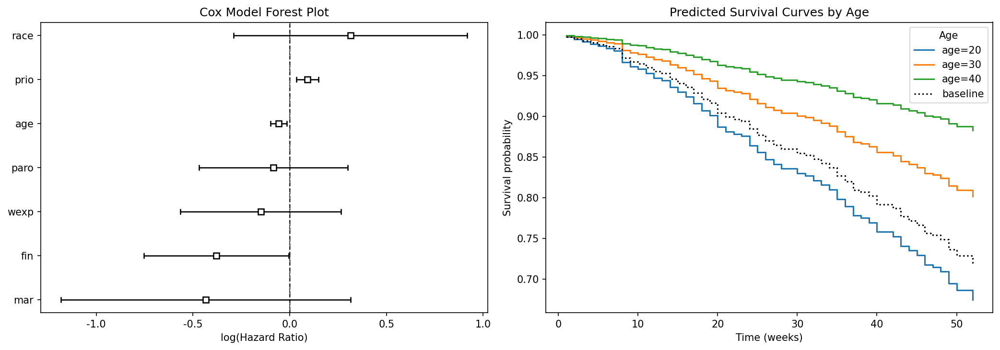
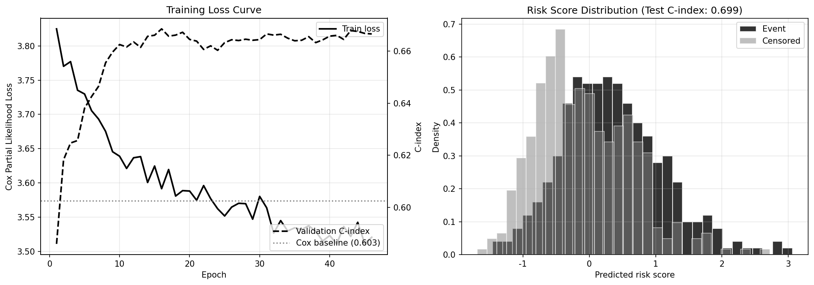

# 10장. 생존 분석: 사건이 일어날지보다 언제 일어날지를 묻는 방법

**학습 목표: 생존 분석이 일반 분류와 다른 이유를 이해하고, 검열, Kaplan-Meier, Cox 모형, 머신러닝 생존 분석, DeepSurv를 시간-사건 데이터의 흐름으로 연결하기**

## 이 장에서 다룰 흐름

- 생존 분석이 어떤 질문에 답하는가
- 검열 데이터가 왜 핵심 정보인가
- Kaplan-Meier와 로그순위 검정은 무엇을 보여 주는가
- Cox 모형은 위험비를 어떻게 해석하게 해 주는가
- 트리 기반 방법과 딥러닝 생존 분석은 언제 필요한가

---

## 10.1 생존 분석은 "일어나는가"가 아니라 "언제 일어나는가"를 다룬다

3장에서 본 분류 모델은 사건 발생 여부를 예측한다.

- 고객이 이탈할까
- 환자가 양성일까
- 장비가 고장날까

하지만 실제 현업 질문은 종종 한 걸음 더 나아간다.

- 고객은 언제 이탈할 가능성이 높은가
- 장비는 언제쯤 고장 위험이 커지는가
- 재입원은 몇 주 안에 발생할 가능성이 높은가

이처럼 시간까지 함께 다루는 문제가 생존 분석이다.

쉽게 말하면 분류는 "비가 올까"를 묻고, 생존 분석은 "언제쯤 비가 올 가능성이 커지는가"를 묻는다.

<표 10-1: 분류와 생존 분석의 차이>

| 질문 | 방법 | 예시 |
| ---- | ---- | ---- |
| 일어날까 | 분류 | 고객 이탈 여부 |
| 언제 일어날까 | 생존 분석 | 고객 이탈 시점 |

---

## 10.2 검열은 정보 부족이 아니라, 생존 분석이 다뤄야 하는 핵심 정보다

생존 분석이 일반 회귀와 가장 크게 다른 이유는 검열(censoring)을 처리할 수 있기 때문이다.

예를 들어 1년 동안 고객 이탈을 관찰한다고 하자.

- 어떤 고객은 3개월 만에 이탈했다
- 어떤 고객은 9개월에 이탈했다
- 어떤 고객은 1년이 끝날 때까지 이탈하지 않았다

마지막 고객에 대해 우리는 "아직 이탈하지 않았다"는 것은 알지만, 실제 이탈 시점은 모른다. 이런 데이터를 버리면 큰 정보 손실이 생긴다.

이처럼 관찰 종료 시점까지 사건이 발생하지 않은 경우가 우측 검열이다.

### 10.2.1 왜 검열 데이터를 버리면 안 되는가

검열 데이터를 버리면 사건이 빨리 일어난 사례만 남아 평균 시간이 짧게 왜곡된다. 반대로 검열 시점을 실제 사건 시점처럼 다뤄도 왜곡이 생긴다.

즉, 생존 분석은 불완전한 데이터를 억지로 완전한 데이터처럼 바꾸는 것이 아니라,  
**불완전성 자체를 모델 안에서 다루는 방법**이다.

---

## 10.3 Kaplan-Meier는 생존 곡선을 가장 직관적으로 보여 주는 출발점이다

Kaplan-Meier(KM) 추정은 시간에 따라 생존 확률이 어떻게 줄어드는지를 계단형 곡선으로 보여 준다. 이 곡선은 해석이 매우 직관적이다.

- 곡선이 빨리 떨어지면 사건이 빨리 많이 발생하는 집단
- 곡선이 천천히 떨어지면 더 오래 생존하는 집단

즉, Kaplan-Meier는 "누가 더 오래 버티는가"를 한눈에 보여 준다.

### 10.3.1 실습: Kaplan-Meier 곡선 읽기

[10-2-kaplan-meier.py](/Users/callii/Documents/dataScience/practice/chapter10/code/10-2-kaplan-meier.py)는 이 장의 시작점이다.


이 그림을 볼 때는 다음을 확인한다.

1. 초기에 급격히 떨어지는가
2. 두 집단 곡선이 일관되게 벌어져 있는가
3. 후반부로 갈수록 신뢰구간이 넓어지는가

KM 곡선은 단순하지만 매우 강력하다. 복잡한 모델에 가기 전에 데이터가 어떤 시간 구조를 갖는지 먼저 보여 주기 때문이다.

### 10.3.2 로그순위 검정은 무엇을 확인하는가

KM 곡선을 두 집단에서 그렸다면 다음 질문이 생긴다.

**보이는 차이가 우연인가, 아니면 구조적인 차이인가?**

로그순위 검정은 바로 이 질문에 답한다. 곡선이 눈에 띄게 달라 보여도 표본 수가 적으면 우연일 수 있다. 반대로 차이가 작아 보여도 일관되면 통계적으로 유의할 수 있다.

---

## 10.4 Cox 모형은 변수 하나가 위험을 얼마나 올리거나 내리는지 읽게 해 준다

Cox 비례위험 모형은 생존 분석에서 가장 널리 쓰이는 모델 중 하나다. 이유는 해석이 좋기 때문이다.

핵심은 위험비(hazard ratio)다.

- 1보다 크면 위험 증가
- 1보다 작으면 위험 감소

즉, 어떤 변수가 사건 발생 속도를 상대적으로 얼마나 높이거나 낮추는지를 읽을 수 있다.

### 10.4.1 위험비는 어떻게 해석해야 하는가

예를 들어 어떤 변수의 위험비가 1.5라면, 다른 조건이 같을 때 위험이 50% 더 높다고 해석한다. 0.7이라면 위험이 30% 낮다고 본다.

여기서 중요한 점은 Cox 모형이 절대 시간 자체를 직접 예측하기보다, **상대적 위험의 크기**를 읽게 해 준다는 것이다.

### 10.4.2 실습: Cox 모형 적합과 해석

[10-3-cox.py](/Users/callii/Documents/dataScience/practice/chapter10/code/10-3-cox.py)는 변수별 위험비 해석의 전형적인 흐름을 보여 준다.



이 실습에서 중요한 것은 계수의 부호를 기계적으로 읽는 것이 아니라, 다음을 함께 보는 것이다.

- 위험비가 1을 기준으로 어느 쪽인가
- 신뢰구간이 1을 가로지르는가
- 도메인 해석과 방향이 맞는가

이 과정을 통해 생존 분석이 예측 도구일 뿐 아니라, **시간 기반 의사결정 요인을 해석하는 도구**라는 점이 분명해진다.

### 10.4.3 비례위험 가정은 왜 확인해야 하는가

Cox 모형은 변수의 효과가 시간 전반에 걸쳐 비례적으로 작용한다는 가정을 둔다. 만약 어떤 변수는 초반에는 강하지만 후반에는 약해진다면, 이 가정이 깨질 수 있다.

이 경우 Cox 결과를 과신하면 안 된다. 시간에 따라 효과가 달라지는 구조를 별도로 고려해야 한다.

---

## 10.5 머신러닝 생존 분석은 복잡한 비선형 관계를 더 잘 다루기 위해 등장했다

전통적 Cox 모형은 해석이 좋지만, 복잡한 비선형성과 상호작용을 충분히 담기 어렵다. 그래서 머신러닝 기반 생존 분석이 등장한다.

대표적으로 다음 같은 방법이 있다.

- Random Survival Forest
- 부스팅/AFT 계열
- 기타 비선형 앙상블 방식

이들은 해석은 다소 약해질 수 있지만, 구조가 복잡한 데이터에서 더 나은 예측을 줄 수 있다.

### 10.5.1 실습: 머신러닝 기반 생존 예측

[10-4-ml-survival.py](/Users/callii/Documents/dataScience/practice/chapter10/code/10-4-ml-survival.py)는 전통적 방법과 다른 예측 방식을 보여 준다.


이 실습에서 확인해야 할 것은 단순히 점수가 높은가가 아니다.

- Cox보다 얼마나 개선되는가
- 어떤 유형의 관계를 더 잘 포착하는가
- 그 대가로 해석 가능성은 얼마나 줄어드는가

생존 분석에서는 예측력만큼 해석이 중요할 때가 많으므로, 이 균형을 늘 함께 봐야 한다.

---

## 10.6 DeepSurv는 생존 분석을 딥러닝 표현 학습으로 확장한 접근이다

DeepSurv는 Cox의 위험 함수 구조를 딥러닝 표현 학습과 결합한 방법으로 이해하면 좋다. 기본 생각은 다음과 같다.

- 상대적 위험이라는 틀은 유지하되
- 입력과 위험 간 관계는 신경망으로 더 유연하게 학습한다

즉, Cox의 해석 틀과 딥러닝의 표현력을 절충한 방식이다.

### 10.6.1 실습: DeepSurv로 복잡한 패턴 학습하기

[10-5-deepsurv.py](/Users/callii/Documents/dataScience/practice/chapter10/code/10-5-deepsurv.py)는 딥러닝 생존 분석의 대표 예다.



이 실습을 읽을 때는 다음을 함께 본다.

- 검증 성능과 테스트 성능 차이가 큰가
- Cox보다 개선 폭이 실질적인가
- 데이터 크기가 딥러닝을 정당화할 만큼 충분한가

딥러닝 생존 분석은 분명 강력할 수 있지만, 표본 수가 적거나 검열 구조가 복잡한 상황에서는 과적합과 불안정성 문제가 더 쉽게 드러난다.

---

## 10.7 결국 생존 분석의 모델 선택도 해석과 예측의 균형 문제다

생존 분석에서 항상 가장 강한 모델 하나가 있는 것은 아니다. 질문의 목적에 따라 선택이 달라진다.

<표 10-2: 상황별 생존 분석 모델 선택 기준>

| 상황 | 더 적합한 접근 |
| ---- | -------------- |
| 해석과 보고가 중요함 | Kaplan-Meier, Cox |
| 비선형 관계가 강함 | 머신러닝 생존 분석 |
| 데이터가 충분하고 복잡함 | DeepSurv 검토 |
| 빠른 기준선 필요 | Cox 우선 |
| 운영 비용이 민감함 | 전통적 방법 우선 |

### 10.7.1 실습: 전체 비교로 의사결정 기준 정리하기

[10-7-model-comparison.py](/Users/callii/Documents/dataScience/practice/chapter10/code/10-7-model-comparison.py)는 전통 모형, 머신러닝, 딥러닝을 같은 기준으로 비교한다.

이 실습의 핵심은 "누가 이겼는가"가 아니라 다음을 묻는 데 있다.

- 성능 차이가 실제로 의미 있는가
- 복잡한 모델이 해석 손실을 감수할 만큼 가치가 있는가
- 우리 문제는 설명이 중요한가, 예측이 중요한가

이 질문에 답할 수 있어야 생존 분석이 실전에서 살아난다.

---

## 10.8 정리

생존 분석은 시간 정보와 검열 정보를 버리지 않고 활용한다는 점에서 일반 분류나 회귀와 분명히 다르다.

```text
1. 생존 분석은 사건 발생 여부보다 사건 발생 시점을 다루는 방법이다.
2. 검열 데이터는 제거 대상이 아니라 핵심 정보다.
3. Kaplan-Meier는 생존 곡선을 가장 직관적으로 보여 준다.
4. Cox 모형은 위험비를 통해 변수 효과를 해석하게 해 준다.
5. 머신러닝과 딥러닝 생존 분석은 복잡한 비선형 관계에 강할 수 있다.
6. 최종 모델 선택은 해석 가능성과 예측력의 균형에서 결정된다.
```

## 실습 연결

이 장의 실습은 아래 순서로 읽으면 자연스럽다.

1. [generate_survival_data.py](/Users/callii/Documents/dataScience/practice/chapter10/code/generate_survival_data.py): 생존 데이터 구조 만들기
2. [10-2-kaplan-meier.py](/Users/callii/Documents/dataScience/practice/chapter10/code/10-2-kaplan-meier.py): 생존 곡선과 집단 비교
3. [10-3-cox.py](/Users/callii/Documents/dataScience/practice/chapter10/code/10-3-cox.py): 위험비 해석
4. [10-4-ml-survival.py](/Users/callii/Documents/dataScience/practice/chapter10/code/10-4-ml-survival.py): 비선형 생존 예측
5. [10-5-deepsurv.py](/Users/callii/Documents/dataScience/practice/chapter10/code/10-5-deepsurv.py): 딥러닝 생존 분석
6. [10-7-model-comparison.py](/Users/callii/Documents/dataScience/practice/chapter10/code/10-7-model-comparison.py): 전체 비교와 선택 기준 정리
